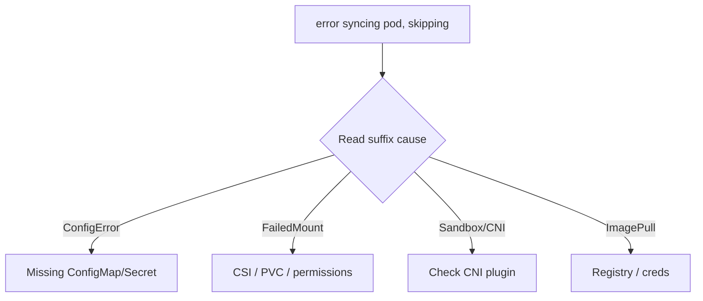

# Failed To Sync Pod

> **Severity:** High · **Typical recovery time:** 5–30 min · **Affected versions:** 1.20+

## Error Message

```text
kubelet: error syncing pod 1a2b3c4d-... ("web-0_default(1a2b3c4d-...)"), skipping:
failed to "StartContainer" for "web" with CreateContainerConfigError: ...
```

## Description

`syncPod` is the kubelet's per-pod reconciliation: pull images, set up the
sandbox, mount volumes, configure networking, and start containers. When any
phase fails, the kubelet logs `error syncing pod ..., skipping` and retries on
the next sync loop with backoff. The pod stays out of `Running` — typically
`ContainerCreating`, `CreateContainerConfigError`, or `Init`.

The string itself is generic; the actionable detail is the trailing cause
(`CreateContainerConfigError`, `FailedMount`, CNI/sandbox errors, image pull
failures). Treat this as a pointer and read the suffix and pod events to find
the real fault.

## Affected Kubernetes Versions

Applies to all 1.20+ kubelets; the message format is stable. Underlying causes
shift with CRI/CSI/CNI versions, but the sync-loop wrapper string is unchanged.

## Likely Root Causes

- Missing/incorrect ConfigMap or Secret referenced by the pod (`CreateContainerConfigError`)
- Volume mount failures (CSI attach/mount, missing PVC, permissions)
- CNI/sandbox setup failure (no IP, plugin error)
- Image pull failure or container runtime errors

## Diagnostic Flow



## Verification Steps

Read the full error suffix and the pod's events to identify which sync phase
failed, then confirm the referenced resources exist.

## kubectl Commands

```bash
kubectl describe pod web-0 -n default
kubectl get events -n default --sort-by=.lastTimestamp
kubectl get configmap,secret,pvc -n default

# On the node host (read-only):
sudo journalctl -u kubelet --no-pager | grep -i 'error syncing pod'
sudo crictl ps -a
sudo crictl pods
```

## Expected Output

```text
$ kubectl describe pod web-0 -n default
  Warning  Failed  kubelet  Error: configmap "app-config" not found
  Warning  FailedSync  kubelet  error syncing pod, skipping: failed to "StartContainer" ...
```

## Common Fixes

1. Create or correct the missing ConfigMap/Secret/PVC the pod references, then
   let the sync loop retry.
2. Resolve volume mount errors (bind the PVC, fix CSI driver, correct fsGroup
   /permissions).
3. Fix CNI (restore the plugin/daemonset) or image pull (registry creds,
   image name) per the suffix.

## Recovery Procedures

1. Fix the root resource (Secret/PVC/CNI) — usually no restart needed; the
   kubelet retries automatically.
2. If a stale sandbox blocks recreation, delete the pod so it is recreated —
   blast radius: that single pod (controller recreates it).
3. Only if the kubelet's view is stale, **restart the kubelet** — blast radius:
   node-local control loop; running pods are not deleted.

## Validation

The pod reaches `Running`/`Ready`, `kubectl describe pod` shows no recent
`FailedSync` events, and the kubelet log stops repeating the error.

## Prevention

Validate manifests in CI (referenced ConfigMaps/Secrets/PVCs exist), gate CNI
and CSI driver rollouts, and alert on pods stuck in `ContainerCreating`.

## Related Errors

- [PLEG Is Not Healthy](kubelet-pleg-not-healthy.md)
- [Orphaned Pod Volume Not Cleaned](kubelet-orphaned-pod-volume.md)
- [Kubelet maxPods Reached](kubelet-maxpods-reached.md)

## References

- [Debug running pods](https://kubernetes.io/docs/tasks/debug/debug-application/debug-running-pod/)
- [Pod lifecycle](https://kubernetes.io/docs/concepts/workloads/pods/pod-lifecycle/)

## Further Reading

- [DevOps AI ToolKit — Kubernetes guides](https://devopsaitoolkit.com/blog/)
