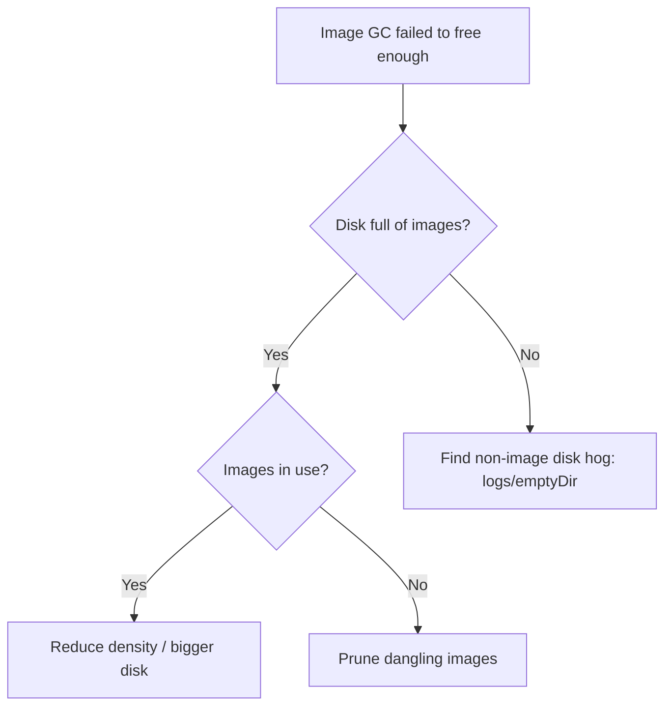

# Kubelet Image GC Failed

> **Severity:** High · **Typical recovery time:** 10–40 min · **Affected versions:** 1.20+

## Error Message

```text
kubelet: failed to garbage collect required amount of images.
Wanted to free 5368709120 bytes, but freed 1073741824 bytes
kubelet: Image garbage collection failed multiple times in a row
```

## Description

The kubelet runs image garbage collection to keep the container runtime's
image filesystem below a high-water mark (`imageGCHighThresholdPercent`,
default 85%). It removes unused images down to the low threshold (default 80%).
When it cannot free enough — because most images are still in use by running
containers, or non-image data is filling the disk — it logs this error and
disk usage keeps climbing toward `DiskPressure` and pod eviction.

This is a leading indicator of node disk exhaustion. By the time GC repeatedly
fails, the node is close to evicting pods or refusing new ones, so treat it as
an early warning rather than a cosmetic log line.

## Affected Kubernetes Versions

Applies to 1.20+. Thresholds are set via the kubelet config
(`imageGCHighThresholdPercent`/`imageGCLowThresholdPercent`); the deprecated
`--image-gc-*` flags map to the same settings. Behaviour is otherwise stable.

## Likely Root Causes

- Image filesystem genuinely small relative to image churn
- Most images are in-use (running containers), so GC cannot reclaim them
- Non-image data (logs, emptyDir, ephemeral writes) consuming the same disk
- A separate volume holding images filled by something other than images

## Diagnostic Flow



## Verification Steps

Confirm the image filesystem is near its threshold and determine whether images
or other data are consuming it.

## kubectl Commands

```bash
kubectl describe node node-1 | grep -iE 'DiskPressure|ImageGС|Allocated'
kubectl get events --field-selector reason=ImageGCFailed -A

# On the node host (read-only):
sudo journalctl -u kubelet --no-pager | grep -i 'garbage collect'
sudo crictl images
sudo crictl imagefsinfo
df -h /var/lib/containerd
```

## Expected Output

```text
$ sudo crictl imagefsinfo
{ "status": { "usedBytes": { "value": "92000000000" } } }

$ df -h /var/lib/containerd
Filesystem  Size  Used Avail Use% Mounted on
/dev/nvme1  100G   94G   6G   94% /var/lib/containerd
```

## Common Fixes

1. Free disk: prune dangling/unused images and clear non-image data (rotate
   container logs, clean stray emptyDir/ephemeral files).
2. Increase the image filesystem size or move it to a larger/dedicated disk.
3. Reduce image bloat: smaller images, fewer per node, lower pod density.

## Recovery Procedures

1. Identify whether images or other data fill the disk.
2. Remove safe-to-delete data first (log rotation, dangling images) — no
   restart required.
3. If a runaway process keeps filling the disk, evict/delete that pod — blast
   radius: that workload (controller reschedules it).
4. If thresholds were misconfigured, update kubelet config and **restart the
   kubelet** — blast radius: node-local control loop; pods keep running.

## Validation

Image filesystem usage drops below `imageGCHighThresholdPercent`, the
`ImageGCFailed` events stop, and the node has no `DiskPressure` condition.

## Prevention

Size image disks for churn, enforce small images and sane pod density, rotate
logs, and alert on image-fs usage well before the high threshold.

## Related Errors

- [Kubelet Attempting To Reclaim](kubelet-eviction-reclaim.md)
- [Failed To Sync Pod](kubelet-failed-to-sync-pod.md)
- [Orphaned Pod Volume Not Cleaned](kubelet-orphaned-pod-volume.md)

## References

- [Garbage collection — images](https://kubernetes.io/docs/concepts/architecture/garbage-collection/#container-image-garbage-collection)
- [Node-pressure eviction](https://kubernetes.io/docs/concepts/scheduling-eviction/node-pressure-eviction/)

## Further Reading

- [DevOps AI ToolKit — Kubernetes guides](https://devopsaitoolkit.com/blog/)
