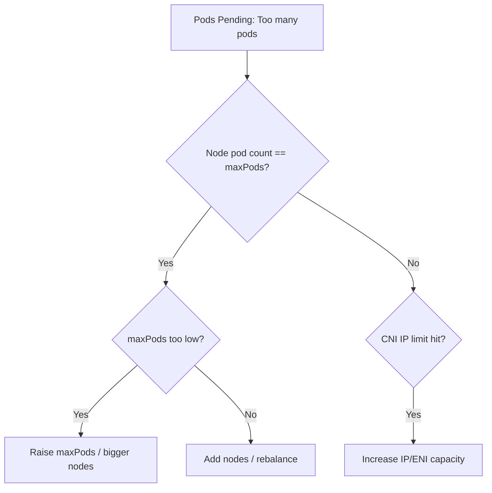

# Kubelet maxPods Reached

> **Severity:** Medium · **Typical recovery time:** 10–30 min · **Affected versions:** 1.20+

## Error Message

```text
0/3 nodes are available: 1 Too many pods, ...
kubelet: "Failed to admit pod" pod="default/web-9" err="node maxPods limit reached (110)"
Event: FailedScheduling  reason: TooManyPods
```

## Description

Each kubelet advertises a maximum number of pods it will run (`maxPods`,
default 110). This is surfaced as the node's `pods` allocatable, and the
scheduler will not place pods on a node already at that count. If a pod still
lands there (e.g. a DaemonSet or static pod) the kubelet rejects admission with
a `maxPods limit reached` error. The result is pods stuck `Pending` with
`TooManyPods`/`Too many pods`, even when CPU and memory are free.

This is a capacity-planning limit, not a fault: the node is full by pod count.
It is common on small/dense nodes and on cloud providers whose CNI ties pod
density to ENI/IP limits, where the effective ceiling may be lower than 110.

## Affected Kubernetes Versions

Applies to 1.20+. `maxPods` is a kubelet config field (default 110). Some
managed platforms compute a lower default from instance networking limits.
The scheduler reason text (`Too many pods` / `TooManyPods`) is stable.

## Likely Root Causes

- Node legitimately running `maxPods` pods (count, not CPU/memory, is the limit)
- `maxPods` set too low for the node size
- CNI IP/ENI limits capping practical pod density below `maxPods`
- Many small/DaemonSet pods consuming pod slots without much CPU/memory

## Diagnostic Flow



## Verification Steps

Confirm the node's running pod count equals its `pods` allocatable and that the
Pending pods fail with `Too many pods`, not a resource shortage.

## kubectl Commands

```bash
kubectl describe node node-1 | grep -iE 'Allocatable|Non-terminated|Allocated'
kubectl get pods --field-selector spec.nodeName=node-1 -A --no-headers | wc -l
kubectl get events -A --field-selector reason=FailedScheduling
kubectl describe pod web-9 -n default

# On the node host (read-only):
sudo journalctl -u kubelet --no-pager | grep -i 'maxpods\|admit pod'
grep -i maxPods /var/lib/kubelet/config.yaml
```

## Expected Output

```text
$ kubectl describe node node-1 | grep -i pods
  pods:               110
Non-terminated Pods:  (110 in total)

$ kubectl describe pod web-9 -n default
  Warning  FailedScheduling  default-scheduler  0/3 nodes are available: 3 Too many pods.
```

## Common Fixes

1. Add nodes (or scale a node group) so the scheduler has pod slots; the
   cluster autoscaler handles this automatically when configured.
2. Raise `maxPods` to match larger node CPU/memory if the default is too
   conservative (and CNI IP capacity allows it).
3. Increase CNI IP/ENI capacity (e.g. prefix delegation) when networking is the
   real ceiling.

## Recovery Procedures

1. Confirm the limit is pod count, not CPU/memory.
2. Scale out node capacity (preferred) — no disruption to running pods.
3. If raising `maxPods`, update kubelet config and **restart the kubelet** —
   blast radius: node-local control loop; running pods are not deleted, but
   ensure CNI/IP capacity supports the higher density first.
4. Rebalance workloads (cordon/drain a hotspot node) if pods are unevenly
   packed — blast radius: drained pods reschedule; verify capacity.

## Validation

Pending pods schedule and reach `Running`, no new `Too many pods` events appear,
and node pod counts sit below their `maxPods` allocatable.

## Prevention

Right-size `maxPods` to node resources and CNI limits, run the cluster
autoscaler, spread workloads with topology constraints, and alert when nodes
approach their pod-count ceiling.

## Related Errors

- [Failed To Sync Pod](kubelet-failed-to-sync-pod.md)
- [Kubelet Attempting To Reclaim](kubelet-eviction-reclaim.md)
- [PLEG Is Not Healthy](kubelet-pleg-not-healthy.md)

## References

- [Reserve compute resources / node allocatable](https://kubernetes.io/docs/tasks/administer-cluster/reserve-compute-resources/)
- [kubelet configuration (maxPods)](https://kubernetes.io/docs/reference/config-api/kubelet-config.v1beta1/)

## Further Reading

- [DevOps AI ToolKit — Kubernetes guides](https://devopsaitoolkit.com/blog/)
