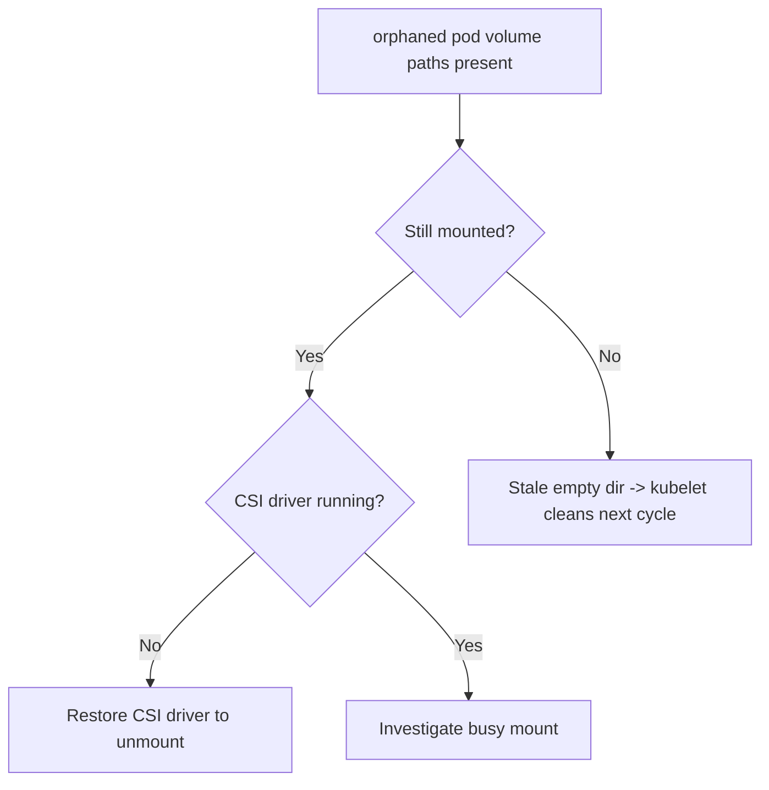

# Orphaned Pod Volume Not Cleaned

> **Severity:** Medium · **Typical recovery time:** 10–30 min · **Affected versions:** 1.20+

## Error Message

```text
kubelet: orphaned pod "1a2b3c4d-..." found, but volume paths are still present on disk:
[/var/lib/kubelet/pods/1a2b3c4d-.../volumes/kubernetes.io~csi/pvc-...]
kubelet: Orphaned pod "1a2b3c4d-..." found, but error ... occurred during reading volume dir
```

## Description

After a pod is deleted from the API server, the kubelet must unmount and remove
its volume directories under `/var/lib/kubelet/pods/<uid>/volumes/`. If those
paths remain when the pod object is already gone, the kubelet logs it as an
*orphaned pod* and retries cleanup every housekeeping cycle. Usually it
self-resolves, but a stuck mount (CSI driver gone, busy mount, leftover
subpath) makes the message repeat indefinitely.

It is mostly noise but signals a real leak: undeleted volume dirs consume inodes
and disk on the kubelet data filesystem, and a wedged mount can block the CSI
driver from attaching that volume elsewhere. Persistent orphan logs warrant
investigation, not suppression.

## Affected Kubernetes Versions

Applies to 1.20+. The path layout and cleanup loop are stable. CSI volumes are
the common offenders; behaviour differs slightly by CSI driver version, not by
Kubernetes version.

## Likely Root Causes

- A volume is still mounted (busy mount) so the directory cannot be removed
- The CSI driver pod is gone/crashed and cannot complete `NodeUnpublish`
- Leftover `subPath` or `emptyDir` files block directory removal
- Node was force-deleted/rebooted, leaving stale pod dirs behind

## Diagnostic Flow



## Verification Steps

Confirm the pod is truly gone from the API, then check whether its volume paths
are still mounted on the node.

## kubectl Commands

```bash
kubectl get pod -A -o wide | grep 1a2b3c4d
kubectl -n kube-system get pods -l app=csi-driver -o wide

# On the node host (read-only):
sudo journalctl -u kubelet --no-pager | grep -i orphaned
mount | grep 1a2b3c4d
ls -la /var/lib/kubelet/pods/1a2b3c4d-.../volumes/
df -i /var/lib/kubelet
```

## Expected Output

```text
$ sudo journalctl -u kubelet | grep orphaned
orphaned pod "1a2b3c4d-..." found, but volume paths are still present on disk

$ mount | grep 1a2b3c4d
/dev/... on /var/lib/kubelet/pods/1a2b3c4d-.../volumes/kubernetes.io~csi/pvc-... type ext4 (rw)
```

## Common Fixes

1. Restore the CSI driver DaemonSet so it can complete `NodeUnpublish` and the
   kubelet can remove the directory.
2. Resolve the busy mount (stop the process holding it) so the volume unmounts
   cleanly.
3. If the pod and mount are truly gone but dirs persist, let the kubelet
   housekeeping loop remove them, or remove the stale leftover dir as a last
   resort.

## Recovery Procedures

1. Verify the pod no longer exists in the API.
2. Bring the CSI driver back if it is down — no node restart; unmount completes
   automatically.
3. Clear a busy mount by stopping the holder process — blast radius: that
   process only.
4. Only if cleanup stays wedged, **restart the kubelet** — blast radius:
   node-local control loop; running pods are not deleted.

## Validation

The orphaned-pod messages stop, the pod's directory under
`/var/lib/kubelet/pods/` is gone, `mount` shows no leftover mounts, and inode
usage on the kubelet filesystem recovers.

## Prevention

Keep CSI driver DaemonSets healthy and budgeted with PodDisruptionBudgets,
drain nodes before reboot/decommission, and alert on repeated orphaned-pod log
lines and rising inode usage.

## Related Errors

- [Failed To Sync Pod](kubelet-failed-to-sync-pod.md)
- [Kubelet Attempting To Reclaim](kubelet-eviction-reclaim.md)
- [Kubelet Image GC Failed](kubelet-image-gc-failed.md)

## References

- [Storage — CSI volumes](https://kubernetes.io/docs/concepts/storage/volumes/#csi)
- [Debugging Kubernetes nodes](https://kubernetes.io/docs/tasks/debug/debug-cluster/)

## Further Reading

- [DevOps AI ToolKit — Kubernetes guides](https://devopsaitoolkit.com/blog/)
