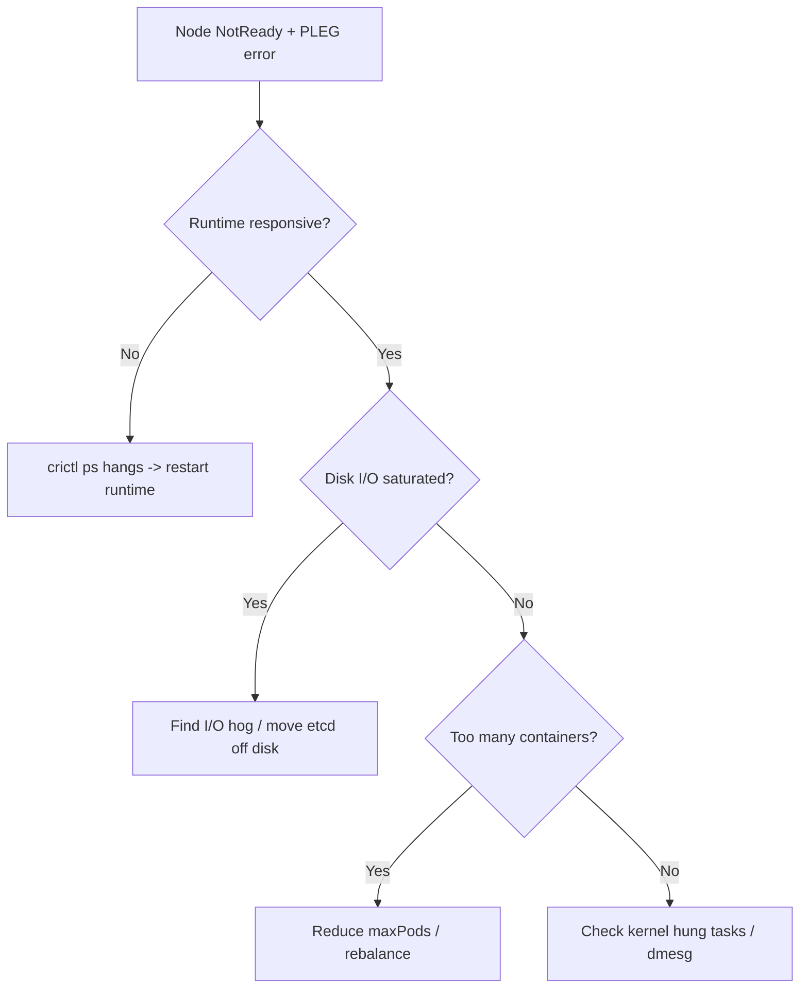

# PLEG Is Not Healthy

> **Severity:** High · **Typical recovery time:** 10–45 min · **Affected versions:** 1.20+

## Error Message

```text
kubelet: PLEG is not healthy: pleg was last seen active 3m12s ago; threshold is 3m0s
NodeNotReady  Node node-1 status is now: NodeNotReady
```

## Description

The Pod Lifecycle Event Generator (PLEG) is the kubelet loop that relists
container state from the container runtime (containerd/CRI-O) to detect pod
events. The kubelet's health check expects PLEG to complete a relist within a
threshold (default 3m0s). When relist stalls past that, the kubelet marks
itself `NotReady`, the API server stops scheduling to the node, and existing
pods may be evicted.

During an incident this almost always points downstream at the container
runtime: it is slow or hung answering CRI calls, usually because of disk I/O
saturation, too many containers, runtime deadlock, or kernel pressure. PLEG is
the symptom; the runtime is the cause.

## Affected Kubernetes Versions

Applies to 1.20+. The relist health threshold (3m0s) and `relistPeriod` (1s)
are kubelet internals. Newer kubelets added event-based PLEG
(`EventedPLEG`, beta in 1.27+) which reduces relist load but the same health
check and error string remain.

## Likely Root Causes

- Container runtime slow or hung responding to CRI `ListPodSandbox`/`ListContainers`
- Disk I/O saturation on the node (image layers, logs, etcd on same disk)
- Too many pods/containers per node amplifying relist cost
- Kernel or cgroup pressure (memory reclaim, hung tasks) stalling the runtime

## Diagnostic Flow



## Verification Steps

Confirm the kubelet, not the apiserver, reports the node NotReady, and check
whether CRI calls return promptly.

## kubectl Commands

```bash
kubectl get nodes
kubectl describe node node-1 | grep -A5 Conditions

# On the node host (read-only):
sudo journalctl -u kubelet --no-pager | grep -i pleg
sudo systemctl status kubelet
sudo crictl ps -a
sudo crictl pods
```

## Expected Output

```text
$ kubectl describe node node-1 | grep -A5 Conditions
  Ready  False  ...  KubeletNotReady  PLEG is not healthy: pleg was last seen active 3m12s ago; threshold is 3m0s

$ time sudo crictl ps
# command hangs for tens of seconds -> runtime is the bottleneck
```

## Common Fixes

1. Relieve the container runtime: clear disk pressure, remove dead containers,
   and reduce I/O contention so relist completes under threshold.
2. Lower pod density on the node (`maxPods`) or rebalance workloads if relist
   cost scales with container count.
3. Upgrade/patch the runtime if a known deadlock applies; move etcd or heavy
   logging off the kubelet data disk.

## Recovery Procedures

1. Confirm the runtime is the bottleneck (`crictl ps` slow/hangs).
2. **Restart the container runtime** (`systemctl restart containerd`) — blast
   radius: node-local; running containers usually keep running but the kubelet
   briefly loses CRI visibility.
3. If the kubelet stays wedged, **restart the kubelet** — blast radius:
   node-local control loop only; pods are not deleted.
4. If the node remains NotReady, **drain and reboot** it — blast radius: its
   pods reschedule; verify cluster capacity first.

## Validation

`kubectl get nodes` shows `Ready`, the kubelet log no longer prints PLEG
warnings, and `crictl ps` returns within a second.

## Prevention

Size nodes so pod density stays well under `maxPods`, give the kubelet/runtime a
dedicated fast disk, alert on PLEG relist latency, and keep the container
runtime patched.

## Related Errors

- [Failed To Sync Pod](kubelet-failed-to-sync-pod.md)
- [Kubelet Failed To Start](kubelet-failed-to-start.md)
- [Node cgroup Driver Mismatch](../nodes/node-cgroup-driver-mismatch.md)

## References

- [Kubernetes node components — kubelet](https://kubernetes.io/docs/concepts/overview/components/#kubelet)
- [Debugging Kubernetes nodes](https://kubernetes.io/docs/tasks/debug/debug-cluster/)

## Further Reading

- [DevOps AI ToolKit — Kubernetes guides](https://devopsaitoolkit.com/blog/)
