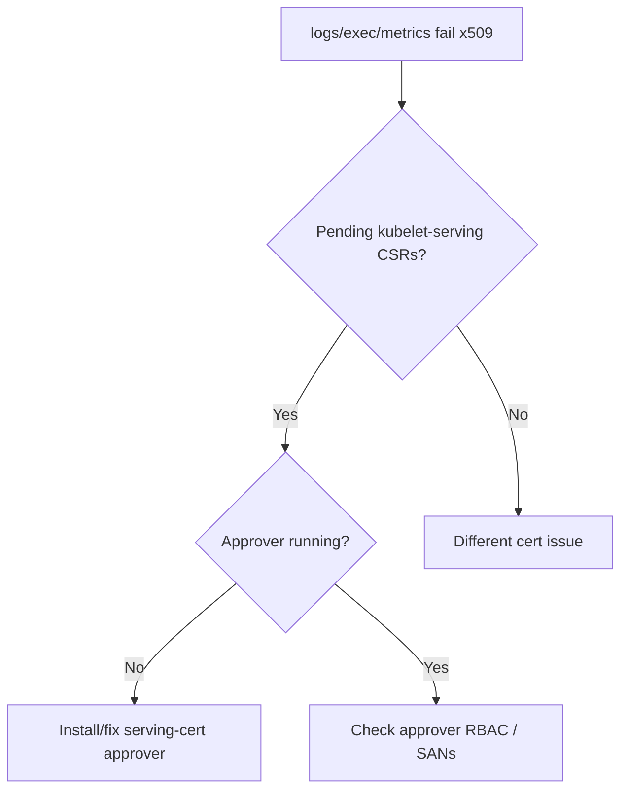

# Kubelet Serving CSR Not Approved

> **Severity:** High · **Typical recovery time:** 10–30 min · **Affected versions:** 1.20+

## Error Message

```text
$ kubectl get csr
csr-9f2k1   5m   kubernetes.io/kubelet-serving   system:node:node-1   <none>   Pending
kubelet: Failed to request signed certificate ... waiting for serving certificate to be signed
```

## Description

When `serverTLSBootstrap` is enabled, the kubelet requests a *serving*
certificate (signer `kubernetes.io/kubelet-serving`) so its HTTPS endpoint
(used by `kubectl logs`, `exec`, and metrics-server) is trusted. Unlike the
client CSR, the serving CSR is **not** auto-approved by the default approver —
it must be approved manually or by a custom controller. Left `Pending`, the
kubelet keeps serving a self-signed/expired cert, so `kubectl logs/exec` and
`metrics-server` fail with x509 errors.

This is a common surprise after enabling serving-cert rotation: nodes are
otherwise healthy and `Ready`, but log/exec/metrics break because the serving
CSRs pile up unapproved.

## Affected Kubernetes Versions

Applies to 1.20+. The `kubernetes.io/kubelet-serving` signer has no built-in
auto-approver (by design — IP/hostname SANs need validation). cgroup/version
specifics do not change this; the gap is the approver, not the kubelet.

## Likely Root Causes

- `serverTLSBootstrap: true` but no controller approving serving CSRs
- Operator forgot serving CSRs are not auto-approved (only client CSRs are)
- Custom approver crashed or lacks RBAC to approve `kubelet-serving` CSRs
- SAN/identity mismatch causing an approver to refuse the CSR

## Diagnostic Flow



## Verification Steps

Confirm there are `Pending` CSRs for the `kubelet-serving` signer and that
metrics/logs are failing TLS, not the client cert path.

## kubectl Commands

```bash
kubectl get csr
kubectl get csr --field-selector spec.signerName=kubernetes.io/kubelet-serving
kubectl describe csr csr-9f2k1
kubectl top nodes

# On the node host (read-only):
sudo journalctl -u kubelet --no-pager | grep -i 'serving certificate'
sudo openssl x509 -enddate -noout -in /var/lib/kubelet/pki/kubelet-server-current.pem
```

## Expected Output

```text
$ kubectl get csr --field-selector spec.signerName=kubernetes.io/kubelet-serving
NAME        AGE   SIGNERNAME                      REQUESTOR            CONDITION
csr-9f2k1   5m    kubernetes.io/kubelet-serving   system:node:node-1   Pending

$ kubectl top nodes
error: Metrics not available ... x509: certificate signed by unknown authority
```

## Common Fixes

1. Approve the pending serving CSRs (after verifying the requesting node and its
   SANs).
2. Deploy a serving-cert approver (e.g. kubelet-csr-approver) with RBAC to
   approve `kubernetes.io/kubelet-serving`, so future rotations approve
   automatically.
3. If you do not need verified serving certs, run metrics-server with
   `--kubelet-insecure-tls` only as a stopgap (not for production).

## Recovery Procedures

1. Verify each pending CSR maps to a legitimate node before approving.
2. Approve the CSRs — no node disruption; the kubelet picks up the signed cert
   automatically.
3. Install/repair the approver so it scales — no restart of healthy nodes
   needed.
4. Only if the kubelet does not load the new cert, **restart the kubelet** —
   blast radius: node-local control loop; pods keep running.

## Validation

No `Pending` `kubelet-serving` CSRs remain, the on-disk serving cert has a
future `notAfter`, and `kubectl top nodes` / `kubectl logs` work without x509
errors.

## Prevention

Run an automated serving-CSR approver with least-privilege RBAC, monitor for
`Pending` CSRs, and alert on serving-cert expiry to avoid silent log/metrics
breakage.

## Related Errors

- [Kubelet Client Certificate Expired](kubelet-client-certificate-expired.md)
- [Kubelet Cannot Connect To API Server](kubelet-cannot-connect-apiserver.md)
- [Kubelet Cert Rotation Failed](../nodes/kubelet-client-certificate-rotation-failed.md)

## References

- [Kubelet TLS bootstrapping](https://kubernetes.io/docs/reference/access-authn-authz/kubelet-tls-bootstrapping/)
- [Certificate signing requests](https://kubernetes.io/docs/reference/access-authn-authz/certificate-signing-requests/)

## Further Reading

- [DevOps AI ToolKit — Kubernetes guides](https://devopsaitoolkit.com/blog/)
