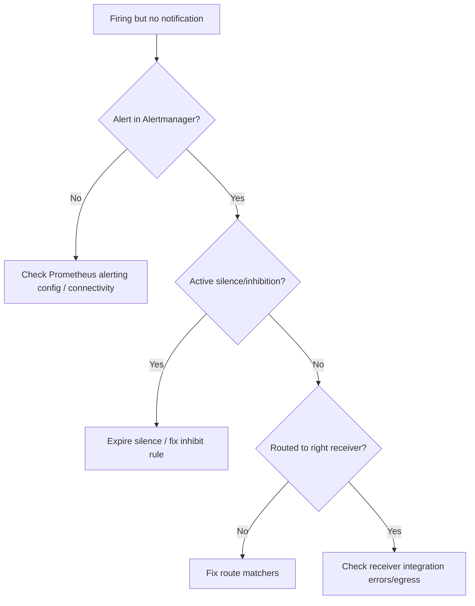

# Alertmanager Not Delivering

> **Severity:** Critical · **Typical recovery time:** 15–45 min · **Affected versions:** 1.19+

## Error Message

```text
# Alerts visible in Prometheus/Alertmanager UI but nothing arrives in Slack/PagerDduty/email:
level=error component=dispatcher msg="Notify for alerts failed"
  err="Slack notification failed: unexpected status code 403"
level=warn msg="Notification attempt failed, will retry" integration=slack
```

## Description

Alertmanager receives firing alerts from Prometheus, deduplicates and groups
them, applies routing and silences/inhibitions, then sends notifications through
receivers. A break anywhere in that chain produces the same operator-visible
symptom: alerts are firing but no human is paged. The alert can be firing in
Prometheus yet never reach Alertmanager, or reach it and be silenced, routed to
the wrong receiver, or fail at the integration (bad webhook, auth, DNS, egress).

This is critical because it is silent failure of your safety net — you only learn
about it during the incident it should have caught. Triage works backwards from
the receiver to the route to the alert source.

## Affected Kubernetes Versions

Independent of Kubernetes version (1.19+). Behaviour is governed by Alertmanager
config and (with the Operator) by AlertmanagerConfig CRs. Egress to external
notification providers depends on cluster NetworkPolicy and DNS.

## Likely Root Causes

- A broad silence or inhibition rule swallowing the alerts
- Routing tree sends the alert to a receiver with no/wrong integration
- Receiver integration failing (bad webhook URL, expired token, 403/timeout)
- Prometheus not connected to Alertmanager, or egress/DNS blocked

## Diagnostic Flow



## Verification Steps

Confirm the alert is actually in Alertmanager, check for silences, trace the
route, then look at receiver send errors and egress.

## kubectl Commands

```bash
kubectl get pods -n monitoring -l app.kubernetes.io/name=alertmanager
kubectl logs -n monitoring -l app.kubernetes.io/name=alertmanager --tail=120
kubectl exec -n monitoring <alertmanager-pod> -c alertmanager -- wget -qO- http://localhost:9093/api/v2/alerts | head
kubectl exec -n monitoring <alertmanager-pod> -c alertmanager -- wget -qO- http://localhost:9093/api/v2/silences
kubectl get secret alertmanager-main -n monitoring -o jsonpath='{.data.alertmanager\.yaml}' | base64 -d | head -40
```

## Expected Output

```text
# Active alerts present:
[{"labels":{"alertname":"KubePodCrashLooping",...},"status":{"state":"active"}}]

# Active silence covering them:
[{"id":"a1b2","status":{"state":"active"},"matchers":[{"name":"alertname","value":".*","isRegex":true}]}]

# Log:
level=error component=dispatcher msg="Notify for alerts failed"
  err="Slack notification failed: unexpected status code 403"
```

## Common Fixes

1. Expire an over-broad silence or correct the inhibition rule
2. Fix the routing tree so the alert matches the intended receiver
3. Repair the receiver integration (rotate token, correct webhook URL, allow egress)

## Recovery Procedures

1. List silences; if one is swallowing alerts, expire it via the UI/API. Blast radius: that silence only.
2. Inspect the receiver send errors in the logs and fix the integration credentials/URL (stored in a Secret).
3. Validate config before applying: `amtool check-config alertmanager.yaml`.
4. **Disruptive (low risk):** `kubectl rollout restart statefulset alertmanager-main -n monitoring` to reload after fixes. Blast radius is notification delivery during the brief restart; clustered Alertmanagers cover each other.

## Validation

Send a test alert (or wait for the real one) and confirm it arrives in the
channel. `amtool alert query` and the receiver's success log line confirm
delivery end to end.

## Prevention

- Add a heartbeat/"watchdog" alert that must always fire to prove the pipeline.
- Validate Alertmanager config in CI with `amtool check-config`.
- Run Alertmanager as a 3-replica cluster and monitor `alertmanager_notifications_failed_total`.

## Related Errors

- [Prometheus Target Down](prometheus-target-down.md)
- [Grafana Datasource Error](grafana-datasource-error.md)
- [kube-state-metrics Down](kube-state-metrics-down.md)

## References

- [Prometheus: Alertmanager configuration](https://prometheus.io/docs/alerting/latest/configuration/)
- [Kubernetes: Network policies](https://kubernetes.io/docs/concepts/services-networking/network-policies/)
