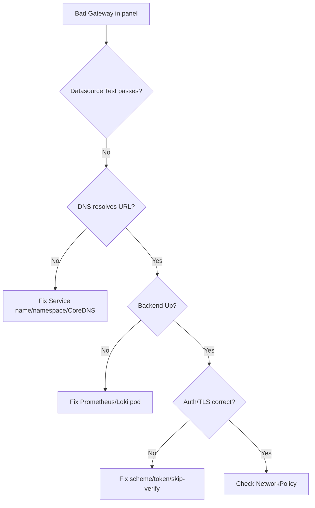

# Grafana Datasource Error

> **Severity:** Medium · **Typical recovery time:** 10–30 min · **Affected versions:** 1.19+

## Error Message

```text
Bad Gateway
Error reading Prometheus: Post "http://prometheus-k8s.monitoring:9090/api/v1/query_range":
  dial tcp: lookup prometheus-k8s.monitoring on 10.96.0.10:53: no such host
templating: Error updating options: Bad Gateway
```

## Description

Grafana queries datasources (most often Prometheus) over HTTP from inside the
cluster. When a panel shows "Bad Gateway", "no such host", or "datasource not
working", Grafana could not reach or authenticate to the datasource backend.
Common shapes: the datasource URL points to a Service name that does not resolve
or no longer exists, the backend is down, TLS/auth is misconfigured, or a
NetworkPolicy blocks Grafana from the backend.

This is medium severity because it is an observability outage, not a workload
outage — but during an incident a blank dashboard slows everyone down. The
distinguishing trait is that the error is about reaching the datasource, so the
fix is in the datasource URL, the backend health, or the path between them.

## Affected Kubernetes Versions

Independent of Kubernetes version (1.19+). DNS resolution of the datasource URL
depends on CoreDNS and on the datasource living in the expected namespace.
Provisioned datasources (file-based) versus UI-created ones behave the same at
query time.

## Likely Root Causes

- Datasource URL wrong (bad Service name, namespace, or port)
- Backend (Prometheus/Loki) pod down or Service has no endpoints
- TLS/auth mismatch (skip-verify, missing token, wrong scheme)
- NetworkPolicy or CoreDNS issue blocking Grafana → datasource

## Diagnostic Flow



## Verification Steps

Use the datasource "Test" button to localise the failure, then confirm DNS,
backend health, and connectivity from the Grafana pod.

## kubectl Commands

```bash
kubectl get pods -n monitoring -l app.kubernetes.io/name=grafana
kubectl logs -n monitoring -l app.kubernetes.io/name=grafana --tail=100
kubectl get svc,endpoints -n monitoring prometheus-k8s
kubectl exec -n monitoring <grafana-pod> -- nslookup prometheus-k8s.monitoring.svc.cluster.local
kubectl exec -n monitoring <grafana-pod> -- wget -qO- --timeout=5 http://prometheus-k8s.monitoring:9090/-/ready
```

## Expected Output

```text
# Grafana log:
t=... lvl=eror msg="Data proxy error" error="http: proxy error: dial tcp: lookup
  prometheus-k8s.monitoring on 10.96.0.10:53: no such host"

# endpoints empty -> backend has no ready pods:
NAME            ENDPOINTS   AGE
prometheus-k8s  <none>      40d
```

## Common Fixes

1. Correct the datasource URL to the right Service name, namespace, port, and scheme
2. Restore the backend so its Service has Ready endpoints
3. Fix auth/TLS settings (token, `tlsSkipVerify`, http vs https) on the datasource

## Recovery Procedures

1. Open the datasource and run "Save & Test" to get the precise error.
2. If DNS fails, verify the backend Service exists in the namespace the URL names and that CoreDNS is healthy.
3. If endpoints are empty, fix the backend (see Prometheus Target Down / WAL pages), then retest.
4. **Disruptive (low risk):** `kubectl rollout restart deployment grafana -n monitoring` only if provisioning is stale. Blast radius is dashboard access during the brief restart; no workloads affected.

## Validation

The datasource "Test" returns success, panels render data, and template
variables populate. `wget /-/ready` from the Grafana pod returns `Prometheus is Ready`.

## Prevention

- Provision datasources from version-controlled config, not ad-hoc UI edits.
- Alert on Grafana datasource health and on backend Service endpoint count.
- Keep Grafana and datasources in the same namespace or use FQDNs consistently.

## Related Errors

- [Prometheus Target Down](prometheus-target-down.md)
- [Alertmanager Not Delivering](alertmanager-not-delivering.md)
- [kube-state-metrics Down](kube-state-metrics-down.md)

## References

- [Grafana: Prometheus data source](https://grafana.com/docs/grafana/latest/datasources/prometheus/)
- [Kubernetes: DNS for Services and Pods](https://kubernetes.io/docs/concepts/services-networking/dns-pod-service/)
