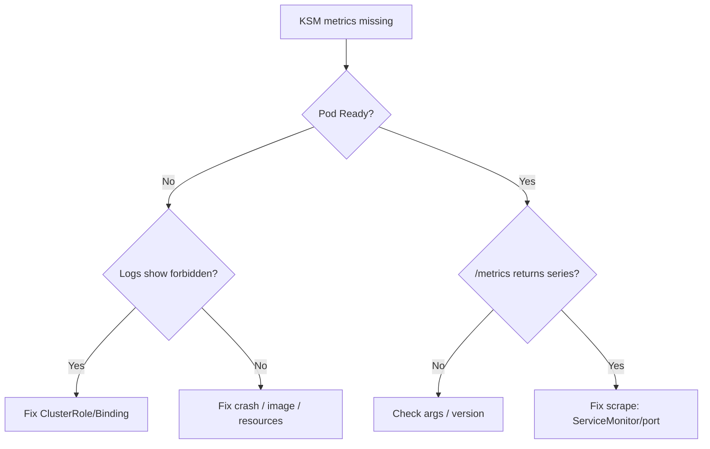

# kube-state-metrics Down

> **Severity:** High · **Typical recovery time:** 10–30 min · **Affected versions:** 1.19+

## Error Message

```text
# Prometheus target for kube-state-metrics is DOWN, or /metrics returns almost nothing:
kube_pod_status_phase  -> no data
forbidden: User "system:serviceaccount:monitoring:kube-state-metrics" cannot list resource "pods" in API group "" at the cluster scope
```

## Description

kube-state-metrics (KSM) is a separate exporter that listens to the Kubernetes
API and generates metrics about object state — `kube_pod_status_phase`,
`kube_deployment_status_replicas`, `kube_node_status_condition`, and many more.
It is not part of metrics-server and serves no resource-usage data; it serves
object-state data that most dashboards and alerts (CrashLooping, replica
mismatch, node NotReady) depend on.

When KSM is down or under-permitted, those dashboards go blank and a large class
of alerts stop firing. Two failure shapes dominate: the pod cannot reach or is
forbidden by the API (RBAC), or Prometheus cannot scrape the KSM Service
(discovery/connectivity).

## Affected Kubernetes Versions

Independent of Kubernetes version (1.19+). Pin the KSM image to a version
compatible with the cluster — running an old KSM against a newer API can drop
metrics for resources whose schema changed. KSM v2.x is the current line.

## Likely Root Causes

- ServiceAccount/ClusterRole missing list/watch on required resources (RBAC forbidden)
- Pod not Ready (crash loop, image pull, OOM) so /metrics is unreachable
- Prometheus not scraping it (ServiceMonitor selector or port mismatch)
- KSM version incompatible with the cluster, silently emitting fewer series

## Diagnostic Flow



## Verification Steps

Check the pod state and logs for RBAC denials first, then confirm /metrics
returns data and that Prometheus is scraping it.

## kubectl Commands

```bash
kubectl get pods -n monitoring -l app.kubernetes.io/name=kube-state-metrics
kubectl logs -n monitoring -l app.kubernetes.io/name=kube-state-metrics --tail=100
kubectl auth can-i list pods --as=system:serviceaccount:monitoring:kube-state-metrics
kubectl get clusterrole kube-state-metrics -o yaml
kubectl exec -n monitoring <prometheus-pod> -c prometheus -- wget -qO- http://kube-state-metrics.monitoring:8080/metrics | head
```

## Expected Output

```text
NAME                                  READY   STATUS             RESTARTS
kube-state-metrics-7b9d8c6f4-2xk9p    0/1     CrashLoopBackOff   6

# Logs:
E0612 listwatch.go:... reflector.go: failed to list *v1.Pod:
  pods is forbidden: User "system:serviceaccount:monitoring:kube-state-metrics"
  cannot list resource "pods" in API group "" at the cluster scope

# can-i:
no
```

## Common Fixes

1. Restore the ClusterRole/ClusterRoleBinding granting list/watch on the needed resources
2. Fix the pod fault (image, resources) so it becomes Ready
3. Correct the ServiceMonitor/port so Prometheus discovers and scrapes it

## Recovery Procedures

1. If logs show `forbidden`, reapply the KSM RBAC manifest (ClusterRole + ClusterRoleBinding). Additive RBAC change; blast radius limited to the KSM ServiceAccount.
2. If the pod is crashing for another reason, fix the image/resources, then **disruptive (low risk):** `kubectl rollout restart deployment kube-state-metrics -n monitoring`. Blast radius is object-state metrics only — no workloads affected.
3. If scraping is the issue, align the ServiceMonitor selector and port (see ServiceMonitor page).

## Validation

```bash
kubectl get pods -n monitoring -l app.kubernetes.io/name=kube-state-metrics
```

Pod `1/1 Ready`, `/metrics` returning `kube_*` series, and `up{job="kube-state-metrics"}==1`
in Prometheus confirm recovery.

## Prevention

- Pin KSM to a cluster-compatible version and bump it during upgrades.
- Alert on `up{job="kube-state-metrics"}` and on KSM restarts.
- Keep RBAC manifests in version control alongside the Deployment.

## Related Errors

- [Prometheus Target Down](prometheus-target-down.md)
- [ServiceMonitor Not Scraped](servicemonitor-not-scraped.md)
- [Grafana Datasource Error](grafana-datasource-error.md)

## References

- [kube-state-metrics documentation](https://github.com/kubernetes/kube-state-metrics/tree/main/docs)
- [Kubernetes: Using RBAC authorization](https://kubernetes.io/docs/reference/access-authn-authz/rbac/)
