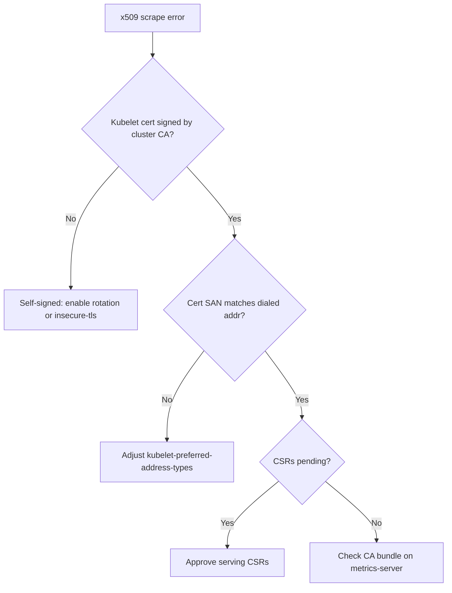

# metrics-server Kubelet x509

> **Severity:** High · **Typical recovery time:** 10–20 min · **Affected versions:** 1.19+

## Error Message

```text
E0612 09:14:22.114 1 scraper.go:140] "Failed to scrape node" err="unable to fully scrape metrics from node node-1: unable to fetch metrics from node node-1: Get \"https://10.0.1.5:10250/metrics/resource\": x509: cannot validate certificate for 10.0.1.5 because it doesn't contain any IP SANs"
```

## Description

metrics-server connects to each node's kubelet over HTTPS on port 10250 to read
the resource metrics endpoint. Many kubelets present a self-signed serving
certificate, or a certificate whose Subject Alternative Names do not include the
node IP that metrics-server dialed. The Go TLS stack then refuses to validate
the certificate and the scrape fails.

When scrapes fail for every node, the metrics API has no data and the
APIService eventually reports `ServiceUnavailable`, so `kubectl top` and CPU/
memory HPAs stop working. This is one of the most common metrics-server
installation failures, especially on kubeadm and bare-metal clusters.

## Affected Kubernetes Versions

Applies to 1.19+. Since metrics-server 0.4 the manifest no longer ships
`--kubelet-insecure-tls` by default, so fresh installs on clusters without
properly signed kubelet serving certificates hit this immediately. Clusters
that enable kubelet serving certificate rotation (`serverTLSBootstrap: true`)
plus an approving controller avoid it cleanly.

## Likely Root Causes

- Kubelet uses a self-signed serving cert that metrics-server will not trust
- Kubelet serving certificate has no IP SAN matching the dialed address
- metrics-server told to prefer InternalIP but cert lists hostnames only
- Pending kubelet serving CSRs never approved (no rotation controller)

## Diagnostic Flow



## Verification Steps

Confirm the failure is TLS validation (not connection refused) and inspect the
certificate the kubelet actually serves.

## kubectl Commands

```bash
kubectl logs -n kube-system -l k8s-app=metrics-server --tail=100
kubectl get csr
kubectl get pod -n kube-system -l k8s-app=metrics-server -o yaml | grep -A8 args
kubectl get nodes -o wide
kubectl get cm kubelet-config -n kube-system -o yaml | grep -i serverTLSBootstrap
```

## Expected Output

```text
NAME        AGE   SIGNERNAME                                    REQUESTOR                 CONDITION
csr-7x2k9   12m   kubernetes.io/kubelet-serving                system:node:node-1        Pending
csr-9a1bd   12m   kubernetes.io/kubelet-serving                system:node:node-2        Pending

"unable to fully scrape metrics from node node-1: ... x509: cannot validate
certificate for 10.0.1.5 because it doesn't contain any IP SANs"
```

## Common Fixes

1. Enable kubelet serving certificate rotation and approve the serving CSRs so kubelets present cluster-CA-signed certs with correct SANs
2. Set metrics-server `--kubelet-preferred-address-types=InternalIP` to match the cert
3. As a last resort on trusted networks, add `--kubelet-insecure-tls`

## Recovery Procedures

1. List CSRs; if kubelet-serving requests are pending, approve them: **Disruptive (control plane action, low risk):** `kubectl certificate approve <csr>`. This issues real serving certs; blast radius is the kubelet TLS layer only.
2. If certs are self-signed by design, edit the metrics-server Deployment args. **Disruptive:** `kubectl rollout restart deployment metrics-server -n kube-system` briefly drops the metrics API during rollout; no workloads impacted.
3. For permanent correctness, set `serverTLSBootstrap: true` in the kubelet config and run an approving controller, then restart kubelets node by node. **Disruptive:** restart kubelets in a rolling fashion to avoid losing node heartbeats cluster-wide.

## Validation

```bash
kubectl logs -n kube-system -l k8s-app=metrics-server --tail=20
kubectl top nodes
```

No x509 lines and a populated `kubectl top nodes` confirm the fix.

## Prevention

- Standardize on cluster-CA-signed kubelet serving certs with rotation.
- Avoid `--kubelet-insecure-tls` outside trusted lab environments.
- Alert on metrics-server scrape error rate, not just pod readiness.

## Related Errors

- [metrics-server Unavailable](metrics-server-unavailable.md)
- [node-exporter Permission Denied](node-exporter-permission-denied.md)
- [Prometheus Target Down](prometheus-target-down.md)

## References

- [Kubernetes: Kubelet TLS bootstrapping](https://kubernetes.io/docs/reference/access-authn-authz/kubelet-tls-bootstrapping/)
- [Kubernetes: Resource metrics pipeline](https://kubernetes.io/docs/tasks/debug/debug-cluster/resource-metrics-pipeline/)
