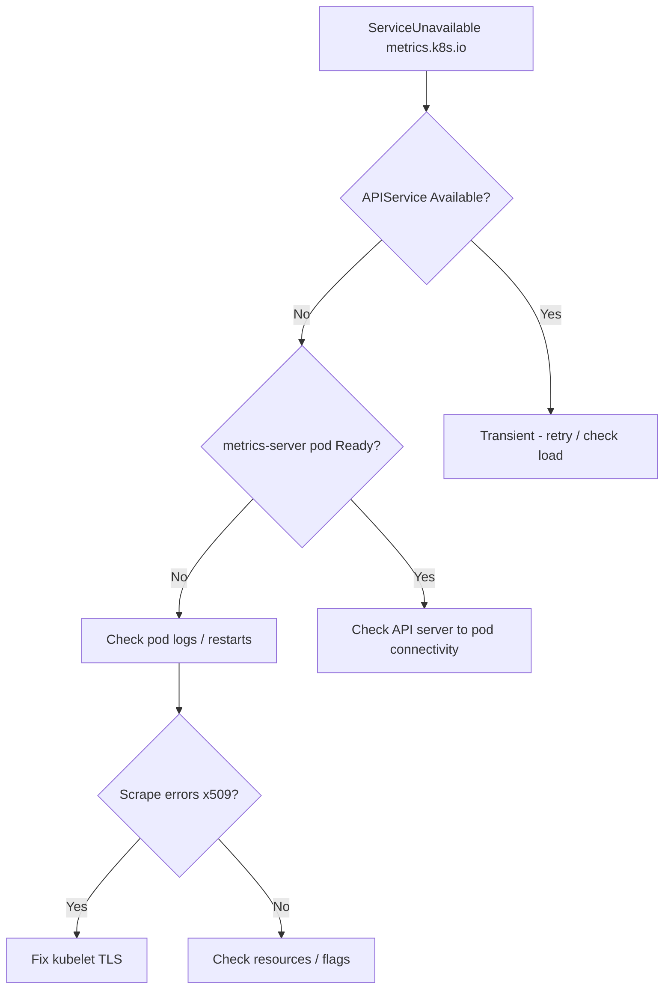

# metrics-server Unavailable

> **Severity:** High · **Typical recovery time:** 10–30 min · **Affected versions:** 1.19+

## Error Message

```text
Error from server (ServiceUnavailable): the server is currently unable to handle the request (metrics.k8s.io)
```

## Description

This appears when you run `kubectl top nodes`, `kubectl top pods`, or when a
HorizontalPodAutoscaler tries to read resource metrics. The Kubernetes
aggregation layer registers `metrics.k8s.io` as an APIService backed by the
metrics-server Deployment. When the API server proxies a request to that
APIService and the backing pod is unreachable, crash-looping, or failing its
own health checks, the aggregator returns `ServiceUnavailable`.

During an incident this is high impact: every HPA that targets CPU or memory
stops scaling, and `kubectl top` goes dark, so you lose your fastest read on
resource pressure. The error is reported by the API server, not metrics-server
itself, so the root cause is almost always one layer deeper.

## Affected Kubernetes Versions

Applies to all clusters using the aggregated metrics API (1.19+). The APIService
object `v1beta1.metrics.k8s.io` is stable across these versions. On 1.21+ the
metrics-server default manifest sets `--kubelet-insecure-tls` off by default,
which is a common cause of the related x509 failure.

## Likely Root Causes

- metrics-server pod is not Ready (crash loop, OOMKilled, or failing probes)
- metrics-server cannot scrape kubelets (x509/TLS or network policy)
- APIService `v1beta1.metrics.k8s.io` shows `Available: False`
- Aggregation layer misconfigured (firewall between API server and pod network)

## Diagnostic Flow



## Verification Steps

Confirm the APIService is the failing component and identify whether the pod is
the problem or the connectivity to it.

## kubectl Commands

```bash
kubectl get apiservices v1beta1.metrics.k8s.io
kubectl describe apiservice v1beta1.metrics.k8s.io
kubectl get pods -n kube-system -l k8s-app=metrics-server
kubectl describe pod -n kube-system -l k8s-app=metrics-server
kubectl logs -n kube-system -l k8s-app=metrics-server --tail=100
kubectl get --raw "/apis/metrics.k8s.io/v1beta1/nodes" | head -c 300
```

## Expected Output

```text
NAME                     SERVICE                      AVAILABLE                      AGE
v1beta1.metrics.k8s.io   kube-system/metrics-server   False (MissingEndpoints)       42d

Conditions:
  Type        Status  Reason            Message
  Available   False   MissingEndpoints  no endpoints available for service "metrics-server"
```

## Common Fixes

1. Restart or roll out metrics-server once the underlying pod fault is fixed
2. Resolve the kubelet scrape error (TLS, address type, or network policy)
3. Raise the metrics-server memory limit if it is being OOMKilled

## Recovery Procedures

1. Read the pod logs to classify the failure (TLS, OOM, flag error).
2. If a NetworkPolicy blocks the API server, allow ingress to metrics-server.
3. **Disruptive:** `kubectl rollout restart deployment metrics-server -n kube-system`. Blast radius is limited to the metrics path — HPA and `kubectl top` are briefly unavailable during the rollout, but no application workloads are affected.
4. If the APIService object is stale, delete and reapply the metrics-server manifest. **Disruptive:** deleting the APIService removes the metrics API until the new one registers.

## Validation

```bash
kubectl top nodes
kubectl get apiservice v1beta1.metrics.k8s.io
```

`Available: True` and a populated `kubectl top` table confirm recovery.

## Prevention

- Set resource requests/limits and a PodDisruptionBudget on metrics-server.
- Run two replicas with anti-affinity on larger clusters.
- Add an alert on `apiservice` availability and on metrics-server restarts.

## Related Errors

- [metrics-server Kubelet x509](metrics-server-kubelet-x509.md)
- [kube-state-metrics Down](kube-state-metrics-down.md)
- [Prometheus Target Down](prometheus-target-down.md)

## References

- [Kubernetes: Resource metrics pipeline](https://kubernetes.io/docs/tasks/debug/debug-cluster/resource-metrics-pipeline/)
- [Kubernetes: Aggregation layer](https://kubernetes.io/docs/concepts/extend-kubernetes/api-extension/apiserver-aggregation/)
