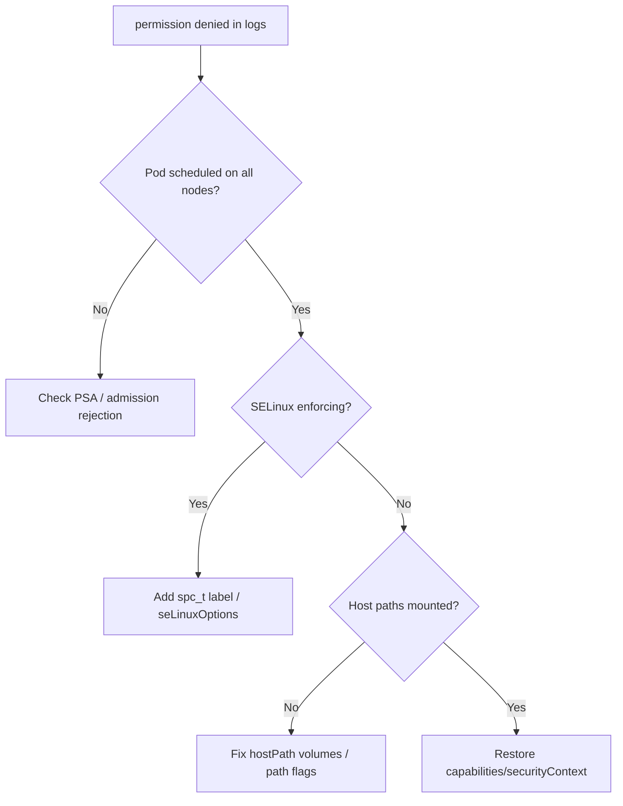

# node-exporter Permission Denied

> **Severity:** Medium · **Typical recovery time:** 10–30 min · **Affected versions:** 1.19+

## Error Message

```text
level=error collector=filesystem msg="failed to read" err="open /host/proc/1/mountinfo: permission denied"
level=error msg="couldn't get statistics" err="reading /host/sys/class/...: permission denied"
ts=... caller=node_exporter.go ... error="permission denied"
```

## Description

node-exporter runs as a DaemonSet and reads host-level metrics by mounting the
node's `/proc`, `/sys`, and root filesystem (typically at `/host/proc`,
`/host/sys`, `/host/root`). It needs to read paths owned by root and, on
hardened or SELinux/AppArmor-enforced nodes, additional privileges. When the
container's SecurityContext, Pod Security Standards, or an SELinux label blocks
those reads, individual collectors log "permission denied" and emit incomplete
or zero metrics for the affected node.

This is medium severity: node and hardware dashboards (CPU, memory, disk,
network per node) go partial or blank, and capacity/saturation alerts may stop
firing for those nodes. The exporter often still serves /metrics, so Prometheus
shows it UP while the data is silently incomplete.

## Affected Kubernetes Versions

Independent of Kubernetes version (1.19+). Most relevant where Pod Security
Admission (1.25+ enforced) restricts hostPath/privileged pods, or where SELinux
is `enforcing`. The node-exporter namespace must allow the `privileged` PSA
level (or an exception) for hostPath mounts and the required capabilities.

## Likely Root Causes

- SecurityContext drops capabilities or runs as non-root without access to host paths
- Pod Security Admission blocks hostPath/privileged in the namespace
- SELinux/AppArmor denying reads of `/proc` and `/sys` (missing `spc_t`/label)
- hostPath mounts missing or mounted read-write-restricted; wrong `--path.*` flags

## Diagnostic Flow



## Verification Steps

Read the exporter logs to see which collector and path are denied, and check
whether admission is rejecting the pod versus the container being denied at
runtime.

## kubectl Commands

```bash
kubectl get ds -n monitoring -l app.kubernetes.io/name=node-exporter
kubectl get pods -n monitoring -l app.kubernetes.io/name=node-exporter -o wide
kubectl logs -n monitoring -l app.kubernetes.io/name=node-exporter --tail=100
kubectl get events -n monitoring --sort-by=.lastTimestamp | grep -i node-exporter
kubectl get ns monitoring -o jsonpath='{.metadata.labels}'
kubectl get pod -n monitoring <node-exporter-pod> -o jsonpath='{.spec.containers[0].securityContext}{"\n"}{.spec.volumes}'
```

## Expected Output

```text
# Admission rejection in events:
Warning  FailedCreate  ... violates PodSecurity "restricted:latest":
  host path volumes (volumes "proc","sys","root"), privileged ...

# Or runtime denial in logs:
level=error collector=filesystem err="open /host/proc/1/mountinfo: permission denied"

# Namespace labels missing privileged enforcement:
{"kubernetes.io/metadata.name":"monitoring"}
```

## Common Fixes

1. Label the namespace for the `privileged` Pod Security Standard so hostPath/privileged pods are admitted
2. Restore the correct SecurityContext (capabilities, `runAsUser`, `seLinuxOptions`) for host reads
3. Ensure `/proc`, `/sys`, `/` hostPath mounts and `--path.*` flags are correct

## Recovery Procedures

1. If events show PSA rejection, set the namespace label `pod-security.kubernetes.io/enforce: privileged` (or add an exemption). Additive label change; blast radius limited to that namespace's admission policy.
2. For SELinux denials, add the appropriate `seLinuxOptions` (e.g. type `spc_t`) to the pod spec.
3. Reapply the corrected DaemonSet manifest with the right hostPath volumes and SecurityContext.
4. **Disruptive (low risk):** `kubectl rollout restart daemonset node-exporter -n monitoring` to reschedule with new settings. Blast radius is per-node metrics briefly during the rolling restart; no workloads affected.

## Validation

```bash
kubectl logs -n monitoring -l app.kubernetes.io/name=node-exporter --tail=20
kubectl exec -n monitoring <node-exporter-pod> -- wget -qO- http://localhost:9100/metrics | grep node_cpu_seconds_total | head
```

No permission-denied lines and populated `node_*` series confirm recovery.

## Prevention

- Keep the monitoring namespace's PSA level appropriate for host-level exporters.
- Manage node-exporter SecurityContext and SELinux options in version control.
- Alert when per-node `node_*` series count drops, not just on target up/down.

## Related Errors

- [Prometheus Target Down](prometheus-target-down.md)
- [kube-state-metrics Down](kube-state-metrics-down.md)
- [metrics-server Kubelet x509](metrics-server-kubelet-x509.md)

## References

- [Kubernetes: Pod Security Standards](https://kubernetes.io/docs/concepts/security/pod-security-standards/)
- [Prometheus: node_exporter](https://github.com/prometheus/node_exporter)
