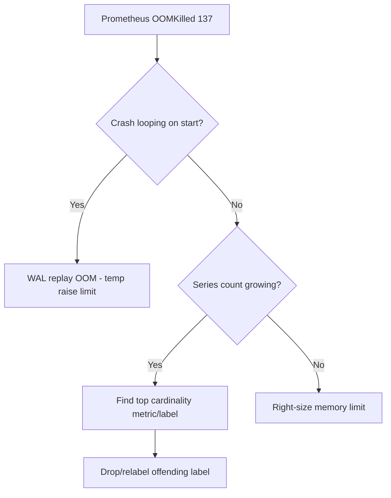

# Prometheus OOMKilled (Cardinality)

> **Severity:** Critical · **Typical recovery time:** 30–90 min · **Affected versions:** 1.19+

## Error Message

```text
Last State:     Terminated
  Reason:       OOMKilled
  Exit Code:    137
Warning  OOMKilling  Memory cgroup out of memory: Killed process 1 (prometheus)
```

## Description

Prometheus holds the head block of every active time series in memory, plus
indexes for fast querying. Memory usage scales with the number of distinct
series (cardinality), not the number of targets. A single label with unbounded
values — a request ID, a full URL path, a pod UID, or a user email — multiplies
series count and can drive the process past its container memory limit, where
the kernel OOM-kills it (exit code 137).

This is critical because Prometheus restarts, must replay its WAL (slow and
memory-hungry), and frequently OOMs again before it finishes — a crash loop that
leaves you with no monitoring during an incident. The fix is almost always to
reduce cardinality, not to keep raising the memory limit.

## Affected Kubernetes Versions

Independent of Kubernetes version (1.19+). The OOMKilled signalling and cgroup
behaviour are the same across these releases; the trigger is the Prometheus
workload, not the cluster version.

## Likely Root Causes

- A high-cardinality label (request_id, path, uuid, email) on a hot metric
- A new exporter or ServiceMonitor adding millions of series at once
- Memory limit set far below the working set after target growth
- WAL replay after a crash needing more memory than steady state

## Diagnostic Flow



## Verification Steps

Confirm the kill reason is memory, then locate the metric and label driving the
series count before changing any limits.

## kubectl Commands

```bash
kubectl get pod -n monitoring -l app.kubernetes.io/name=prometheus -o wide
kubectl describe pod -n monitoring <prometheus-pod> | grep -A5 "Last State"
kubectl top pod -n monitoring -l app.kubernetes.io/name=prometheus
kubectl get pod -n monitoring <prometheus-pod> -o jsonpath='{.spec.containers[?(@.name=="prometheus")].resources}'
```

Use the Prometheus UI for the cardinality breakdown:
`topk(10, count by (__name__)({__name__=~".+"}))` and
`/api/v1/status/tsdb` (top series and label values).

## Expected Output

```text
Last State:   Terminated
  Reason:     OOMKilled
  Exit Code:  137

TSDB status (top series count):
  http_requests_total{path=...}   4821334
  Highest cardinality labels:
    path     2200145
    user_id  1903221
```

## Common Fixes

1. Drop or aggregate the high-cardinality label with `metric_relabel_configs`
2. Fix the instrumented app to stop emitting unbounded label values
3. Right-size memory requests/limits to the real working set (after fixing cardinality)

## Recovery Procedures

1. To break a WAL-replay crash loop, temporarily raise the memory limit so the process can finish replay and become queryable.
2. Add `metric_relabel_configs` to drop the offending label or metric, then reload.
3. **Disruptive (data loss):** if replay never completes, delete the WAL/corrupt block under the data dir for that pod. Blast radius is loss of unpersisted recent samples for that Prometheus instance only — do this only after replay repeatedly OOMs.
4. **Disruptive:** `kubectl rollout restart statefulset prometheus-k8s -n monitoring` to apply config; monitoring is unavailable during restart.

## Validation

```bash
kubectl get pod -n monitoring -l app.kubernetes.io/name=prometheus
kubectl top pod -n monitoring -l app.kubernetes.io/name=prometheus
```

Steady memory below the limit, no new OOM events, and series count holding flat
confirm recovery. Re-check `topk` series counts after an hour.

## Prevention

- Enforce `sample_limit`/`label_limit` per scrape and review new exporters.
- Add alerts on `prometheus_tsdb_head_series` growth rate.
- Code-review instrumentation for unbounded label values before merge.

## Related Errors

- [Prometheus WAL Disk Full](prometheus-wal-disk-full.md)
- [Prometheus Target Down](prometheus-target-down.md)
- [ServiceMonitor Not Scraped](servicemonitor-not-scraped.md)

## References

- [Prometheus: Storage and TSDB](https://prometheus.io/docs/prometheus/latest/storage/)
- [Kubernetes: Assign memory resources](https://kubernetes.io/docs/tasks/configure-pod-container/assign-memory-resource/)
