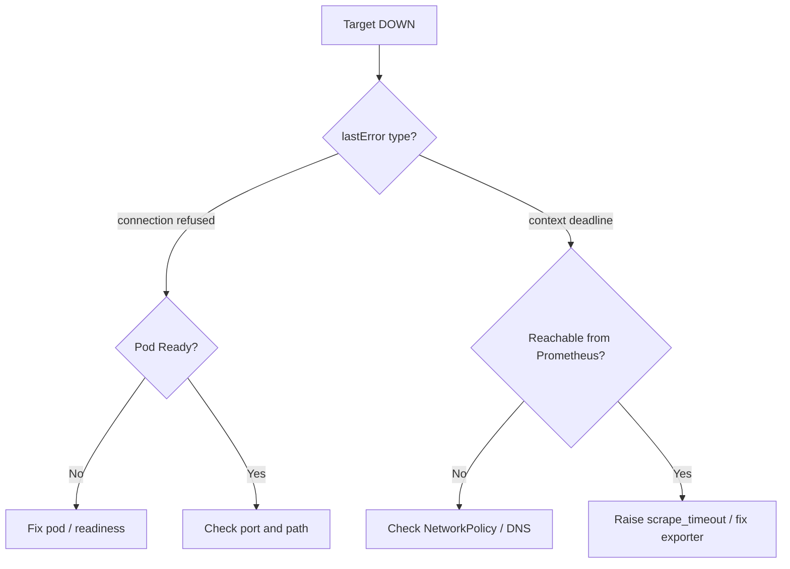

# Prometheus Target Down

> **Severity:** High · **Typical recovery time:** 5–30 min · **Affected versions:** 1.19+

## Error Message

```text
Get "http://10.244.3.17:8080/metrics": dial tcp 10.244.3.17:8080: connect: connection refused
Get "http://10.244.3.17:8080/metrics": context deadline exceeded (Client.Timeout exceeded while awaiting headers)
```

## Description

A Prometheus target moves to `DOWN` when a scrape fails. The Targets page and
the `up` metric (`up == 0`) record the reason in the `lastError` field.
`connection refused` means nothing is listening on the target IP and port —
the pod is gone, not ready, or exposing metrics on a different port.
`context deadline exceeded` means the connection was attempted but the endpoint
did not respond within `scrape_timeout`, typically because the exporter is slow,
overloaded, or a NetworkPolicy is silently dropping packets.

During an incident a down target means you are blind to that component. Worse,
alerts that depend on its series may evaluate against stale or absent data,
producing false silence. Triage starts by deciding which of the two error
classes you are seeing.

## Affected Kubernetes Versions

Independent of Kubernetes version (1.19+); this is a Prometheus scrape behaviour.
Behaviour differs only by how targets are discovered — static config, the
Prometheus Operator (ServiceMonitor/PodMonitor), or Kubernetes SD.

## Likely Root Causes

- Target pod not Ready, restarting, or terminated (connection refused)
- Wrong port or path in the scrape config / ServiceMonitor
- NetworkPolicy blocking Prometheus from reaching the target (deadline)
- Exporter overloaded or `scrape_timeout` too low for the payload size

## Diagnostic Flow



## Verification Steps

Confirm the exact `lastError` per target and whether the endpoint exists, then
test reachability from the Prometheus pod's network namespace.

## kubectl Commands

```bash
kubectl get pods -n monitoring -l app.kubernetes.io/name=prometheus
kubectl get endpoints <target-service> -n <namespace>
kubectl get pod <target-pod> -n <namespace> -o jsonpath='{.spec.containers[*].ports}'
kubectl get networkpolicy -A
kubectl exec -n monitoring <prometheus-pod> -c prometheus -- wget -qO- --timeout=5 http://<target-ip>:<port>/metrics | head
```

## Expected Output

```text
Endpoint Targets (Prometheus UI / API):
  Endpoint                              State  Last Scrape  Error
  http://10.244.3.17:8080/metrics       DOWN   12s ago      connect: connection refused

up{job="my-app",instance="10.244.3.17:8080"} 0
```

## Common Fixes

1. Restore target readiness so the metrics port accepts connections
2. Correct the port name/number and metrics path in the ServiceMonitor or scrape config
3. Add a NetworkPolicy rule allowing Prometheus to reach the target; or raise `scrape_timeout`

## Recovery Procedures

1. Identify whether the target pod is Ready and listening on the expected port.
2. If a NetworkPolicy is the cause, add ingress allowing the Prometheus pod selector — additive change, no blast radius.
3. If the exporter is overloaded, raise `scrape_timeout`/`scrape_interval` in the scrape config or ServiceMonitor.
4. **Disruptive:** restarting the target workload (`kubectl rollout restart deployment <target>`) recovers a wedged exporter; blast radius is that workload's availability during rollout.

## Validation

In Prometheus run `up{job="<job>"}` and confirm it returns `1`; the Targets page
should show `UP` with a recent successful scrape.

## Prevention

- Alert on `up == 0` and on `count(up) by (job)` dropping.
- Define readiness probes on exporters so unready pods leave the endpoints list.
- Keep ServiceMonitor port names in sync with Service port names in CI.

## Related Errors

- [ServiceMonitor Not Scraped](servicemonitor-not-scraped.md)
- [kube-state-metrics Down](kube-state-metrics-down.md)
- [node-exporter Permission Denied](node-exporter-permission-denied.md)

## References

- [Prometheus: Configuration](https://prometheus.io/docs/prometheus/latest/configuration/configuration/)
- [Kubernetes: Network policies](https://kubernetes.io/docs/concepts/services-networking/network-policies/)
