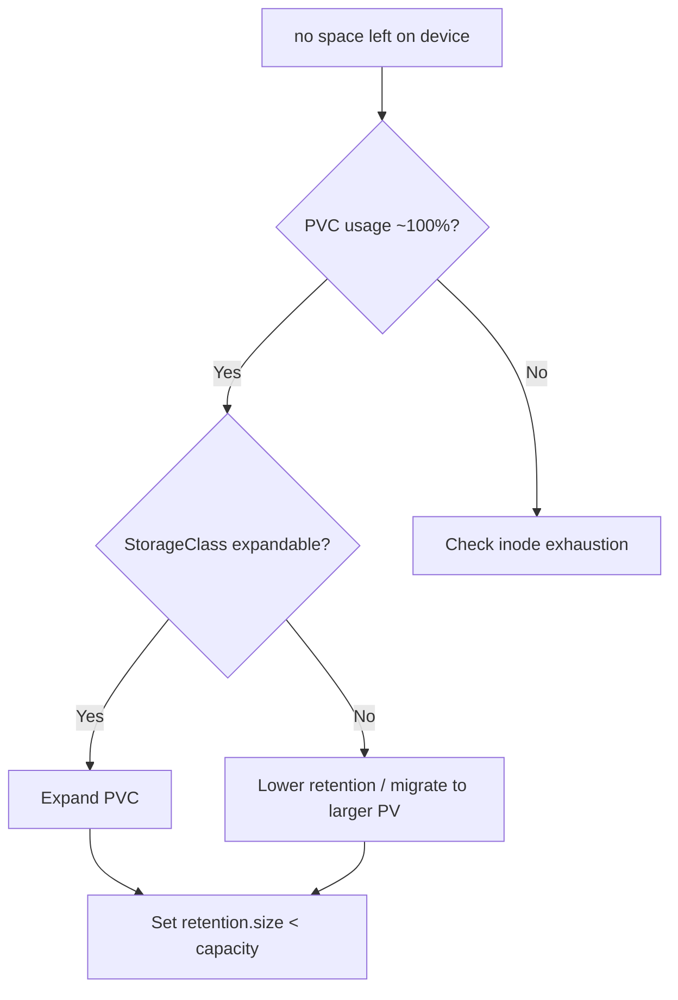

# Prometheus WAL Disk Full

> **Severity:** Critical · **Typical recovery time:** 20–60 min · **Affected versions:** 1.19+

## Error Message

```text
level=error msg="write to WAL" err="write /prometheus/wal/00001234: no space left on device"
level=error component=tsdb msg="compact head" err="no space left on device"
```

## Description

Prometheus writes every incoming sample to a write-ahead log (WAL) on its
persistent volume before flushing compacted blocks to the TSDB. When the volume
fills, WAL writes fail, the head block cannot be persisted, and Prometheus stops
ingesting samples — you lose data for the entire scrape fleet, not one target.
On restart it may also fail to replay a truncated WAL, leading to a crash loop.

This is critical: monitoring goes dark exactly when you need it. The disk fills
either because retention/size settings exceed the PVC, because series cardinality
grew, or because old blocks were not compacted. The durable fix is sizing and
retention, not repeatedly clearing space.

## Affected Kubernetes Versions

Independent of Kubernetes version (1.19+). The PVC and StorageClass behaviour are
standard Kubernetes; the trigger is Prometheus TSDB growth on a fixed-size
PersistentVolume. Volume expansion requires a StorageClass with
`allowVolumeExpansion: true`.

## Likely Root Causes

- PVC too small for retention (`--storage.tsdb.retention.time/.size`)
- Series cardinality growth inflating WAL and head block size
- `retention.size` unset or larger than the volume capacity
- Failed compaction leaving stale blocks; orphaned snapshots

## Diagnostic Flow



## Verification Steps

Confirm the volume (not memory) is full and identify whether retention settings
or cardinality drove the growth.

## kubectl Commands

```bash
kubectl get pvc -n monitoring
kubectl exec -n monitoring <prometheus-pod> -c prometheus -- df -h /prometheus
kubectl exec -n monitoring <prometheus-pod> -c prometheus -- du -sh /prometheus/wal /prometheus/chunks_head
kubectl get pod -n monitoring <prometheus-pod> -o jsonpath='{.spec.containers[?(@.name=="prometheus")].args}'
kubectl get sc <storageclass> -o jsonpath='{.allowVolumeExpansion}'
```

## Expected Output

```text
Filesystem      Size  Used Avail Use% Mounted on
/dev/nvme1n1    50G   50G   0    100% /prometheus

8.9G    /prometheus/wal
1.2G    /prometheus/chunks_head

args: ["--storage.tsdb.retention.time=30d"]   # no retention.size set
```

## Common Fixes

1. Expand the PVC if the StorageClass allows volume expansion
2. Set `--storage.tsdb.retention.size` below the volume capacity and lower `retention.time`
3. Reduce cardinality so WAL and head blocks shrink (see cardinality page)

## Recovery Procedures

1. **Disruptive:** edit the PVC `spec.resources.requests.storage` to a larger size if expandable; the volume grows online on most CSI drivers. Blast radius: brief I/O pause; no data loss.
2. If not expandable, set a smaller `retention.time`/`retention.size` and **disruptive (data loss):** delete the oldest TSDB block directories under `/prometheus` to free space immediately. Blast radius is loss of the oldest historical samples on that instance.
3. **Disruptive:** `kubectl rollout restart statefulset prometheus-k8s -n monitoring` to apply new args; monitoring is unavailable during restart.

## Validation

```bash
kubectl exec -n monitoring <prometheus-pod> -c prometheus -- df -h /prometheus
kubectl get pod -n monitoring -l app.kubernetes.io/name=prometheus
```

Free space available, pod Running and Ready, and successful WAL writes in the log
confirm recovery.

## Prevention

- Always set `retention.size` to roughly 80% of PVC capacity.
- Alert on `prometheus_tsdb_storage_blocks_bytes` and PVC `kubelet_volume_stats_available_bytes`.
- Use an expandable StorageClass and size PVCs from real ingest rate.

## Related Errors

- [Prometheus OOMKilled (Cardinality)](prometheus-oomkilled-cardinality.md)
- [Prometheus Target Down](prometheus-target-down.md)
- [kube-state-metrics Down](kube-state-metrics-down.md)

## References

- [Prometheus: Storage and TSDB](https://prometheus.io/docs/prometheus/latest/storage/)
- [Kubernetes: Expanding persistent volumes](https://kubernetes.io/docs/concepts/storage/persistent-volumes/#expanding-persistent-volumes-claims)
