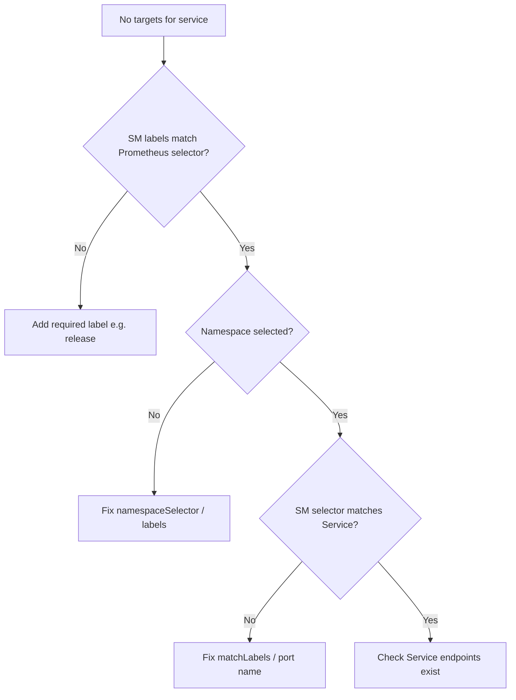

# ServiceMonitor Not Scraped

> **Severity:** Medium · **Typical recovery time:** 10–30 min · **Affected versions:** 1.19+

## Error Message

```text
ServiceMonitor not discovered by Prometheus Operator
(no targets appear under Status > Targets; up{job="<svc>"} returns no data)
```

## Description

The Prometheus Operator turns ServiceMonitor and PodMonitor objects into scrape
configuration. A Prometheus custom resource selects which ServiceMonitors to
include using `serviceMonitorSelector` and `serviceMonitorNamespaceSelector`. If
a ServiceMonitor's labels do not match the selector, or it lives in a namespace
the Prometheus is not allowed to read, the Operator silently ignores it — no
error is logged on the object, the target simply never appears.

This is the most common reason "I added a ServiceMonitor but Prometheus shows
nothing." Unlike a target that is DOWN, here there is no target at all. The
problem is matching, not connectivity, so the fix is in labels and selectors.

## Affected Kubernetes Versions

Independent of Kubernetes version (1.19+); behaviour is defined by the Prometheus
Operator version. Note that kube-prometheus-stack sets a `release` label
requirement on ServiceMonitors by default — a frequent gotcha after Helm installs.

## Likely Root Causes

- ServiceMonitor labels do not match the Prometheus `serviceMonitorSelector`
- ServiceMonitor namespace not allowed by `serviceMonitorNamespaceSelector`
- ServiceMonitor `selector`/`endpoints.port` does not match the Service ports
- The Service has no Ready endpoints, or the port is referenced by wrong name

## Diagnostic Flow



## Verification Steps

Read the Prometheus CR selectors first, then confirm the ServiceMonitor labels,
namespace, and port references line up with the Service.

## kubectl Commands

```bash
kubectl get prometheus -A -o jsonpath='{range .items[*]}{.metadata.name}{": "}{.spec.serviceMonitorSelector}{"\n"}{end}'
kubectl get servicemonitor <name> -n <ns> -o yaml
kubectl get svc <svc> -n <ns> --show-labels
kubectl get endpoints <svc> -n <ns>
kubectl logs -n monitoring -l app.kubernetes.io/name=prometheus-operator --tail=100
```

## Expected Output

```text
prometheus-k8s: {"matchLabels":{"release":"kube-prometheus-stack"}}

# ServiceMonitor metadata.labels:
labels:
  app: my-app          # <-- missing required "release" label

# Operator log:
level=info msg="skipping servicemonitor" servicemonitor=my-ns/my-app
  reason="does not match serviceMonitorSelector"
```

## Common Fixes

1. Add the label the Prometheus `serviceMonitorSelector` requires (often `release: <stack>`)
2. Ensure the ServiceMonitor namespace matches `serviceMonitorNamespaceSelector`
3. Align `spec.selector.matchLabels` and `endpoints.port` with the target Service

## Recovery Procedures

1. Compare the Prometheus CR selectors against the ServiceMonitor labels and namespace.
2. Patch the ServiceMonitor labels/selector to match — additive metadata change, no blast radius.
3. The Operator reconciles automatically; if it appears stuck, **disruptive (low risk):** `kubectl rollout restart deployment prometheus-operator -n monitoring`. Blast radius is config regeneration only; existing Prometheus pods keep scraping.

## Validation

In the Prometheus UI, the new job appears under Status > Targets as `UP`, and
`up{job="<svc>"}` returns `1`. Confirm `/api/v1/targets` lists the endpoints.

## Prevention

- Template ServiceMonitors so required selector labels are always set.
- Lint that ServiceMonitor `endpoints.port` names exist on the Service in CI.
- Document the cluster's `serviceMonitorSelector` convention for app teams.

## Related Errors

- [Prometheus Target Down](prometheus-target-down.md)
- [kube-state-metrics Down](kube-state-metrics-down.md)
- [Grafana Datasource Error](grafana-datasource-error.md)

## References

- [Prometheus Operator: ServiceMonitor design](https://prometheus-operator.dev/docs/developer/getting-started/)
- [Prometheus: Kubernetes service discovery](https://prometheus.io/docs/prometheus/latest/configuration/configuration/#kubernetes_sd_config)
