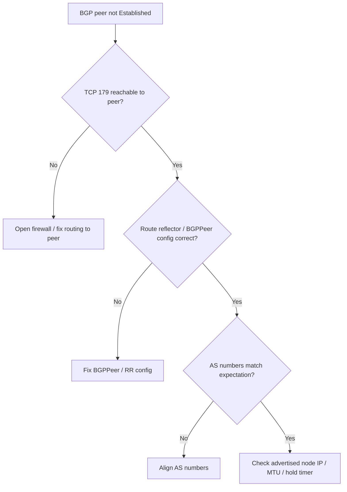

# Calico BGP Peering Down

> **Severity:** Critical · **Typical recovery time:** 20–60 min · **Affected versions:** 1.20+

## Error Message

```text
calico/node is not ready: BIRD is not ready: BGP not established with 10.0.1.12
bird: BGP1: Connection lost (Connection refused)
bird: BGP2: Received: Hold timer expired
calicoctl: PEER ADDRESS | PEER TYPE | STATE   | INFO
          10.0.1.12     | node-to-node | start | Active   (not Established)
```

## Description

In BGP mode, Calico nodes peer over TCP 179 to exchange pod-network routes —
either full-mesh node-to-node or via route reflectors. When a session is not
`Established`, the routes for the affected pod CIDRs aren't distributed, so pods
behind the missing peer become unreachable across nodes. BIRD reports the
session stuck in `Active`/`Connect`/`Idle` and `calico-node` readiness fails.

This is Critical because routing gaps cause partial, hard-to-debug cross-node
connectivity loss: some pods reach each other and others time out depending on
which routes propagated.

## Affected Kubernetes Versions

Any Calico cluster using BGP routing (1.20+). Not applicable to VXLAN-only or
eBPF dataplanes where BGP is disabled. On-prem and bare-metal clusters peering
with physical routers are the most common place this surfaces.

## Likely Root Causes

- Firewall/security group blocking TCP 179 between nodes or to the router
- Route reflector down or misconfigured `BGPPeer`/`BGPConfiguration`
- AS number mismatch between peers
- Wrong node IP advertised (`IP_AUTODETECTION_METHOD` picked a bad NIC)
- MTU/asymmetric routing causing hold-timer expiry

## Diagnostic Flow



## Verification Steps

Confirm the session state (Active/Idle/Established) and test TCP 179
reachability to the peer from the calico-node pod. A connection refused or
timeout to 179 means a firewall or the peer's BGP daemon is the problem, not
Calico config.

## kubectl Commands

```bash
kubectl get pods -n kube-system -l k8s-app=calico-node -o wide
kubectl logs -n kube-system <calico-node-pod> --tail=60 | grep -i bgp
kubectl exec -n kube-system <calico-node-pod> -- sh -c 'ss -tn state established sport = :179 or dport = :179'
kubectl exec -n kube-system <calico-node-pod> -- nc -zv -w3 10.0.1.12 179
kubectl get bgppeers.crd.projectcalico.org -o yaml 2>/dev/null
```

## Expected Output

```text
bird: BGP1: Connection lost (Connection refused)

# 179 not reachable -> firewall or peer BGP down:
nc: connect to 10.0.1.12 port 179 (tcp) timed out: Operation now in progress

# Healthy state once fixed:
State    Recv-Q  Local Address:Port   Peer Address:Port
ESTAB    0       10.0.1.11:179        10.0.1.12:51234
```

## Common Fixes

1. Open TCP 179 between nodes (and to physical routers / route reflectors)
2. Fix the `BGPPeer`/`BGPConfiguration` (peer IP, AS number, route reflector)
3. Recover the route reflector(s) if the topology depends on them
4. Correct the advertised node IP via `IP_AUTODETECTION_METHOD`

## Recovery Procedures

1. Check session state and TCP 179 reachability to each declared peer.
2. If 179 is blocked, open it in the firewall/security group on both ends —
   this is the most common cause and is non-disruptive to fix.
3. Reconcile `BGPPeer`/`BGPConfiguration` (peer addresses, AS numbers, route
   reflector cluster ID). BIRD re-establishes automatically once config and
   reachability are correct.
4. If you must restart the dataplane to clear a stuck session, roll
   `calico-node`. **Disruptive — cluster network:** restarting calico-node
   reprograms routes per node; do it node by node to avoid a routing blackout.

## Validation

`calicoctl node status` (or the `ss`/BIRD log) shows every peer `Established`,
pod CIDR routes for peer nodes appear in `ip route`, and cross-node pod traffic
succeeds end to end.

## Prevention

- Keep TCP 179 firewall rules in version control and audited
- Use redundant route reflectors instead of relying on full mesh at scale
- Pin AS numbers and `IP_AUTODETECTION_METHOD` explicitly
- Alert on BGP session count dropping below the expected number of peers

## Related Errors

- [Calico Node Not Ready](./calico-node-not-ready.md)
- [Pod-to-Pod Timeout](./pod-to-pod-timeout.md)
- [CNI Config Uninitialized](./cni-config-uninitialized.md)

## References

- [Cluster Networking](https://kubernetes.io/docs/concepts/cluster-administration/networking/)
- [Network Plugins (CNI)](https://kubernetes.io/docs/concepts/extend-kubernetes/compute-storage-net/network-plugins/)

## Further Reading

- [DevOps AI ToolKit — Kubernetes guides](https://devopsaitoolkit.com/blog/)
