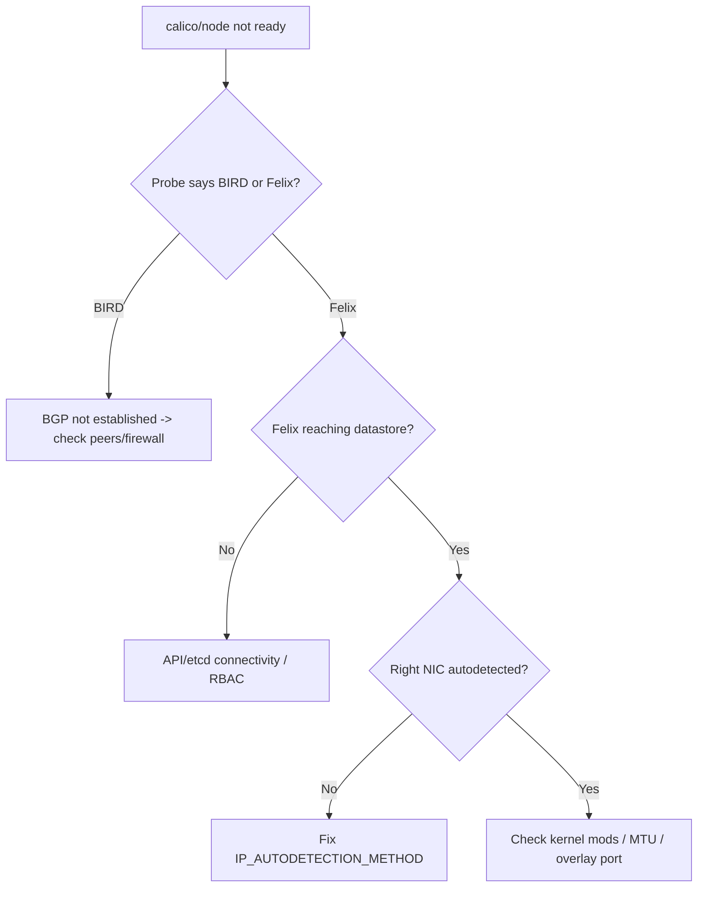

# Calico Node Not Ready

> **Severity:** Critical · **Typical recovery time:** 15–60 min · **Affected versions:** 1.20+

## Error Message

```text
Readiness probe failed: calico/node is not ready: BIRD is not ready:
  BGP not established with 10.0.1.12,10.0.1.13
calico/node is not ready: felix is not ready: readiness probe reporting 503
Warning  Unhealthy  ...  Readiness probe failed: calico/node is not ready
```

## Description

The `calico-node` DaemonSet runs two key components per node: Felix (programs
routes, iptables, and policy) and BIRD (the BGP daemon that distributes pod
routes). Its readiness probe fails when either isn't healthy. A node whose
`calico-node` is NotReady can't reliably route pod traffic — especially
cross-node — so pods there see timeouts, and new pods may be stuck because the
CNI isn't fully functional.

This is Critical because Calico is the dataplane; a NotReady `calico-node`
degrades connectivity and policy enforcement for everything on that node.

## Affected Kubernetes Versions

Any cluster running Calico as the CNI (1.20+). The BIRD/Felix readiness wording
is stable across Calico 3.x. Note: in VXLAN-only or eBPF-dataplane modes BIRD/BGP
may be disabled, so a "BIRD not ready" message is only relevant when BGP routing
is in use.

## Likely Root Causes

- BGP peering not established (see [Calico BGP Peering Down](./calico-bgp-peer-down.md))
- Felix failing to program iptables/routes (kernel modules, conntrack)
- Wrong `IP_AUTODETECTION_METHOD` picking the wrong NIC/IP
- MTU mismatch or blocked overlay port (VXLAN 4789 / IPIP)
- `calico-node` can't reach the datastore (Kubernetes API / etcd)

## Diagnostic Flow



## Verification Steps

Read the readiness message to see whether BIRD or Felix is failing. Check the
`calico-node` pod logs and the calico-node-to-datastore connectivity. If BIRD,
pivot to BGP peer status; if Felix, look at datastore reachability and dataplane
programming errors.

## kubectl Commands

```bash
kubectl get pods -n kube-system -l k8s-app=calico-node -o wide
kubectl describe pod -n kube-system <calico-node-pod> | grep -A3 -i readiness
kubectl logs -n kube-system <calico-node-pod> --tail=60
kubectl get nodes -o wide
kubectl exec -n kube-system <calico-node-pod> -- ip route | head
```

## Expected Output

```text
NAME                READY   STATUS    RESTARTS   AGE
calico-node-7g2kf   0/1     Running   0          12m

Readiness probe failed: calico/node is not ready: BIRD is not ready:
  BGP not established with 10.0.1.12

# log:
felix INFO  Failed to connect to datastore  error=Get https://10.96.0.1:443/...: i/o timeout
```

## Common Fixes

1. Restore BGP peering (firewall TCP 179, peer config, route reflectors)
2. Restore `calico-node` datastore connectivity (API/etcd reachability, RBAC)
3. Set the correct `IP_AUTODETECTION_METHOD` for the node's real NIC
4. Open the overlay port and align MTU across nodes

## Recovery Procedures

1. Determine BIRD vs. Felix from the readiness message.
2. **BIRD/BGP:** follow [Calico BGP Peering Down](./calico-bgp-peer-down.md) —
   verify TCP 179 reachability and peer/route-reflector config.
3. **Felix/datastore:** confirm `calico-node` can reach the API server
   ClusterIP; fix RBAC or network path. Correct `IP_AUTODETECTION_METHOD` if the
   wrong IP was chosen.
4. Roll the `calico-node` DaemonSet after a config change.
   **Disruptive — cluster network:** restarting calico-node briefly disrupts
   dataplane programming on each node; roll node by node, never all at once.

## Validation

All `calico-node` pods report `1/1 Ready`, `ip route` shows pod CIDR routes for
peer nodes, and cross-node pod-to-pod traffic succeeds.

## Prevention

- Pin `IP_AUTODETECTION_METHOD` instead of relying on first-found
- Keep TCP 179 and the overlay port open in node firewalls/security groups
- Standardise MTU across nodes and the overlay
- Alert on `calico-node` readiness and BGP session count

## Related Errors

- [Calico BGP Peering Down](./calico-bgp-peer-down.md)
- [CNI Config Uninitialized](./cni-config-uninitialized.md)
- [Pod-to-Pod Timeout](./pod-to-pod-timeout.md)

## References

- [Network Plugins (CNI)](https://kubernetes.io/docs/concepts/extend-kubernetes/compute-storage-net/network-plugins/)
- [Cluster Networking](https://kubernetes.io/docs/concepts/cluster-administration/networking/)

## Further Reading

- [DevOps AI ToolKit — Kubernetes guides](https://devopsaitoolkit.com/blog/)
