# Cilium Agent Not Ready

> **Severity:** Critical · **Typical recovery time:** 10–45 min · **Affected versions:** 1.21+

## Error Message

```text
Warning  FailedCreatePodSandBox  kubelet  Failed to create pod sandbox:
plugin type="cilium-cni" failed (add): unable to connect to Cilium daemon:
failed to create cilium agent client: Get "http://localhost/v1/config":
dial unix /var/run/cilium/cilium.sock: connect: no such file or directory

cilium-agent not ready: unmanaged pods detected
```

## Description

When the Cilium agent DaemonSet pod on a node is not `Ready`, the `cilium-cni`
plugin cannot reach the agent socket (`/var/run/cilium/cilium.sock`). New pods
scheduled to that node fail at the sandbox stage and never get networking. Pods
that started before the agent crashed often become "unmanaged" — they have an IP
but no enforced identity or policy. During an incident this looks like a node
that schedules pods but never makes them `Running`, plus broken east-west
connectivity for anything already there.

## Affected Kubernetes Versions

Applies to any cluster running Cilium 1.10+ on Kubernetes 1.21+. The socket path
and `cilium status` output are stable across recent releases. Cilium 1.14+ moved
some health fields under `cilium-dbg status`; older builds use `cilium status`.

## Likely Root Causes

- Agent crash-looping due to a kernel/eBPF incompatibility or missing kernel config
- `clustermesh`/kube-apiserver unreachable so the agent can't sync identities
- ConfigMap (`cilium-config`) drift after an upgrade (bad `tunnel`/`routing-mode`)
- Node out of resources, so the agent pod is evicted or OOMKilled
- Stale `cilium_host`/eBPF state after a partial upgrade

## Diagnostic Flow

```mermaid
flowchart TD
    A[Pods stuck ContainerCreating] --> B{cilium-agent pod Ready?}
    B -- No --> C[Inspect agent logs]
    C --> D{Kernel/eBPF error?}
    D -- Yes --> E[Check kernel version & config]
    D -- No --> F{API server reachable?}
    F -- No --> G[Fix connectivity / kube-proxy]
    B -- Yes --> H{cilium status healthy?}
    H -- No --> I[Check identity/KVStore sync]
    H -- Yes --> J[Inspect CNI plugin logs]
```



## Verification Steps

Confirm the agent on the affected node is the actual fault, not a downstream
endpoint problem, by checking pod readiness and the agent's own status output.

## kubectl Commands

```bash
kubectl -n kube-system get pods -l k8s-app=cilium -o wide
kubectl -n kube-system describe pod <cilium-pod>
kubectl -n kube-system logs <cilium-pod> -c cilium-agent --tail=200
kubectl -n kube-system exec <cilium-pod> -- cilium status --verbose
kubectl get pods -A --field-selector spec.nodeName=<node> -o wide
kubectl get events -n kube-system --sort-by=.lastTimestamp
```

## Expected Output

```text
NAME           READY   STATUS             RESTARTS   AGE
cilium-7x9qd   0/1     CrashLoopBackOff   6          11m

level=fatal msg="Cannot load eBPF program" error="program too large"
KVStore:    Failure   Err: context deadline exceeded
Controller bpf-map-sync         Status: failing
```

## Common Fixes

1. If the agent is OOMKilled, raise the `cilium-agent` memory limit and reschedule
2. If kube-apiserver is unreachable, fix `k8sServiceHost`/`k8sServicePort` or kube-proxy
3. After an upgrade, reconcile `cilium-config` ConfigMap to match the chart values
4. For eBPF load failures, upgrade the node kernel to a Cilium-supported version

## Recovery Procedures

1. Identify the failing node and agent pod (read-only, no impact).
2. Correct the underlying config/ConfigMap or node kernel.
3. **Disruptive — restart the agent DaemonSet pod on the node** (`kubectl delete pod`).
   Blast radius: networking on that single node briefly flaps; new pod creation
   pauses for ~30–60s. Existing established connections usually survive.
4. **Disruptive — rolling restart of the DaemonSet** only if config drift is
   cluster-wide. Blast radius: cluster-wide CNI churn; do one node at a time.

## Validation

`cilium status` reports `KVStore: Ok` and all controllers green; the affected
node shows `0` unmanaged pods; a freshly scheduled test pod reaches `Running`
and can reach a known Service.

## Prevention

- Set resource requests/limits and a PodDisruptionBudget for the agent
- Pin and test Cilium chart upgrades in staging; validate kernel support first
- Alert on `cilium_unreachable_nodes` and agent restart counts
- Use the [validators](https://devopsaitoolkit.com/validators/) to catch config drift in CI

## Related Errors

- [Cilium Endpoint Not Ready](cilium-endpoint-not-regenerating.md)
- [Pod CIDR IP Exhaustion](pod-cidr-ip-exhaustion.md)
- [MTU Mismatch Packet Drops](mtu-mismatch-packet-drops.md)

## References

- [Kubernetes CNI documentation](https://kubernetes.io/docs/concepts/extend-kubernetes/compute-storage-net/network-plugins/)
- [Debugging DNS resolution](https://kubernetes.io/docs/tasks/administer-cluster/dns-debugging-resolution/)
