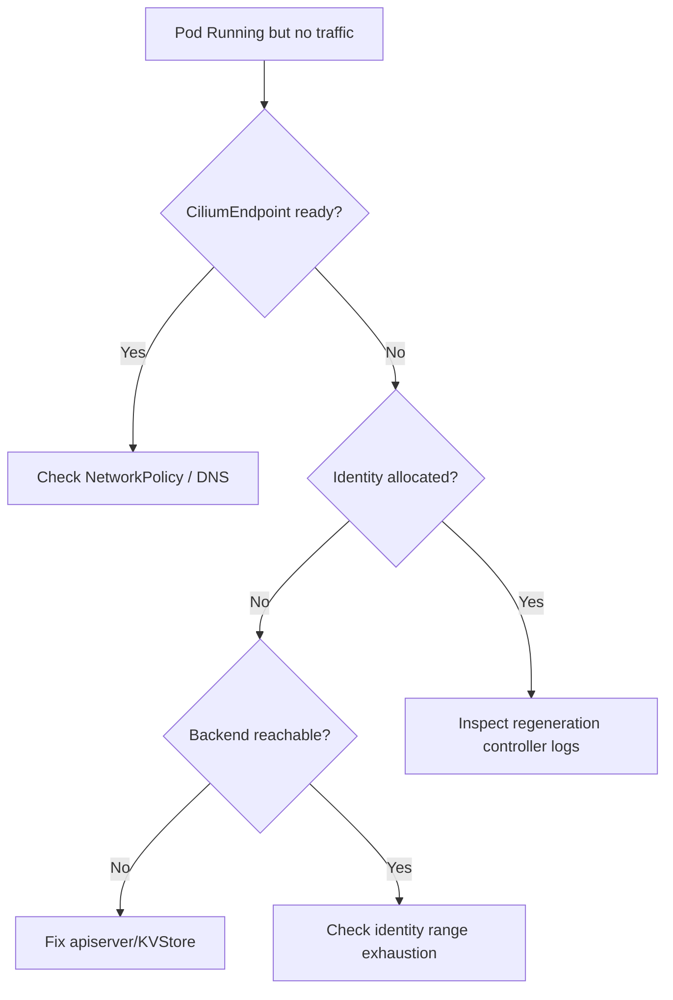

# Cilium Endpoint Not Ready

> **Severity:** High · **Typical recovery time:** 10–30 min · **Affected versions:** 1.21+

## Error Message

```text
level=warning msg="Regeneration of endpoint failed" endpointID=1423
identity=unknown error="unable to allocate identity: context deadline exceeded"

endpoint not regenerating: identity not ready
CiliumEndpoint <pod>: state=not-ready, identity=<pending>
```

## Description

Every Cilium-managed pod has a `CiliumEndpoint` whose datapath (eBPF maps,
policy, identity) must be "regenerated" before traffic is allowed. When an
endpoint is stuck `not-ready` or its security identity stays `pending`, the pod
may be `Running` from the kubelet's view but drops or blocks traffic because no
identity-based policy can be applied. This commonly surfaces as a pod that passes
liveness checks yet times out on every connection, or whose NetworkPolicies are
silently not enforced.

## Affected Kubernetes Versions

Cilium 1.10+ on Kubernetes 1.21+. Identity allocation uses either the CRD backend
(default since 1.11) or an external KVStore (etcd). The CRD path depends on a
healthy kube-apiserver; KVStore path depends on etcd reachability.

## Likely Root Causes

- Identity allocation backend (CRD apiserver or KVStore) is slow or unreachable
- `CiliumIdentity` CRD garbage-collection backlog exhausting the identity range
- Endpoint regeneration queue stalled behind a crashing controller
- Conflicting/oversized NetworkPolicy causing repeated regeneration failures
- Clock skew or expired certs breaking the agent ↔ apiserver connection

## Diagnostic Flow



## Verification Steps

Confirm the endpoint — not the agent or the pod itself — is the blocker by
listing endpoint state and identity on the node hosting the pod.

## kubectl Commands

```bash
kubectl get ciliumendpoints -A -o wide
kubectl get ciliumendpoint <pod> -n <namespace> -o yaml
kubectl get ciliumidentities -o wide | head
kubectl -n kube-system exec <cilium-pod> -- cilium endpoint list
kubectl -n kube-system exec <cilium-pod> -- cilium endpoint get <id>
kubectl -n kube-system logs <cilium-pod> -c cilium-agent --tail=200
```

## Expected Output

```text
ENDPOINT   IDENTITY   STATE          IPv4
1423       0          not-ready      10.0.3.55

level=warning msg="Regeneration of endpoint failed" identity=unknown
Controller endpoint-1423-regeneration  Status: failing (12 consecutive)
```

## Common Fixes

1. Restore connectivity to the identity backend (apiserver or etcd KVStore)
2. Reduce identity churn from overly broad/label-heavy NetworkPolicies
3. Clear the regeneration backlog by restarting the agent on the node
4. Increase identity allocation range if exhausted by stale identities

## Recovery Procedures

1. Inspect endpoint and controller state (read-only).
2. Fix the backend reachability or the offending policy.
3. **Disruptive — delete the pod to force endpoint recreation.** Blast radius:
   single pod restart; brief connection loss for that pod only.
4. **Disruptive — restart the node's cilium-agent pod** to flush the
   regeneration queue. Blast radius: that node's CNI flaps for ~30–60s.

## Validation

`cilium endpoint list` shows the endpoint `ready` with a non-zero identity;
the `CiliumEndpoint` status is `ready`; the pod can now reach in-cluster
Services and policy is enforced as expected.

## Prevention

- Keep the identity backend highly available and monitor its latency
- Limit NetworkPolicy fan-out; avoid policies that match thousands of pods
- Alert on `cilium_endpoint_regenerations_total` failure rate
- Run [config validators](https://devopsaitoolkit.com/validators/) on policies before merge

## Related Errors

- [Cilium Agent Not Ready](cilium-agent-not-ready.md)
- [Egress To External Blocked](egress-to-external-blocked.md)
- [Pod CIDR IP Exhaustion](pod-cidr-ip-exhaustion.md)

## References

- [Network plugins (CNI)](https://kubernetes.io/docs/concepts/extend-kubernetes/compute-storage-net/network-plugins/)
- [Network Policies](https://kubernetes.io/docs/concepts/services-networking/network-policies/)
