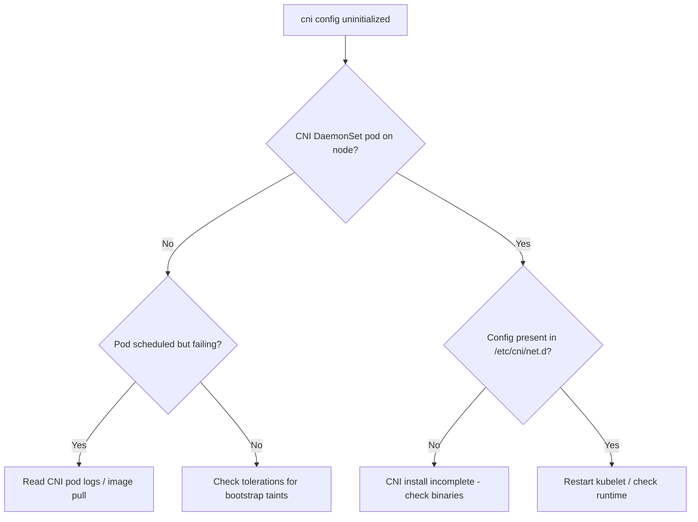

# CNI Config Uninitialized

> **Severity:** Critical · **Typical recovery time:** 10–45 min · **Affected versions:** 1.18+

## Error Message

```text
network plugin is not ready: cni config uninitialized
Failed to create pod sandbox: rpc error: code = Unknown desc =
  failed to set up sandbox container network: plugin type="calico" failed
  (add): ... cni plugin not initialized
container runtime network not ready: NetworkReady=false reason:NetworkPluginNotReady
```

## Description

The kubelet has no valid CNI configuration in `/etc/cni/net.d`, so it cannot set
up pod networking. The node goes `NotReady`, carries the
`node.kubernetes.io/network-unavailable` taint, and any pod assigned to it stalls
in `ContainerCreating`. This normally happens right after a node joins, after a
CNI upgrade, or when the CNI DaemonSet (Calico, Cilium, Flannel, AWS VPC CNI)
hasn't successfully installed its config and binaries.

This is Critical: no networking means no workloads on that node, and a
cluster-wide CNI failure halts scheduling everywhere.

## Affected Kubernetes Versions

All CNI-based clusters (1.18+). Since dockershim removal (1.24+), every cluster
uses CNI, so this condition is universal. The exact wording varies slightly by
container runtime (containerd/CRI-O) but the meaning is identical.

## Likely Root Causes

- CNI DaemonSet pod not running / crashing on the node
- Missing or invalid config file in `/etc/cni/net.d`
- CNI binaries absent from `/opt/cni/bin`
- CNI image pull failing on the node
- CNI agent RBAC/version mismatch preventing config install

## Diagnostic Flow



## Verification Steps

Confirm the node is `NotReady`, the CNI DaemonSet has a pod targeting that node,
and the event chain ends in `cni config uninitialized`. Then check whether the
CNI pod is even running and whether it dropped a config file on the node.

## kubectl Commands

```bash
kubectl get nodes -o wide
kubectl describe node <node> | grep -A5 -i 'taint\|networkunavailable'
kubectl get pods -n kube-system -o wide | grep -Ei 'calico|cilium|flannel|cni|aws-node'
kubectl logs -n kube-system <cni-pod> --tail=50
kubectl exec -n kube-system <cni-pod> -- ls /host/etc/cni/net.d 2>/dev/null
```

## Expected Output

```text
NAME      STATUS     ROLES    AGE   VERSION
node-2    NotReady   <none>   4m    v1.29.4

Taints:  node.kubernetes.io/network-unavailable:NoSchedule
Conditions:
  Type                Status   Reason
  NetworkUnavailable  True     NoRouteCreated
Events:
  Warning  FailedCreatePodSandBox  ... cni config uninitialized
```

## Common Fixes

1. Get the CNI DaemonSet healthy and scheduled on the node
2. Repair/install CNI config in `/etc/cni/net.d` and binaries in `/opt/cni/bin`
3. Fix the CNI image pull or registry access
4. Add tolerations so the CNI DaemonSet lands on bootstrap-tainted nodes

## Recovery Procedures

1. Check the CNI DaemonSet and its pod on the affected node; read logs if it is
   crashing (config, RBAC, image).
2. Fix the root cause — the node clears the `network-unavailable` taint
   automatically once CNI writes a valid config and reports ready.
3. If a cluster-wide CNI rollout is broken, roll the DaemonSet back to a
   known-good version. **Disruptive — cluster network:** affects pod networking
   on all nodes; stage by node group and coordinate.
4. For a single stuck node, cordon and drain it while repairing.
   **Disruptive — per node:** draining evicts that node's pods.

## Validation

The node turns `Ready`, the `network-unavailable` taint clears, and new pods
schedule there and reach `Running` with assigned pod IPs and working
connectivity.

## Prevention

- Stage CNI upgrades through canary node pools
- Bake CNI binaries into the node image to avoid pull-time failures
- Keep CNI DaemonSet tolerations broad enough for bootstrap taints
- Alert on node `NetworkUnavailable` and CNI DaemonSet readiness

## Related Errors

- [Calico Node Not Ready](./calico-node-not-ready.md)
- [Pod-to-Pod Timeout](./pod-to-pod-timeout.md)
- [DNS Resolution Failure](./dns-resolution-failure.md)

## References

- [Network Plugins (CNI)](https://kubernetes.io/docs/concepts/extend-kubernetes/compute-storage-net/network-plugins/)
- [Node Status & Conditions](https://kubernetes.io/docs/reference/node/node-status/)

## Further Reading

- [DevOps AI ToolKit — Kubernetes guides](https://devopsaitoolkit.com/blog/)
