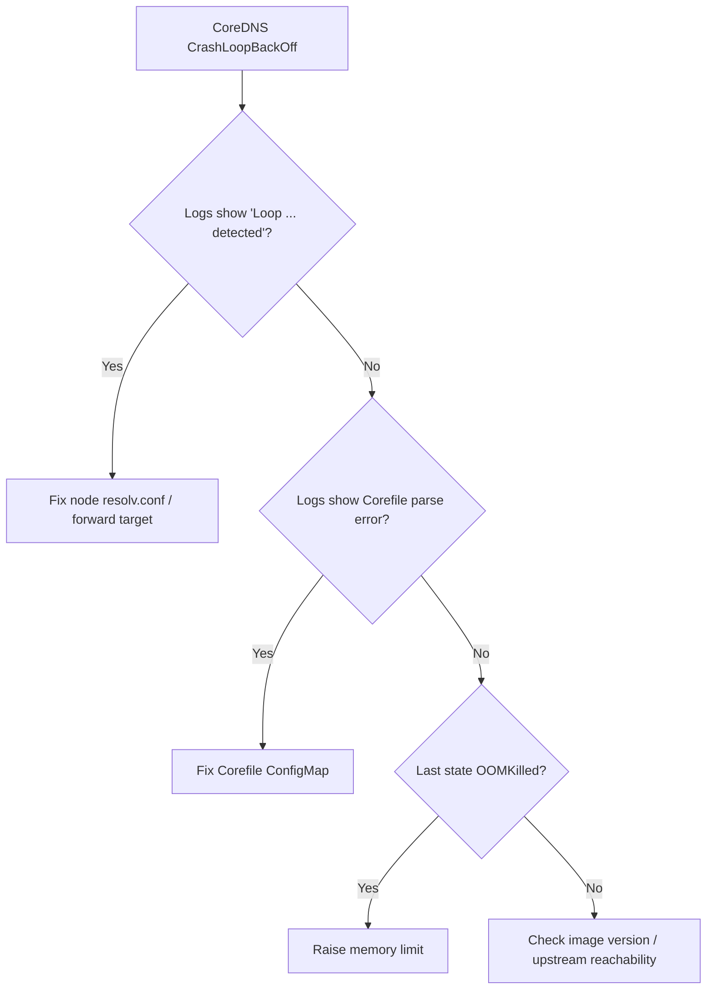

# CoreDNS CrashLoopBackOff

> **Severity:** Critical · **Typical recovery time:** 10–30 min · **Affected versions:** 1.20+

## Error Message

```text
[FATAL] plugin/loop: Loop (127.0.0.1:46232 -> :53) detected for zone ".",
see https://coredns.io/plugins/loop#troubleshooting. Query: "HINFO 4456...
NAME              READY   STATUS             RESTARTS   AGE
coredns-5d78c9   0/1     CrashLoopBackOff   6          7m
```

## Description

CoreDNS provides cluster DNS. When its pods enter `CrashLoopBackOff`, name
resolution degrades or stops entirely once the running replicas are gone. The
most common fatal is the `loop` plugin detecting that CoreDNS is forwarding to
itself — usually because the node's `/etc/resolv.conf` contains `127.0.0.1` or
`127.0.0.53` (systemd-resolved stub), which CoreDNS inherits and forwards back
to.

This is Critical: cluster DNS is a shared dependency, so a CoreDNS crashloop
manifests as broad, confusing failures across unrelated workloads.

## Affected Kubernetes Versions

All CoreDNS clusters (1.20+). The `loop` and `forward` plugins behave
consistently across versions. Nodes running systemd-resolved (most modern
Ubuntu/Debian) are the usual trigger for the loopback issue.

## Likely Root Causes

- Node `resolv.conf` points at a local stub (`127.0.0.1`/`127.0.0.53`) → loop
- Invalid or unparseable Corefile (bad plugin/zone block)
- Upstream resolver unreachable, causing readiness/health failures
- Memory limit too low → OOMKilled under query load
- Incompatible CoreDNS image after an upgrade

## Diagnostic Flow



## Verification Steps

Read the CoreDNS pod logs and the previous container's logs. A `plugin/loop`
fatal confirms the loopback case; a parse error names the offending Corefile
line; `OOMKilled` shows in the previous state.

## kubectl Commands

```bash
kubectl get pods -n kube-system -l k8s-app=kube-dns
kubectl logs -n kube-system -l k8s-app=kube-dns --previous --tail=50
kubectl describe pod -n kube-system -l k8s-app=kube-dns
kubectl get configmap coredns -n kube-system -o yaml
kubectl exec -n kube-system <coredns-pod> -- cat /etc/resolv.conf
```

## Expected Output

```text
[FATAL] plugin/loop: Loop (127.0.0.1:46232 -> :53) detected for zone "."
    Last State:   Terminated
      Reason:     Error
      Exit Code:  1
# or, when OOMKilled:
      Reason:     OOMKilled
      Exit Code:  137
```

## Common Fixes

1. Point CoreDNS `forward` at the real upstream, not the node loopback stub
2. Fix the node `/etc/resolv.conf` (or set kubelet `--resolv-conf`)
3. Correct the Corefile ConfigMap syntax
4. Raise the CoreDNS memory limit if OOMKilled

## Recovery Procedures

1. Identify the fatal from `--previous` logs.
2. **Loop case:** edit the `coredns` ConfigMap so `forward . ...` targets a real
   resolver (e.g. `/etc/resolv.conf` on a node without a stub, or an explicit
   upstream like `8.8.8.8`), or fix node DNS to not use 127.0.0.x.
3. Roll CoreDNS to apply the fixed Corefile.
   **Disruptive — cluster-wide:** restarts all CoreDNS replicas; do it as a
   surging rolling restart so at least one replica keeps serving.
4. **Parse error / bad image:** revert the ConfigMap or image to the last
   known-good revision.

## Validation

All CoreDNS pods reach `1/1 Running` with stable restart counts, and
`nslookup kubernetes.default` succeeds from a test pod.

## Prevention

- Avoid `127.0.0.x` upstreams; validate Corefile in CI before applying
- Keep ≥2 replicas plus a PDB and a tested memory limit
- Pin CoreDNS image versions and stage upgrades
- Alert on CoreDNS restart count and readiness

## Related Errors

- [DNS Resolution Failure](./dns-resolution-failure.md)
- [Service Name Not Resolving](./service-name-not-resolving.md)
- [Slow DNS Lookups](./coredns-slow-lookups.md)

## References

- [Debugging DNS Resolution](https://kubernetes.io/docs/tasks/administer-cluster/dns-debugging-resolution/)
- [Customizing DNS Service](https://kubernetes.io/docs/tasks/administer-cluster/dns-custom-nameservers/)

## Further Reading

- [DevOps AI ToolKit — Kubernetes guides](https://devopsaitoolkit.com/blog/)
