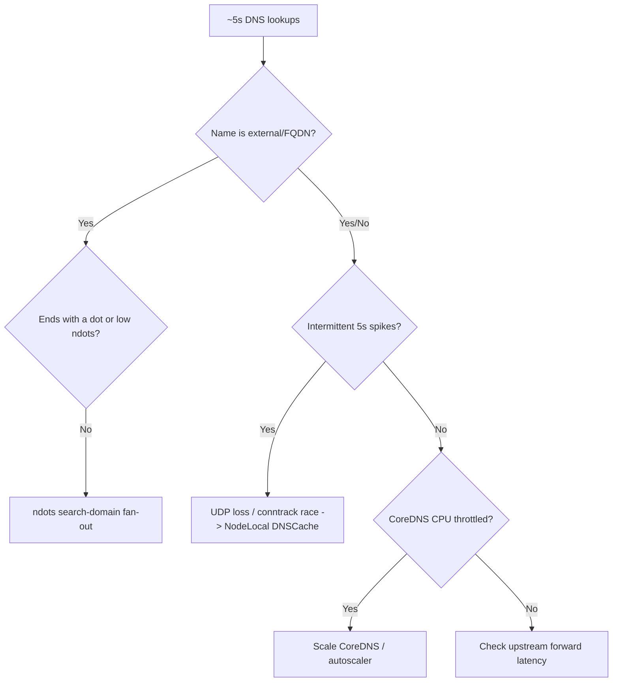

# Slow DNS Lookups

> **Severity:** Medium · **Typical recovery time:** 15–60 min · **Affected versions:** 1.20+

## Error Message

```text
real    0m5.012s        # time nslookup api.example.com
;; connection timed out; trying next origin
upstream request timeout after 5000ms (dns lookup)
context deadline exceeded (Client.Timeout exceeded while awaiting headers)
```

## Description

Applications work but every external (and some internal) name takes about 5
seconds before resolving. This is almost always the interaction between the
default `ndots:5` in pod `/etc/resolv.conf` and the DNS client's 5-second
timeout. With `ndots:5`, any name containing fewer than 5 dots is first tried
against each search domain (`<ns>.svc.cluster.local`, `svc.cluster.local`,
`cluster.local`). Each miss costs a round trip, and a single dropped UDP packet
adds the full timeout.

This is Medium severity: it rarely causes hard outages, but it inflates request
latency and can trip downstream timeouts, looking like an application slowdown.

## Affected Kubernetes Versions

All clusters (1.20+) using the default `ndots:5`. A long-standing conntrack race
on the DNAT of UDP DNS packets (especially with iptables kube-proxy on older
kernels) compounds the problem on busy nodes.

## Likely Root Causes

- `ndots:5` causing many search-domain attempts for external names
- UDP packet loss / conntrack DNAT race adding 5s timeouts
- CoreDNS under-replicated or CPU-throttled under query load
- Slow upstream resolver in the `forward` block
- No DNS caching close to the workload

## Diagnostic Flow



## Verification Steps

Time a lookup of an external name with and without a trailing dot. If the FQDN
(with dot) is fast and the bare name is slow, it is the `ndots` fan-out. If
spikes are intermittent and random, suspect UDP/conntrack packet loss.

## kubectl Commands

```bash
kubectl exec <pod> -n <ns> -- cat /etc/resolv.conf
kubectl exec <pod> -n <ns> -- sh -c 'time nslookup api.example.com'
kubectl exec <pod> -n <ns> -- sh -c 'time nslookup api.example.com.'
kubectl top pods -n kube-system -l k8s-app=kube-dns
kubectl logs -n kube-system -l k8s-app=kube-dns --tail=50 | grep -i 'SERVFAIL\|timeout'
```

## Expected Output

```text
options ndots:5

real    0m5.004s    # bare name: slow (search-domain misses + 1 dropped packet)
real    0m0.012s    # FQDN with trailing dot: fast
```

## Common Fixes

1. Use FQDNs (trailing dot) for known-external hostnames
2. Set `dnsConfig.options: ndots: "1"` (or 2) on chatty external-calling pods
3. Deploy NodeLocal DNSCache to eliminate UDP/conntrack timeouts
4. Scale CoreDNS (more replicas / cluster-proportional autoscaler)

## Recovery Procedures

1. Confirm the pattern with the timed FQDN-vs-bare-name test above.
2. For the `ndots` case, lower `ndots` via the pod's `dnsConfig` or have the app
   use fully-qualified names. This is per-workload and non-disruptive.
3. For intermittent 5s spikes, deploy NodeLocal DNSCache as a DaemonSet. It adds
   a per-node cache over TCP to CoreDNS, removing the UDP conntrack race.
   **Mild disruption:** it changes the nameserver pods use; roll out node by node.
4. If CoreDNS itself is the bottleneck, scale it up.
   **Disruptive — cluster-wide:** a CoreDNS rollout briefly restarts replicas.

## Validation

Bare-name external lookups complete in well under a second from affected pods,
p99 DNS latency drops, and downstream request timeouts disappear.

## Prevention

- Standardise on FQDNs or a sane `ndots` for outbound-heavy services
- Run NodeLocal DNSCache cluster-wide by default
- Right-size and autoscale CoreDNS; set CPU requests to avoid throttling
- Monitor DNS p99 latency and CoreDNS request rate

## Related Errors

- [DNS Resolution Failure](./dns-resolution-failure.md)
- [Service Name Not Resolving](./service-name-not-resolving.md)
- [CoreDNS CrashLoopBackOff](./coredns-crashloopbackoff.md)

## References

- [DNS for Services and Pods](https://kubernetes.io/docs/concepts/services-networking/dns-pod-service/)
- [Using NodeLocal DNSCache](https://kubernetes.io/docs/tasks/administer-cluster/nodelocaldns/)

## Further Reading

- [DevOps AI ToolKit — Kubernetes guides](https://devopsaitoolkit.com/blog/)
