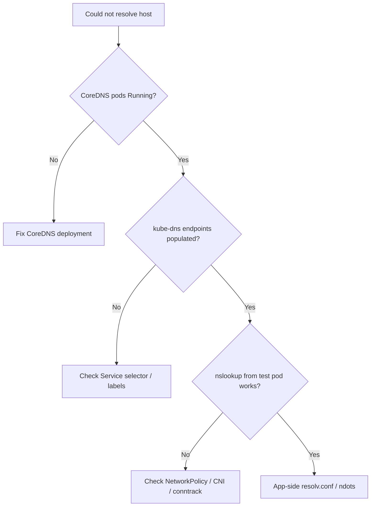

# DNS Resolution Failure

> **Severity:** High · **Typical recovery time:** 10–45 min · **Affected versions:** 1.20+

## Error Message

```text
curl: (6) Could not resolve host: api.internal.svc.cluster.local
ping: bad address 'redis'
getaddrinfo ENOTFOUND postgres.prod.svc.cluster.local
nslookup: can't resolve 'kubernetes.default': Name or service not known
```

## Description

A pod cannot turn a hostname into an IP address. In Kubernetes, every pod's
`/etc/resolv.conf` points at the cluster DNS Service (`kube-dns` ClusterIP,
normally `10.96.0.10`), which is backed by CoreDNS pods. When resolution fails,
the application sees `Could not resolve host` or `Name or service not known`,
and otherwise-healthy services appear down.

This is High severity because it breaks service discovery cluster-wide: even if
every workload pod is `Running`, nothing can find anything. The failure is
either total (CoreDNS down, kube-dns Service broken) or partial (one node's
networking, NetworkPolicy, or upstream forwarder is broken).

## Affected Kubernetes Versions

Applies to all CoreDNS-based clusters (1.20+; CoreDNS is the default since
1.13). Older clusters using kube-dns behave similarly. EKS, GKE, and AKS all
ship CoreDNS, so the diagnostic path is the same.

## Likely Root Causes

- CoreDNS pods not running, crashing, or scaled to zero
- `kube-dns` Service / endpoints missing the CoreDNS pod IPs
- NetworkPolicy blocking UDP/TCP 53 to kube-system
- Node-level CNI/conntrack problem dropping DNS packets
- Broken upstream resolver in the CoreDNS `forward` block

## Diagnostic Flow



## Verification Steps

Run a lookup from a throwaway pod against both an in-cluster name and an
external name. If both fail, suspect CoreDNS or kube-dns; if only external
fails, suspect the upstream `forward`; if only in-cluster fails, suspect the
Service or search domains.

## kubectl Commands

```bash
kubectl get pods -n kube-system -l k8s-app=kube-dns -o wide
kubectl get svc -n kube-system kube-dns
kubectl get endpoints -n kube-system kube-dns
kubectl run dnsutils --image=registry.k8s.io/e2e-test-images/jessie-dnsutils:1.7 --restart=Never -- sleep 3600
kubectl exec dnsutils -- nslookup kubernetes.default
kubectl exec dnsutils -- cat /etc/resolv.conf
```

## Expected Output

```text
;; connection timed out; no servers could be reached

nameserver 10.96.0.10
search prod.svc.cluster.local svc.cluster.local cluster.local
options ndots:5

# Endpoints empty when CoreDNS is the problem:
NAME       ENDPOINTS   AGE
kube-dns   <none>      40d
```

## Common Fixes

1. Restore CoreDNS pods to `Running` (fix crashloop, scale up from zero)
2. Repair the `kube-dns` Service selector so endpoints repopulate
3. Allow DNS (UDP/TCP 53) egress to kube-system in NetworkPolicy
4. Fix or replace a dead upstream in the CoreDNS `forward` directive

## Recovery Procedures

1. Confirm CoreDNS pods are `Running` and Ready; if not, treat as
   [CoreDNS CrashLoopBackOff](./coredns-crashloopbackoff.md).
2. Verify `kube-dns` endpoints list the CoreDNS pod IPs. Empty endpoints mean a
   selector/label mismatch — reconcile the Service.
3. Roll the CoreDNS deployment to pick up a fixed Corefile.
   **Disruptive — cluster-wide:** during the rollout in-flight lookups may fail;
   CoreDNS runs ≥2 replicas so impact is brief if done as a surging rollout.
4. If a single node is affected, cordon and drain it. **Disruptive:** evicts
   pods from that node.

## Validation

`nslookup kubernetes.default` and an external name both resolve from a test pod
in the affected namespace, and application error rates return to baseline.

## Prevention

- Run CoreDNS with ≥2 replicas and a PodDisruptionBudget
- Deploy NodeLocal DNSCache to cut load and survive blips
- Always allow egress to kube-system DNS in default-deny NetworkPolicies
- Alert on CoreDNS readiness and kube-dns endpoint count

## Related Errors

- [CoreDNS CrashLoopBackOff](./coredns-crashloopbackoff.md)
- [Service Name Not Resolving](./service-name-not-resolving.md)
- [Slow DNS Lookups](./coredns-slow-lookups.md)

## References

- [Debugging DNS Resolution](https://kubernetes.io/docs/tasks/administer-cluster/dns-debugging-resolution/)
- [DNS for Services and Pods](https://kubernetes.io/docs/concepts/services-networking/dns-pod-service/)

## Further Reading

- [DevOps AI ToolKit — Kubernetes guides](https://devopsaitoolkit.com/blog/)
