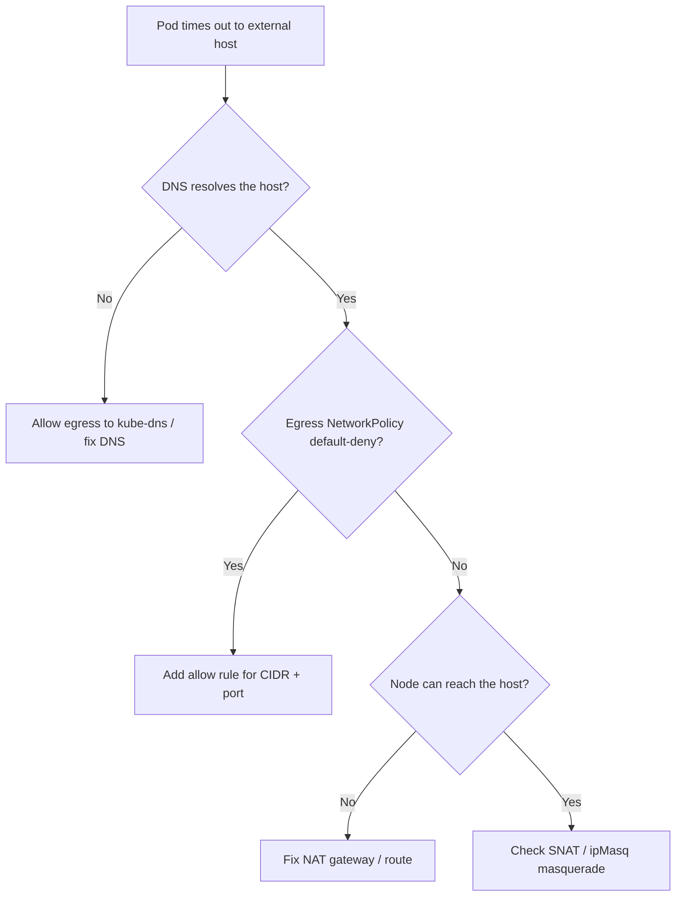

# Egress To External Blocked

> **Severity:** High · **Typical recovery time:** 20–60 min · **Affected versions:** 1.20+

## Error Message

```text
egress to external endpoint times out (egress policy/NAT)

curl: (28) Connection timed out after 10001 milliseconds
dial tcp 52.x.x.x:443: i/o timeout
context deadline exceeded while calling external API
```

## Description

Pods can resolve and reach in-cluster Services but time out calling anything
outside the cluster (a SaaS API, package registry, database). The two dominant
causes are a default-deny egress NetworkPolicy that wasn't opened for the external
CIDR/DNS, or broken outbound NAT/SNAT at the node/cloud layer (missing route,
NAT gateway, or IP masquerade rule). Timeouts (not connection-refused) are the
tell: packets leave but no return path exists, or they're silently dropped by a
policy or firewall.

## Affected Kubernetes Versions

All Kubernetes 1.20+. NetworkPolicy egress requires a CNI that enforces it
(Calico, Cilium); with a non-enforcing CNI, policies are silently ignored.
SNAT/masquerade behavior depends on the CNI's `ipMasqAgent`/`masquerade` settings
and the cloud's outbound NAT.

## Likely Root Causes

- Default-deny egress NetworkPolicy without an allow rule for the destination/DNS
- Missing IP masquerade/SNAT so pod source IPs aren't translated
- No NAT gateway / outbound route in the cloud VPC for the node subnet
- DNS egress blocked, so name resolution to the external host fails first
- Cilium/Calico FQDN or CIDR egress policy too narrow

## Diagnostic Flow



## Verification Steps

Separate DNS failure from connectivity failure, then determine whether the drop
is policy-side (in-cluster) or NAT/route-side (node/cloud).

## kubectl Commands

```bash
kubectl get networkpolicy -A -o wide
kubectl get networkpolicy <np> -n <namespace> -o yaml
kubectl exec <pod> -n <namespace> -- nslookup <external-host>
kubectl exec <pod> -n <namespace> -- getent hosts <external-host>
kubectl -n kube-system get configmap -o name | grep -i -E 'ip-masq|calico|cilium'
kubectl get pods -n <namespace> -o wide
```

## Expected Output

```text
# DNS works, connect times out -> egress/NAT problem
$ kubectl exec app -n shop -- nslookup api.stripe.com
Address: 52.10.20.30

# default-deny egress policy with no allow:
spec:
  policyTypes: [Egress]
  egress: []   # nothing allowed
```

## Common Fixes

1. Add an egress allow rule for the destination CIDR + port (and kube-dns/UDP 53)
2. Enable IP masquerade/SNAT for traffic leaving the cluster CIDR
3. Provision/repair the cloud NAT gateway and outbound route for node subnets
4. Widen too-narrow Cilium/Calico FQDN or CIDR egress selectors

## Recovery Procedures

1. Confirm DNS vs connectivity and inspect egress policies (read-only).
2. Apply the corrected NetworkPolicy or NAT/route configuration.
3. Editing a shared default-deny policy is **disruptive — it changes egress for
   every pod the policy selects.** Blast radius: namespace/label scope of the
   policy; review the selector before applying.
4. NAT gateway / route changes are cloud-infra operations — **coordinate, as they
   affect all nodes in the subnet.**

## Validation

`curl`/`getent` from the pod reaches the external endpoint within timeout; the
NetworkPolicy shows the explicit allow; outbound connections succeed from
multiple pods/nodes, confirming NAT works fleet-wide.

## Prevention

- Pair default-deny egress with explicit, reviewed allow-lists (incl. DNS)
- Monitor NAT gateway health and outbound connection error rates
- Use FQDN-based egress policies for SaaS endpoints with rotating IPs
- Validate NetworkPolicies in CI with [config validators](https://devopsaitoolkit.com/validators/)

## Related Errors

- [Istio Sidecar 503 UH/UF](istio-sidecar-503-uh.md)
- [ExternalDNS Not Creating Records](externaldns-not-updating.md)
- [ndots Extra DNS Lookups](ndots-extra-dns-lookups.md)

## References

- [Network Policies](https://kubernetes.io/docs/concepts/services-networking/network-policies/)
- [Cluster networking](https://kubernetes.io/docs/concepts/cluster-administration/networking/)
