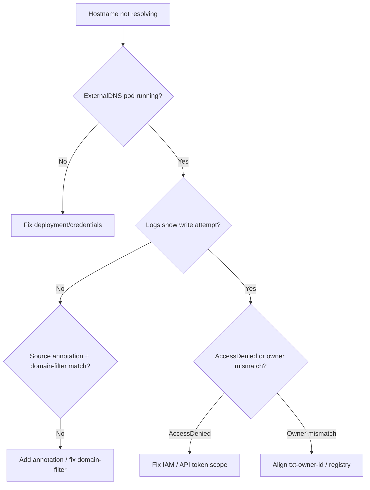

# ExternalDNS Not Creating Records

> **Severity:** Medium · **Typical recovery time:** 15–45 min · **Affected versions:** 1.20+

## Error Message

```text
ExternalDNS not updating DNS provider records

time="..." level=error msg="records retrieval failed: AccessDenied: ..."
time="..." level=info msg="All records are already up to date"
time="..." level=warning msg="Skipping endpoint ... because owner id does not match"
```

## Description

ExternalDNS watches Services and Ingresses and syncs their hostnames to a DNS
provider (Route53, Cloud DNS, Cloudflare, etc.). When it stops creating or
updating records, the new app hostname simply never resolves publicly — even
though the Ingress and Service are healthy. Two patterns dominate: ExternalDNS
lacks permission/credentials to write to the zone, or its TXT "owner" registry
records don't match, so it refuses to touch records it didn't create. Both look
identical from the user side: DNS just doesn't update.

## Affected Kubernetes Versions

ExternalDNS is version-independent of Kubernetes (works on 1.20+). Behavior
depends on the ExternalDNS version, the `--policy` (`sync` vs `upsert-only`),
`--txt-owner-id`, and the provider plugin. Gateway API sources require newer
ExternalDNS releases.

## Likely Root Causes

- IAM/API credentials lack write permission to the hosted zone (most common)
- `--txt-owner-id` mismatch, so records are owned by another instance
- `--policy=upsert-only` preventing deletions, or `--registry=noop` confusion
- Source object missing required annotation / `--domain-filter` excludes the zone
- Provider/zone ID misconfigured, or rate-limited by the DNS API

## Diagnostic Flow



## Verification Steps

Confirm ExternalDNS sees the source object and is attempting (not skipping) the
write, distinguishing a permission error from an owner/registry mismatch.

## kubectl Commands

```bash
kubectl -n external-dns get pods -o wide
kubectl -n external-dns logs deploy/external-dns --tail=200
kubectl -n external-dns get deploy external-dns -o yaml | grep -A30 'args:'
kubectl get ingress -A -o wide
kubectl get ingress <ing> -n <ns> -o jsonpath='{.metadata.annotations}{"\n"}'
kubectl get svc -A -o jsonpath='{range .items[*]}{.metadata.name}{"\t"}{.metadata.annotations.external-dns\.alpha\.kubernetes\.io/hostname}{"\n"}{end}'
```

## Expected Output

```text
level=info  msg="Instance is up to date"   # but record absent in provider
level=error msg="Failed to submit changes: AccessDenied: User is not authorized
  to perform: route53:ChangeResourceRecordSets"
level=warning msg="Skipping endpoint app.example.com because owner id does not match"
```

## Common Fixes

1. Grant the ExternalDNS identity write access to the target hosted zone
2. Align `--txt-owner-id` with the existing TXT registry records (or clean them)
3. Add the required `external-dns.alpha.kubernetes.io/hostname` annotation
4. Ensure `--domain-filter` and `--zone-id-filter` include the intended zone

## Recovery Procedures

1. Read ExternalDNS logs to classify permission vs ownership vs filtering.
2. Apply the credential/IAM or annotation/argument fix (config change).
3. **Disruptive (low) — restart the ExternalDNS deployment** to force a fresh
   reconcile. Blast radius: a short pause in DNS reconciliation; existing records
   remain. ExternalDNS is the only consumer affected.
4. If TXT registry is corrupt, **carefully reconcile owner records** — changing
   `--policy` to `sync` can delete records; verify scope before applying.

## Validation

ExternalDNS logs show a successful change submission; the record appears in the
provider console; `dig <hostname>` returns the expected IP/CNAME from public
resolvers after TTL.

## Prevention

- Use least-privilege but sufficient IAM scoped to the exact zone
- Pin a unique `--txt-owner-id` per cluster to avoid cross-cluster conflicts
- Alert on ExternalDNS error log rate and last-successful-sync age
- Validate annotations and args with [config validators](https://devopsaitoolkit.com/validators/)

## Related Errors

- [ndots Extra DNS Lookups](ndots-extra-dns-lookups.md)
- [NodeLocal DNSCache Failure](nodelocaldns-failure.md)
- [Egress To External Blocked](egress-to-external-blocked.md)

## References

- [DNS for Services and Pods](https://kubernetes.io/docs/concepts/services-networking/dns-pod-service/)
- [Ingress](https://kubernetes.io/docs/concepts/services-networking/ingress/)
