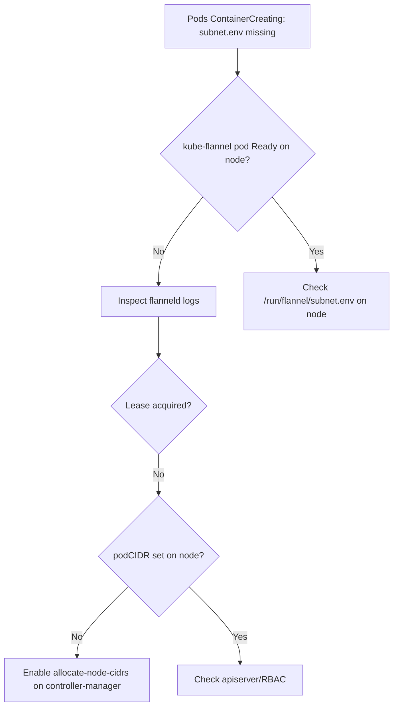

# Flannel subnet.env Missing

> **Severity:** Critical · **Typical recovery time:** 10–30 min · **Affected versions:** 1.20+

## Error Message

```text
Warning  FailedCreatePodSandBox  kubelet  Failed to create pod sandbox:
plugin type="flannel" failed (add): failed to read flannel subnet.env file:
open /run/flannel/subnet.env: no such file or directory
```

## Description

The Flannel CNI plugin (`/opt/cni/bin/flannel`) reads `/run/flannel/subnet.env`
to learn the node's pod subnet, MTU, and IPMASQ settings. That file is written by
the `flanneld` DaemonSet pod once it has acquired a per-node subnet lease from the
Kubernetes API (or etcd). If `flanneld` hasn't run, crashed before writing, or the
node was rebooted (clearing `/run`, which is tmpfs), the file is absent and every
new pod sandbox on that node fails. Result: a node that cannot start any
non-hostNetwork pods.

## Affected Kubernetes Versions

Applies to all Kubernetes 1.20+ clusters using Flannel as CNI. Behavior is the
same across Flannel 0.14–0.25. Note that `/run` is tmpfs, so `subnet.env` is
expected to be regenerated by `flanneld` on every boot.

## Likely Root Causes

- `kube-flannel` DaemonSet pod not running/ready on the node (most common)
- Node rebooted; `flanneld` hasn't rewritten `/run/flannel/subnet.env` yet
- `flanneld` cannot get a subnet lease (apiserver/etcd unreachable, RBAC)
- `Node.spec.podCIDR` not assigned because `--allocate-node-cidrs` is off
- CNI conflist references flannel but the flannel binary/config is missing

## Diagnostic Flow



## Verification Steps

Confirm the file is genuinely missing and tie it to the `flanneld` pod state on
the specific node, rather than a generic CNI misconfiguration.

## kubectl Commands

```bash
kubectl -n kube-flannel get pods -o wide
kubectl -n kube-flannel logs <kube-flannel-pod> --tail=200
kubectl -n kube-flannel describe pod <kube-flannel-pod>
kubectl get node <node> -o jsonpath='{.spec.podCIDR}{"\n"}'
kubectl get pods -A --field-selector spec.nodeName=<node> -o wide
kubectl get events -n kube-flannel --sort-by=.lastTimestamp
```

## Expected Output

```text
NAME                    READY   STATUS             RESTARTS   AGE
kube-flannel-ds-abcde   0/1     CrashLoopBackOff   5          7m

E0629 failed to acquire lease: node "worker-2" pod cidr not assigned
# kubectl get node worker-2 -o jsonpath='{.spec.podCIDR}' -> (empty)
```

## Common Fixes

1. Ensure `kube-flannel` DaemonSet is scheduled and `Ready` on the node
2. Set `--allocate-node-cidrs=true` and `--cluster-cidr` on kube-controller-manager
3. Fix RBAC so `flanneld` can list/patch nodes and read its lease
4. Verify CNI binary `/opt/cni/bin/flannel` and `/etc/cni/net.d` conflist exist

## Recovery Procedures

1. Check the `flanneld` pod and node `podCIDR` (read-only).
2. Correct the controller-manager CIDR flags or RBAC.
3. **Disruptive — delete the kube-flannel pod on the node** so it restarts and
   rewrites `subnet.env`. Blast radius: that node's pod networking flaps briefly;
   new pods pause until the file is regenerated.
4. **Disruptive — drain & reboot the node** only if `/run` is corrupt. Blast
   radius: all pods on the node are evicted; do one node at a time.

## Validation

`/run/flannel/subnet.env` exists with a valid `FLANNEL_SUBNET`; the
`kube-flannel` pod is `Ready`; a new test pod on the node reaches `Running` and
can ping a pod on another node.

## Prevention

- Run flannel as a DaemonSet with a PodDisruptionBudget and proper RBAC
- Confirm controller-manager always assigns `podCIDR` (allocate-node-cidrs)
- Monitor node readiness and CNI plugin errors via events
- Validate manifests with [config validators](https://devopsaitoolkit.com/validators/)

## Related Errors

- [Pod CIDR IP Exhaustion](pod-cidr-ip-exhaustion.md)
- [MTU Mismatch Packet Drops](mtu-mismatch-packet-drops.md)
- [hostNetwork Port Conflict](hostnetwork-port-conflict.md)

## References

- [Network plugins (CNI)](https://kubernetes.io/docs/concepts/extend-kubernetes/compute-storage-net/network-plugins/)
- [Cluster networking](https://kubernetes.io/docs/concepts/cluster-administration/networking/)
