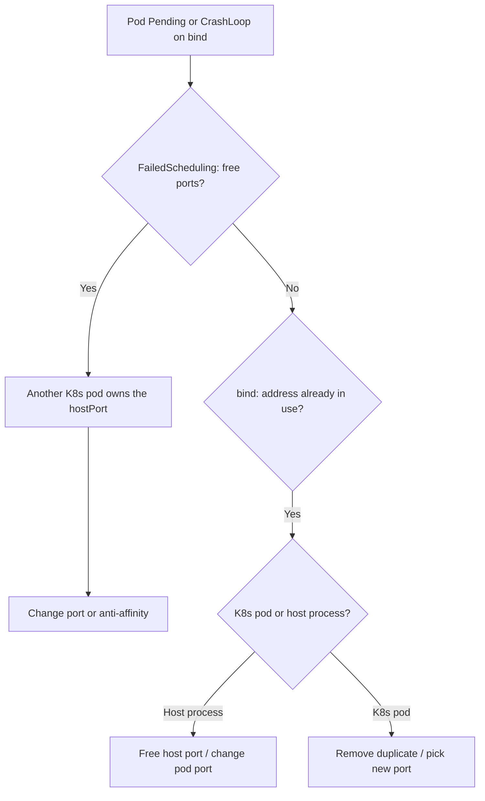

# hostNetwork Port Conflict

> **Severity:** High · **Typical recovery time:** 10–30 min · **Affected versions:** 1.20+

## Error Message

```text
hostNetwork pod port already in use

Warning  FailedScheduling  default-scheduler  0/5 nodes are available:
  5 node(s) didn't have free ports for the requested pod ports.

# or, started but crashing:
listen tcp 0.0.0.0:9100: bind: address already in use
```

## Description

A pod with `hostNetwork: true` (or a container `hostPort`) shares the node's
network namespace, so its listening ports are the node's ports. If another pod or
a host process already binds that port, the new pod either fails scheduling
(`didn't have free ports`) or starts and crashes with `bind: address already in
use`. This is common with node-exporter on 9100, ingress controllers on 80/443
using hostNetwork, or two DaemonSets competing for the same port.

## Affected Kubernetes Versions

All Kubernetes 1.20+. The scheduler accounts for `hostPort` and `hostNetwork`
ports via the `NodePorts` predicate/plugin. Conflicts with non-Kubernetes host
processes are invisible to the scheduler and only surface as a runtime bind
error.

## Likely Root Causes

- Two pods/DaemonSets requesting the same hostPort on the same node
- A host-level process already bound to the port (systemd service, kubelet metrics)
- A previous pod's process didn't release the port (lingering, hostNetwork)
- Wrong `hostPort` chosen that collides with NodePort range or kube-proxy
- `hostNetwork: true` set unnecessarily, forcing node-port semantics

## Diagnostic Flow



## Verification Steps

Determine whether the collision is with another Kubernetes pod (scheduler event)
or a host process (runtime bind error) before choosing a fix.

## kubectl Commands

```bash
kubectl get pods -A -o wide --field-selector spec.nodeName=<node>
kubectl get pods -A -o jsonpath='{range .items[*]}{.metadata.namespace}{"\t"}{.metadata.name}{"\t"}{.spec.hostNetwork}{"\t"}{.spec.containers[*].ports[*].hostPort}{"\n"}{end}' | grep -v '^.*\t\t'
kubectl describe pod <pod> -n <namespace>
kubectl get events -n <namespace> --sort-by=.lastTimestamp
kubectl get daemonset -A -o wide
kubectl get pod <pod> -n <namespace> -o jsonpath='{.spec.hostNetwork}{"\n"}'
```

## Expected Output

```text
Warning  FailedScheduling  0/5 nodes are available: 5 node(s) didn't
  have free ports for the requested pod ports (9100).

# two pods claim hostPort 9100:
monitoring  node-exporter-aaaaa   true   9100
custom      my-exporter-bbbbb     true   9100
```

## Common Fixes

1. Change one pod's `hostPort`/listen port to a free, unique value
2. Stop or relocate the conflicting host process / duplicate DaemonSet
3. Drop `hostNetwork: true` if the pod doesn't actually need host networking
4. Add pod anti-affinity so colliding pods never co-locate

## Recovery Procedures

1. Identify the owner of the port (read-only describe/events).
2. Edit the offending workload's port or `hostNetwork` setting.
3. **Disruptive — roll the workload** so the new port takes effect. Blast radius:
   restart of that Deployment/DaemonSet; for hostNetwork ingress controllers this
   can briefly interrupt node-level traffic on that port.
4. If a host process owns the port, **coordinate freeing it on the node** — node
   admin action; blast radius limited to that service on that node.

## Validation

The pod schedules and reaches `Running`; the process binds its port without
error; the exporter/endpoint responds on the node; no further `FailedScheduling`
free-port events.

## Prevention

- Reserve a documented hostPort map; treat node ports as a shared resource
- Prefer ClusterIP + Service over hostNetwork unless truly required
- Use anti-affinity / `maxSkew` to avoid co-location collisions
- Lint specs for risky hostNetwork/hostPort with [config validators](https://devopsaitoolkit.com/validators/)

## Related Errors

- [Flannel subnet.env Missing](flannel-subnet-env-missing.md)
- [Egress To External Blocked](egress-to-external-blocked.md)
- [MTU Mismatch Packet Drops](mtu-mismatch-packet-drops.md)

## References

- [Configure pod hostNetwork and ports](https://kubernetes.io/docs/concepts/workloads/pods/)
- [Assigning Pods to Nodes (affinity)](https://kubernetes.io/docs/concepts/scheduling-eviction/assign-pod-node/)
