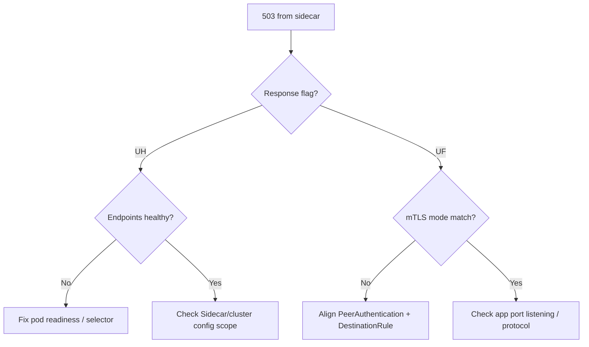

# Istio Sidecar 503 UH/UF

> **Severity:** High · **Typical recovery time:** 15–45 min · **Affected versions:** 1.21+

## Error Message

```text
upstream connect error or disconnect/reset before headers.
reset reason: connection failure, transport failure reason: ...
HTTP/1.1 503 Service Unavailable

response flags: UH   (no healthy upstream)
response flags: UF   (upstream connection failure)
```

## Description

In an Istio mesh, the Envoy sidecar returns `503` with response flags that pin
the cause. `UH` ("no healthy upstream") means Envoy has zero healthy endpoints for
the cluster — usually no ready pods behind the Service, or the destination isn't
in Envoy's config. `UF` ("upstream connection failure") means Envoy reached an
endpoint but the TCP/TLS connection failed — often an mTLS mode mismatch
(STRICT vs PERMISSIVE) or the app port not actually listening. These flags are
the fastest path to root cause.

## Affected Kubernetes Versions

Kubernetes 1.21+ with Istio 1.10+. The response-flag semantics and `istioctl
proxy-config` output are stable across recent Istio releases. Ambient mesh
(ztunnel) shifts some of this off the per-pod sidecar, but classic sidecar mode is
the common case here.

## Likely Root Causes

- No ready endpoints behind the destination Service (UH)
- mTLS mode mismatch: STRICT PeerAuthentication vs a plaintext/excluded client (UF)
- DestinationRule TLS settings conflicting with PeerAuthentication
- App not listening on the declared port, or wrong `appProtocol`/port name
- Sidecar not injected on one side, so traffic bypasses/violates mesh policy

## Diagnostic Flow



## Verification Steps

Read the exact response flag, then confirm against Envoy's view of clusters and
endpoints for the destination — do not guess between UH and UF.

## kubectl Commands

```bash
kubectl get endpoints <svc> -n <namespace> -o wide
kubectl get pods -n <namespace> -o wide -l <app-selector>
kubectl get peerauthentication -A
kubectl get destinationrule -A
kubectl logs <pod> -n <namespace> -c istio-proxy --tail=200 | grep -E '503|UH|UF'
kubectl exec <pod> -n <namespace> -c istio-proxy -- pilot-agent request GET clusters | grep <svc>
```

## Expected Output

```text
# istio-proxy access log
[2026-06-29T..] "GET /api HTTP/1.1" 503 UF ... upstream_cluster=outbound|8080||svc.ns.svc.cluster.local

# endpoints empty => UH
$ kubectl get endpoints orders -n shop
NAME     ENDPOINTS   AGE
orders   <none>      4d
```

## Common Fixes

1. UH: fix pod readiness / Service selector so endpoints are populated
2. UF: align PeerAuthentication mTLS mode with the client (STRICT both sides, or PERMISSIVE)
3. Remove conflicting DestinationRule `trafficPolicy.tls` settings
4. Correct the container port name/protocol so Envoy builds the cluster correctly

## Recovery Procedures

1. Capture the response flag and inspect endpoints + mesh config (read-only).
2. Apply the targeted PeerAuthentication/DestinationRule or readiness fix.
3. **Disruptive — roll the destination workload** if the fix is app-side
   (port/readiness). Blast radius: rolling restart of that service only.
4. **Disruptive — restart the client sidecar/pod** if it holds stale Envoy
   config. Blast radius: single pod; `istioctl proxy-config` confirms config
   pushed before recreating.

## Validation

`istioctl proxy-config clusters/endpoints` shows healthy endpoints for the
destination; access logs return `200` with no `UH`/`UF` flags; a test request
from the client pod succeeds over mTLS.

## Prevention

- Enforce sidecar injection on all mesh namespaces; alert on missing sidecars
- Standardize mTLS mode (STRICT) and avoid per-service DestinationRule TLS drift
- Name container ports with protocol prefixes (`http-`, `grpc-`)
- Validate mesh CRDs in CI with [config validators](https://devopsaitoolkit.com/validators/)

## Related Errors

- [Egress To External Blocked](egress-to-external-blocked.md)
- [Cilium Endpoint Not Ready](cilium-endpoint-not-regenerating.md)
- [ndots Extra DNS Lookups](ndots-extra-dns-lookups.md)

## References

- [Services, Load Balancing, and Networking](https://kubernetes.io/docs/concepts/services-networking/)
- [Service and Endpoints](https://kubernetes.io/docs/concepts/services-networking/service/)
