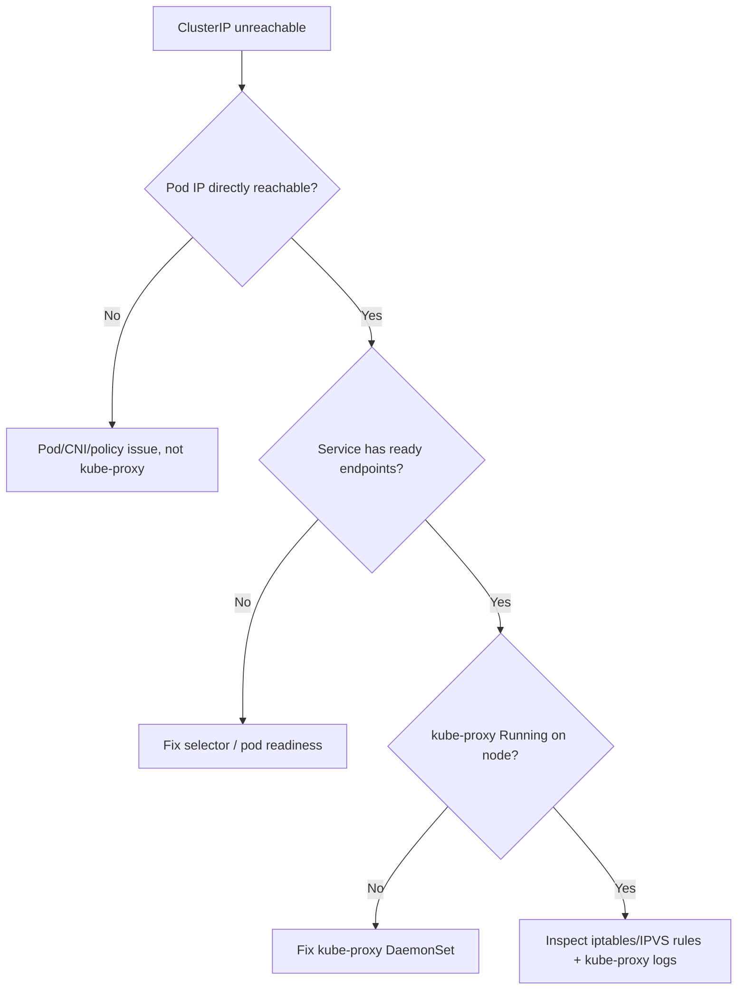

# ClusterIP Unreachable (kube-proxy)

> **Severity:** High · **Typical recovery time:** 15–45 min · **Affected versions:** 1.20+

## Error Message

```text
curl: (28) Failed to connect to 10.103.42.7 port 80 after 3000 ms: Connection timed out
dial tcp 10.96.0.1:443: i/o timeout          # even kubernetes.default ClusterIP fails
No route to host (10.103.42.7:80)
```

## Description

The Service name resolves to a ClusterIP, but connecting to that virtual IP
fails. ClusterIPs are not real interfaces — kube-proxy programs iptables/IPVS
rules on every node to DNAT ClusterIP traffic to a backing pod. If kube-proxy is
down, mis-rendering rules, or the Service has no endpoints, the ClusterIP is a
black hole. A telltale sign is that connecting *directly to a pod IP* works while
the *ClusterIP* does not.

This is High severity because it breaks the Service abstraction node-wide or
cluster-wide depending on scope, even though pods themselves are healthy.

## Affected Kubernetes Versions

All versions (1.20+). kube-proxy runs in `iptables` (default) or `ipvs` mode;
nftables mode is beta in newer releases (1.29+). Behaviour and diagnosis are the
same — the rules just live in a different subsystem.

## Likely Root Causes

- kube-proxy pod down/crashing on the node (stale or missing rules)
- Service has no ready endpoints (selector/readiness issue)
- iptables/IPVS rules not programmed (kube-proxy mode/config error)
- Conflicting firewall or another controller flushing iptables
- kube-proxy can't reach the API server to sync Service/Endpoints

## Diagnostic Flow



## Verification Steps

From a client pod, curl the pod IP and the ClusterIP. Pod IP works + ClusterIP
times out = kube-proxy / Service layer. Then confirm the Service has endpoints
and kube-proxy is healthy on the node where the client runs.

## kubectl Commands

```bash
kubectl get svc <service> -n <ns>
kubectl get endpoints <service> -n <ns>
kubectl get pods -n kube-system -l k8s-app=kube-proxy -o wide
kubectl logs -n kube-system -l k8s-app=kube-proxy --tail=40
kubectl exec -n <ns> <client> -- curl -s -m 3 http://<pod-ip>:80 -o /dev/null -w '%{http_code}\n'
kubectl exec -n <ns> <client> -- curl -s -m 3 http://<clusterip>:80 -o /dev/null -w '%{http_code}\n'
```

## Expected Output

```text
NAME       ENDPOINTS            AGE
web        10.244.2.9:8080      30m   # endpoints exist

# pod IP works, ClusterIP times out -> kube-proxy not programming rules:
200
curl: (28) Connection timed out after 3001 milliseconds

# kube-proxy log:
E  proxier.go  Failed to execute iptables-restore: exit status 1
```

## Common Fixes

1. Restore kube-proxy pods to Running on the affected node(s)
2. Fix the Service selector / pod readiness so endpoints populate
3. Resolve iptables/IPVS errors in kube-proxy logs (mode, conntrack, kernel mods)
4. Remove conflicting firewall/agents that flush kube-proxy's chains

## Recovery Procedures

1. Confirm the Service has ready endpoints; if not, fix selectors/readiness
   ([Service Name Not Resolving](./service-name-not-resolving.md) covers the DNS
   side).
2. Check kube-proxy health on the node and read its logs for rule-programming
   errors (missing kernel modules for IPVS, `iptables-restore` failures).
3. Restart kube-proxy on the affected node by rolling the DaemonSet.
   **Disruptive — node networking:** while kube-proxy restarts, Service routing
   on that node briefly reprograms; stage node by node, not all at once.
4. If another tool flushes iptables, fix that controller's config so it stops
   clobbering kube-proxy chains.

## Validation

Curling the ClusterIP returns the expected status from clients on every node,
including `kubernetes.default` (10.96.0.1) for control-plane reachability.

## Prevention

- Monitor kube-proxy DaemonSet readiness on every node
- Alert on Services with zero endpoints for critical workloads
- Preload required kernel modules for IPVS mode in the node image
- Avoid third-party agents that flush iptables without coordination

## Related Errors

- [Pod-to-Pod Connection Refused](./pod-to-pod-connection-refused.md)
- [Service Name Not Resolving](./service-name-not-resolving.md)
- [Pod-to-Pod Timeout](./pod-to-pod-timeout.md)

## References

- [Virtual IPs and Service Proxies](https://kubernetes.io/docs/reference/networking/virtual-ips/)
- [Debug Services](https://kubernetes.io/docs/tasks/debug/debug-application/debug-service/)

## Further Reading

- [DevOps AI ToolKit — Kubernetes guides](https://devopsaitoolkit.com/blog/)
