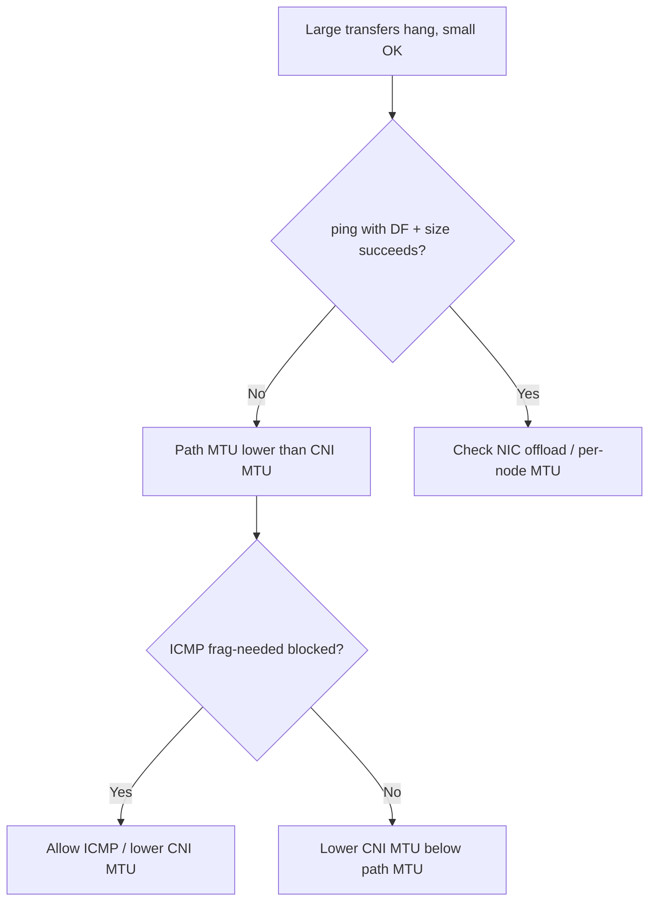

# MTU Mismatch Packet Drops

> **Severity:** High · **Typical recovery time:** 30–90 min · **Affected versions:** 1.20+

## Error Message

```text
intermittent packet loss / large packets dropped (MTU)

curl: (56) Recv failure: Connection reset by peer
TLS handshake stalls; small requests succeed, large responses hang
ip -s link: RX/TX dropped counters incrementing on cni0/flannel.1/cilium_vxlan
```

## Description

MTU mismatch is the classic "small requests work, big ones hang" failure. When
the CNI overlay interface (VXLAN/Geneve/IPIP) advertises an MTU larger than the
underlying network path can carry, packets above the path MTU are dropped — often
silently, because the encapsulation overhead (50 bytes for VXLAN) wasn't
subtracted. Symptoms are intermittent: TCP small payloads and pings succeed,
while large POST bodies, TLS handshakes, or image pulls stall and reset. It is
maddening to diagnose because connectivity "mostly works."

## Affected Kubernetes Versions

Independent of Kubernetes version (1.20+); it is a CNI/datapath property. Affects
Flannel (VXLAN default 1450), Calico (IPIP/VXLAN), Cilium (auto-detected), and
any overlay over a network with jumbo frames disabled or a lower-MTU tunnel
(e.g., cloud VPN/WireGuard at 1420 or 1380).

## Likely Root Causes

- CNI MTU not reduced for encapsulation overhead (VXLAN −50, WireGuard −80)
- Underlying network/VPN path MTU lower than nodes assume
- Mixed MTU across nodes after adding a new node pool
- Cloud provider blocks ICMP "fragmentation needed", breaking PMTU discovery
- NIC offload (TSO/GRO) masking the issue inconsistently

## Diagnostic Flow



## Verification Steps

Confirm it is MTU by sending Don't-Fragment packets at decreasing sizes and
comparing interface MTUs across nodes and the CNI overlay device.

## kubectl Commands

```bash
kubectl get nodes -o wide
kubectl -n kube-system get configmap -o name | grep -i -E 'flannel|calico|cilium'
kubectl -n kube-system get configmap kube-flannel-cfg -o yaml
kubectl -n kube-system exec <cilium-pod> -- cilium status | grep -i mtu
kubectl get pods -A -o wide --field-selector status.phase=Running
kubectl describe node <node> | grep -i -A2 'Addresses\|Allocatable'
```

## Expected Output

```text
# from inside a debug pod:
$ ping -M do -s 1472 10.0.4.21
ping: local error: message too long, mtu=1450

# cni0 MTU 1500 but flannel.1 (vxlan) MTU 1450 over a 1400 VPN path
flannel.1: dropped 18342 (TX), errors 0
```

## Common Fixes

1. Lower the CNI MTU to (path MTU − encapsulation overhead) and roll the DaemonSet
2. Allow ICMP type 3 code 4 (fragmentation needed) so PMTU discovery works
3. Standardize MTU across all node pools / instance types
4. For WireGuard/VPN overlays, set MTU ≤ 1380 to be safe

## Recovery Procedures

1. Measure the real path MTU with DF pings (read-only).
2. Set the correct MTU in the CNI ConfigMap (e.g., flannel `Network`/`Backend`
   MTU, Calico `veth_mtu`, Cilium `--mtu`).
3. **Disruptive — rolling restart of the CNI DaemonSet** to apply the new MTU.
   Blast radius: per-node CNI flap during the roll; do one node at a time and
   watch drop counters.
4. **Disruptive — recreate affected pods** so their veth picks up the new MTU.
   Blast radius: pod restarts for the selected workloads only.

## Validation

`ping -M do` succeeds at the new MTU minus headers; interface drop counters stop
climbing; a large file transfer / TLS handshake between pods on different nodes
completes without reset.

## Prevention

- Set CNI MTU explicitly; never rely on defaults across mixed networks
- Document path MTU for every link (VPN, peering, cloud interconnect)
- Add a synthetic large-payload cross-node probe to monitoring
- Validate CNI MTU values in CI with [config validators](https://devopsaitoolkit.com/validators/)

## Related Errors

- [Flannel subnet.env Missing](flannel-subnet-env-missing.md)
- [Cilium Agent Not Ready](cilium-agent-not-ready.md)
- [Egress To External Blocked](egress-to-external-blocked.md)

## References

- [Cluster networking](https://kubernetes.io/docs/concepts/cluster-administration/networking/)
- [Network plugins (CNI)](https://kubernetes.io/docs/concepts/extend-kubernetes/compute-storage-net/network-plugins/)
