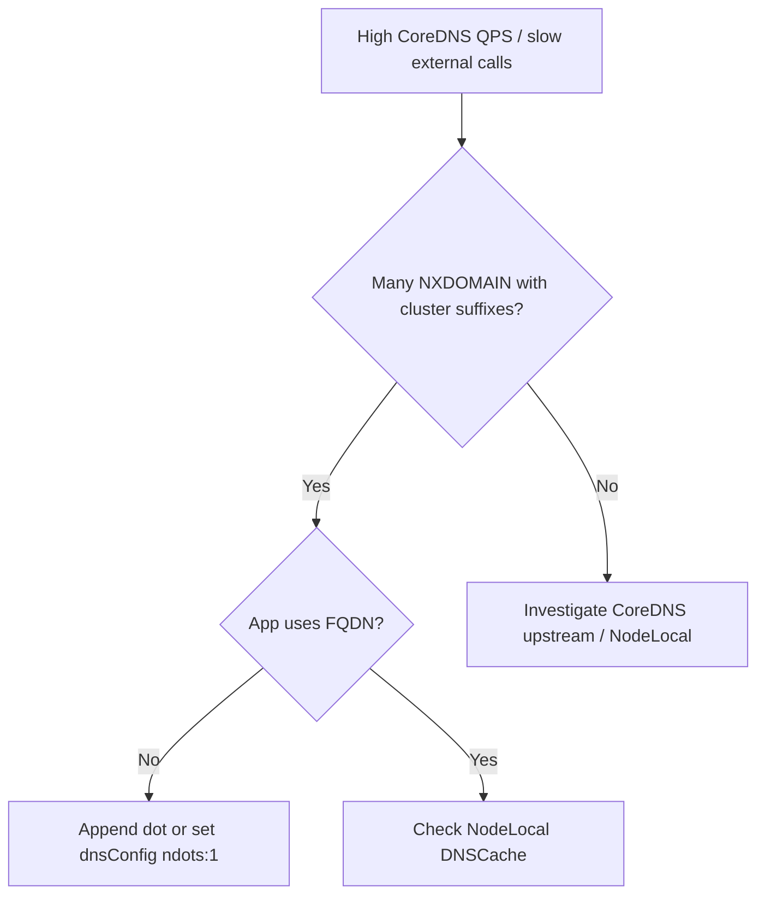

# ndots Extra DNS Lookups

> **Severity:** Medium · **Typical recovery time:** 10–30 min · **Affected versions:** 1.20+

## Error Message

```text
excessive DNS queries due to ndots:5

CoreDNS QPS spike; many NXDOMAIN for names like
api.stripe.com.default.svc.cluster.local
api.stripe.com.svc.cluster.local
api.stripe.com.cluster.local
latency added to every outbound connection
```

## Description

Kubernetes injects `ndots:5` into pod `/etc/resolv.conf` by default. Any hostname
with fewer than 5 dots is treated as relative and tried against every search
domain first. So resolving `api.stripe.com` (2 dots) fires up to four extra
cluster-suffix lookups that all NXDOMAIN before the real query succeeds. At scale
this multiplies CoreDNS load 4–5x, adds tail latency to every external call, and
can look like a DNS outage when it is actually search-domain amplification.

## Affected Kubernetes Versions

All Kubernetes 1.20+ using the default `ClusterFirst` dnsPolicy. The `ndots:5`
default is intentional (so short Service names resolve), but it penalizes
external FQDN lookups unless the name is fully qualified or `ndots` is tuned.

## Likely Root Causes

- Default `ndots:5` plus external hostnames with <5 dots (most common)
- Application code uses bare hostnames instead of FQDNs (no trailing dot)
- High request rate amplifying each lookup into 4–5 queries
- Missing per-pod `dnsConfig` override for DNS-heavy workloads
- NodeLocal DNSCache absent, so every miss hits CoreDNS over the network

## Diagnostic Flow



## Verification Steps

Confirm the queries are search-domain expansions by inspecting CoreDNS logs and
the pod's `resolv.conf` rather than assuming an upstream DNS failure.

## kubectl Commands

```bash
kubectl exec <pod> -n <namespace> -- cat /etc/resolv.conf
kubectl -n kube-system get configmap coredns -o yaml
kubectl -n kube-system logs -l k8s-app=kube-dns --tail=200 | grep -i nxdomain
kubectl -n kube-system get pods -l k8s-app=kube-dns -o wide
kubectl get pod <pod> -n <namespace> -o jsonpath='{.spec.dnsConfig}{"\n"}'
kubectl get pod <pod> -n <namespace> -o jsonpath='{.spec.dnsPolicy}{"\n"}'
```

## Expected Output

```text
# /etc/resolv.conf in pod
search default.svc.cluster.local svc.cluster.local cluster.local
options ndots:5

# CoreDNS log
[INFO] 10.0.2.5:51234 - A IN api.stripe.com.default.svc.cluster.local. NXDOMAIN
[INFO] 10.0.2.5:51235 - A IN api.stripe.com.svc.cluster.local.        NXDOMAIN
```

## Common Fixes

1. Use fully qualified names with a trailing dot for external hosts (`api.stripe.com.`)
2. Set a per-pod `dnsConfig` with `options: [{name: ndots, value: "1"}]`
3. Deploy NodeLocal DNSCache to absorb the extra negative lookups locally
4. Enable CoreDNS negative caching so repeat NXDOMAINs are cheap

## Recovery Procedures

1. Identify offending workloads from CoreDNS NXDOMAIN logs (read-only).
2. Apply a `dnsConfig` `ndots:1` override or FQDN change to the Deployment spec.
3. **Disruptive — roll the affected Deployment** so pods pick up the new
   `resolv.conf`. Blast radius: rolling restart of that workload only.
4. If CoreDNS is overloaded cluster-wide, **scale CoreDNS / enable NodeLocal
   DNSCache** — additive, low risk, but a DaemonSet rollout.

## Validation

Pod `resolv.conf` shows the tuned `ndots`; CoreDNS NXDOMAIN rate and QPS drop;
external call latency returns to baseline; no functional regression on in-cluster
Service resolution.

## Prevention

- Default DNS-heavy services to `ndots:2` and FQDNs in templates
- Run NodeLocal DNSCache fleet-wide
- Alert on CoreDNS QPS and NXDOMAIN ratio
- Lint pod specs for risky `ndots` with [config validators](https://devopsaitoolkit.com/validators/)

## Related Errors

- [NodeLocal DNSCache Failure](nodelocaldns-failure.md)
- [ExternalDNS Not Creating Records](externaldns-not-updating.md)
- [Egress To External Blocked](egress-to-external-blocked.md)

## References

- [DNS for Services and Pods](https://kubernetes.io/docs/concepts/services-networking/dns-pod-service/)
- [Customizing DNS Service](https://kubernetes.io/docs/tasks/administer-cluster/dns-custom-nameservers/)
