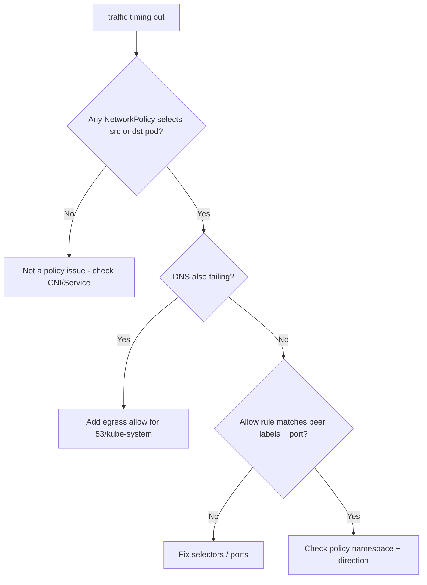

# NetworkPolicy Blocking Traffic

> **Severity:** High · **Typical recovery time:** 10–40 min · **Affected versions:** 1.20+

## Error Message

```text
dial tcp 10.244.5.23:5432: i/o timeout        # silently dropped by policy
calico-felix: Denying packet ... policyName=default/deny-all
cilium_monitor: Policy verdict: DENIED  ingress  10.244.1.4 -> 10.244.5.23:5432
upstream connect error or disconnect/reset before headers (DNS lookup timed out)
```

## Description

A NetworkPolicy is dropping packets the application expects to flow. Policies are
default-allow until *any* policy selects a pod; from then on, only explicitly
allowed traffic for that direction is permitted and everything else is silently
dropped — no RST, so callers see timeouts, not refusals. A very common pitfall:
a default-deny egress policy that forgets to allow DNS (UDP/TCP 53 to
kube-system), so every name lookup hangs.

This is High severity because policies are cluster security controls; a too-broad
deny can sever critical paths while looking like a generic network fault.

## Affected Kubernetes Versions

All versions (1.20+), provided the CNI enforces NetworkPolicy (Calico, Cilium,
Weave, Antrea; AWS VPC CNI needs the policy agent). Flannel alone does not
enforce policy. Egress rules and `namespaceSelector` semantics are stable across
modern releases.

## Likely Root Causes

- Default-deny policy without an allow rule for the needed flow
- Default-deny egress missing the DNS allow rule (UDP/TCP 53)
- `podSelector`/`namespaceSelector` not matching the intended peer
- Port/protocol mismatch in the allow rule
- Policy applied in the wrong namespace or with wrong labels

## Diagnostic Flow



## Verification Steps

List the policies selecting the source and destination pods and read their
ingress/egress rules. Confirm whether the failing flow (direction, peer
selector, port, protocol) is explicitly allowed. If DNS is also failing,
strongly suspect a default-deny egress without a DNS exception.

## kubectl Commands

```bash
kubectl get networkpolicy -A
kubectl describe networkpolicy <name> -n <ns>
kubectl get pods -n <ns> --show-labels
kubectl exec -n <ns> <client-pod> -- sh -c 'time nslookup kubernetes.default'
kubectl exec -n <ns> <client-pod> -- curl -s -m 3 http://<target>:5432 -o /dev/null -w '%{http_code}\n'
kubectl logs -n kube-system -l k8s-app=calico-node --tail=40 | grep -i den
```

## Expected Output

```text
Spec:
  PodSelector: app=api
  Policy Types: Ingress, Egress
  Egress: <none>          # default-deny egress: DNS and DB both blocked
  Ingress:
    From: podSelector app=frontend
    Ports: 8080/TCP

# DNS hangs because egress 53 is not allowed:
;; connection timed out; no servers could be reached
```

## Common Fixes

1. Add an egress rule allowing DNS (UDP+TCP 53) to the kube-system DNS pods
2. Add the missing ingress/egress allow rule for the required peer and port
3. Correct `podSelector`/`namespaceSelector` labels to match the real peer
4. Ensure the policy is in the same namespace as the pods it should govern

## Recovery Procedures

1. Identify which policy selects the affected pods and which direction is denied.
2. Add a targeted allow rule (peer + port + protocol). Always include a DNS
   egress exception in any default-deny egress policy.
3. **Emergency only:** temporarily relax the offending policy to restore
   service. **Disruptive — security blast radius:** loosening a policy exposes
   the workload; scope it tightly and revert once a precise rule is in place.
4. Re-apply the corrected, least-privilege policy and re-test the flow.

## Validation

The previously blocked flow (and DNS) succeeds from the affected pod, while
unrelated denied traffic stays blocked — confirm the allow rule is narrow, not a
blanket allow-all.

## Prevention

- Template a reusable "allow DNS egress" snippet for every default-deny policy
- Test policies in staging with explicit connectivity checks
- Use a policy linter / `kubectl describe` review in CI
- Label pods and namespaces consistently so selectors are predictable

## Related Errors

- [Pod-to-Pod Timeout](./pod-to-pod-timeout.md)
- [DNS Resolution Failure](./dns-resolution-failure.md)
- [ClusterIP Unreachable (kube-proxy)](./kube-proxy-clusterip-unreachable.md)

## References

- [Network Policies](https://kubernetes.io/docs/concepts/services-networking/network-policies/)
- [Declare Network Policy](https://kubernetes.io/docs/tasks/administer-cluster/declare-network-policy/)

## Further Reading

- [DevOps AI ToolKit — Kubernetes guides](https://devopsaitoolkit.com/blog/)
