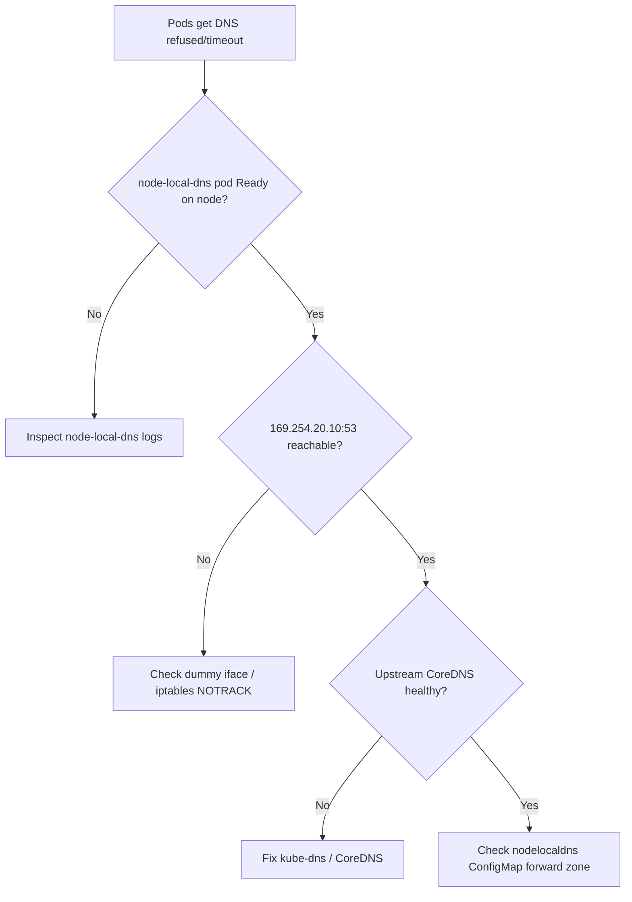

# NodeLocal DNSCache Failure

> **Severity:** High · **Typical recovery time:** 10–40 min · **Affected versions:** 1.20+

## Error Message

```text
node-local-dns not answering / cache failing

dial tcp 169.254.20.10:53: connect: connection refused
[ERROR] plugin/errors: ... read udp 169.254.20.10:53: i/o timeout
SERVFAIL from local cache; pods fall back / time out on DNS
```

## Description

NodeLocal DNSCache runs a CoreDNS-based DaemonSet listening on a link-local
address (default `169.254.20.10`) so pods resolve DNS without crossing the
network for every lookup. When the `node-local-dns` pod is down, its interface or
iptables rules are missing, or its upstream to cluster CoreDNS is broken, pods on
that node get connection-refused or timeouts for DNS. Because the dummy interface
and iptables NOTRACK rules are involved, failures can persist even after the pod
recovers if the datapath wasn't reprogrammed.

## Affected Kubernetes Versions

All Kubernetes 1.20+ clusters that opt into NodeLocal DNSCache. The link-local IP,
the `nodelocaldns` ConfigMap, and the `__PILLAR__` upstream templating are
consistent across recent releases. kube-proxy mode (iptables vs IPVS) changes how
the local listener is reached.

## Likely Root Causes

- `node-local-dns` DaemonSet pod crashed or not scheduled on the node
- Dummy interface / iptables NOTRACK rules missing or flushed (e.g., firewall reload)
- Upstream to cluster CoreDNS (`kube-dns` Service) unreachable
- ConfigMap misconfigured `__PILLAR__UPSTREAM__SERVERS__` / forward zone
- kube-proxy reprogrammed rules and dropped the local DNS interception

## Diagnostic Flow



## Verification Steps

Confirm the local cache, not upstream CoreDNS, is the problem by testing
resolution against the link-local IP from a pod on the affected node.

## kubectl Commands

```bash
kubectl -n kube-system get pods -l k8s-app=node-local-dns -o wide
kubectl -n kube-system logs <node-local-dns-pod> --tail=200
kubectl -n kube-system get configmap node-local-dns -o yaml
kubectl -n kube-system get svc kube-dns -o wide
kubectl exec <pod> -n <namespace> -- cat /etc/resolv.conf
kubectl -n kube-system get pods -l k8s-app=kube-dns -o wide
```

## Expected Output

```text
NAME                   READY   STATUS             RESTARTS   AGE
node-local-dns-9q2sx   0/1     CrashLoopBackOff   4          6m

[ERROR] plugin/errors: ... read udp 10.96.0.10:53: i/o timeout
# from a pod on the node:
$ nslookup kubernetes.default 169.254.20.10
;; connection timed out; no servers could be reached
```

## Common Fixes

1. Restart the failing `node-local-dns` pod so it reprograms its datapath
2. Re-apply iptables NOTRACK rules / restore the dummy interface after firewall reloads
3. Fix the upstream forward in the `node-local-dns` ConfigMap to point at kube-dns
4. Repair cluster CoreDNS if the local cache's upstream is the real fault

## Recovery Procedures

1. Confirm the pod state and test the link-local listener (read-only).
2. Correct the ConfigMap or upstream CoreDNS issue.
3. **Disruptive — delete the node-local-dns pod on the node** to force a clean
   restart and datapath reprogramming. Blast radius: brief DNS gap on that node;
   pods fall back to cluster CoreDNS during restart if `resolv.conf` allows.
4. **Disruptive — rolling restart of the DaemonSet** only for cluster-wide
   ConfigMap fixes. Blast radius: node-by-node DNS flap; roll gradually.

## Validation

`node-local-dns` pod is `Ready`; resolving a known name against
`169.254.20.10` succeeds from a pod on the node; CoreDNS upstream QPS normalizes;
no DNS timeouts in application logs.

## Prevention

- Run NodeLocal DNSCache with a PodDisruptionBudget and resource limits
- Ensure firewall/iptables reloads don't flush NOTRACK rules (manage via the DaemonSet)
- Alert on `node-local-dns` readiness and DNS error rate
- Validate the ConfigMap forward zone with [config validators](https://devopsaitoolkit.com/validators/)

## Related Errors

- [ndots Extra DNS Lookups](ndots-extra-dns-lookups.md)
- [ExternalDNS Not Creating Records](externaldns-not-updating.md)
- [Egress To External Blocked](egress-to-external-blocked.md)

## References

- [Using NodeLocal DNSCache](https://kubernetes.io/docs/tasks/administer-cluster/nodelocaldns/)
- [DNS for Services and Pods](https://kubernetes.io/docs/concepts/services-networking/dns-pod-service/)
