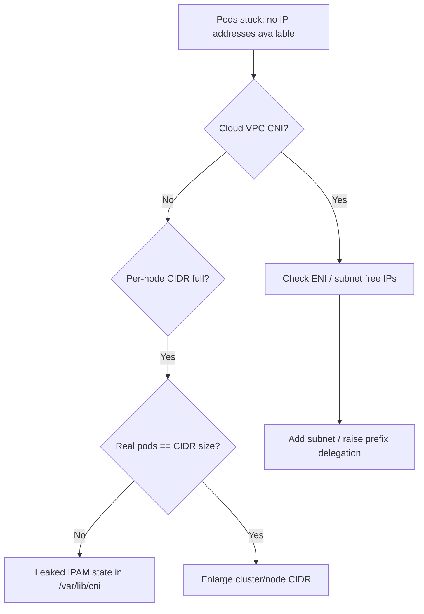

# Pod CIDR IP Exhaustion

> **Severity:** Critical · **Typical recovery time:** 15–60 min · **Affected versions:** 1.20+

## Error Message

```text
Warning  FailedCreatePodSandBox  kubelet  Failed to create pod sandbox:
plugin type="..." failed (add): failed to allocate for range 0:
no IP addresses available in range set: 10.244.3.1-10.244.3.254
```

## Description

The CNI IPAM has run out of usable addresses for the pod subnet assigned to a
node (or, for cloud VPC-CNI, the ENI/prefix pool). New pods on that node stall in
`ContainerCreating` because no IP can be assigned. This frequently appears after
scaling up, after many pod churn cycles that leaked IPs, or when the per-node
`/24` is simply too small for the pod density. It can also mean leaked IPAM state
in `/var/lib/cni/networks` from pods that died without proper teardown.

## Affected Kubernetes Versions

All Kubernetes 1.20+ clusters. Host-local IPAM (Flannel, default Calico) carves a
`podCIDR` per node — usually `/24` = 254 IPs. Cloud CNIs (AWS VPC CNI, Azure CNI)
exhaust differently: by ENI/secondary-IP limits or VPC subnet free addresses.

## Likely Root Causes

- Pod density exceeds the per-node CIDR size (e.g., >254 pods on a `/24`)
- Leaked host-local IPAM reservations in `/var/lib/cni/networks/<net>`
- Cluster pod CIDR / `--node-cidr-mask-size` too small for the fleet
- Cloud: VPC subnet or ENI secondary-IP limit reached (VPC CNI)
- Rapid pod churn faster than IPAM garbage collection

## Diagnostic Flow



## Verification Steps

Confirm the node's CIDR is actually full versus leaked reservations by comparing
running pod count to allocated IPs.

## kubectl Commands

```bash
kubectl get pods -A -o wide --field-selector spec.nodeName=<node> | wc -l
kubectl get node <node> -o jsonpath='{.spec.podCIDR}{"\n"}'
kubectl describe node <node> | grep -i -A3 'Allocatable\|Allocated resources'
kubectl get pods -A --field-selector status.phase=Pending -o wide
kubectl get events -A --sort-by=.lastTimestamp | grep -i 'no IP addresses'
kubectl get configmap -n kube-system aws-node -o yaml 2>/dev/null
```

## Expected Output

```text
# 254 IPs in a /24, ~254 running pods on the node:
$ kubectl get pods -A -o wide --field-selector spec.nodeName=worker-3 | wc -l
   255

Warning FailedCreatePodSandBox  failed to allocate for range 0:
  no IP addresses available in range set: 10.244.3.1-10.244.3.254
```

## Common Fixes

1. Enlarge the pod CIDR / lower `--node-cidr-mask-size` (gives more IPs per node)
2. For VPC CNI, enable prefix delegation or add subnets to the subnet group
3. Reclaim leaked IPAM state (clean stale files in `/var/lib/cni/networks`)
4. Spread workload to more nodes or raise pods-per-node CIDR size

## Recovery Procedures

1. Confirm whether IPs are genuinely used or leaked (read-only).
2. For leaks, **disruptive — restart the CNI/kubelet on the node** so IPAM
   rebuilds. Blast radius: that node's pods may restart; do one node at a time.
3. For genuine exhaustion, expand the CIDR. Changing cluster pod CIDR is a major
   operation — **disruptive — and may require recreating nodes.** Blast radius:
   fleet-wide; plan a controlled node pool rotation.
4. As an immediate relief, **cordon and shift workloads** to under-utilized nodes.

## Validation

New pods schedule and reach `Running` on the previously full node; the
`no IP addresses available` events stop; allocated IPs are below the CIDR size
with headroom.

## Prevention

- Size pod CIDR and `node-cidr-mask-size` for peak density plus 30% headroom
- Use VPC CNI prefix delegation in cloud to multiply available IPs
- Alert on per-node IP utilization (e.g., >80%)
- Catch undersized CIDRs early with [config validators](https://devopsaitoolkit.com/validators/)

## Related Errors

- [Flannel subnet.env Missing](flannel-subnet-env-missing.md)
- [Cilium Agent Not Ready](cilium-agent-not-ready.md)
- [MTU Mismatch Packet Drops](mtu-mismatch-packet-drops.md)

## References

- [Cluster networking](https://kubernetes.io/docs/concepts/cluster-administration/networking/)
- [Network plugins (CNI)](https://kubernetes.io/docs/concepts/extend-kubernetes/compute-storage-net/network-plugins/)
