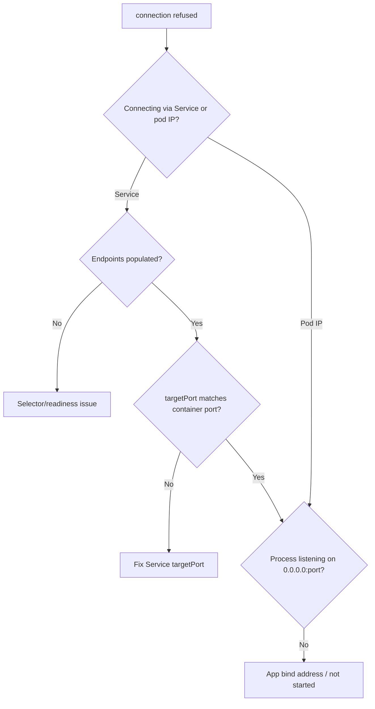

# Pod-to-Pod Connection Refused

> **Severity:** High · **Typical recovery time:** 10–30 min · **Affected versions:** 1.20+

## Error Message

```text
dial tcp 10.244.3.17:8080: connect: connection refused
Get "http://payments:8080/health": dial tcp 10.103.42.7:8080: connect: connection refused
curl: (7) Failed to connect to redis port 6379: Connection refused
```

## Description

The DNS name resolved and a TCP packet reached the destination, but the target
actively refused the connection by sending a RST. This is fundamentally
different from a timeout: the network path works, so the problem is the
*destination* — nothing is listening on that IP and port. The application may
not have started, may be bound to `127.0.0.1` instead of `0.0.0.0`, or the
Service `targetPort` may not match the container's actual port.

This is High severity because it usually means a dependency is effectively down
for callers even if the pod shows `Running`.

## Affected Kubernetes Versions

All versions (1.20+). Behaviour is independent of CNI; `connection refused` is a
standard TCP RST surfaced by the kernel, so the diagnosis is the same on any
cluster.

## Likely Root Causes

- Target container not listening yet (still starting / crashed)
- App bound to `127.0.0.1`/`localhost` instead of `0.0.0.0`
- Service `targetPort` ≠ the container's listening port
- Wrong port in the client config
- Service selector matches a pod whose process isn't up

## Diagnostic Flow



## Verification Steps

Hit the pod IP directly to bypass the Service. If the pod IP also refuses, the
target process isn't listening on that interface/port. Then confirm what the
process is actually bound to and that the Service `targetPort` matches.

## kubectl Commands

```bash
kubectl get endpoints <service> -n <ns>
kubectl get svc <service> -n <ns> -o yaml | grep -A3 ports
kubectl exec -n <ns> <client-pod> -- curl -s -m 3 http://<pod-ip>:8080/ -o /dev/null -w '%{http_code}\n'
kubectl exec -n <ns> <target-pod> -- ss -ltnp
kubectl logs -n <ns> <target-pod> --tail=50
```

## Expected Output

```text
# ss inside target pod — note bind on 127.0.0.1, not 0.0.0.0:
State    Recv-Q   Local Address:Port    Process
LISTEN   0        127.0.0.1:8080        users:(("app",pid=1))

# curl to pod IP:
curl: (7) Failed to connect to 10.244.3.17 port 8080: Connection refused
```

## Common Fixes

1. Make the app listen on `0.0.0.0:<port>`, not loopback
2. Align Service `targetPort` with the container's listening port
3. Wait for / fix the target so its process is actually up and Ready
4. Correct the port number in the client's configuration

## Recovery Procedures

1. Reproduce against the pod IP to isolate Service vs. application.
2. Inside the target pod, run `ss -ltnp` to see the real bind address and port.
   A `127.0.0.1` bind is the classic cause — fix the app's listen address.
3. If endpoints are empty, the Service selector or pod readiness is the issue;
   reconcile labels/probes.
4. Roll the target Deployment after a config fix.
   **Disruptive — single workload:** restarting the target briefly drops its
   in-flight connections; readiness gating limits caller impact.

## Validation

`curl` to both the pod IP and the Service ClusterIP returns the expected
response code, endpoints are populated, and `ss` shows a `0.0.0.0` (or `::`)
bind on the right port.

## Prevention

- Standardise on `0.0.0.0` binds and document ports in the container image
- Add readiness probes on the real listening port
- Validate Service `targetPort` against container `containerPort` in CI
- Use named ports to keep Service and container in sync

## Related Errors

- [Pod-to-Pod Timeout](./pod-to-pod-timeout.md)
- [ClusterIP Unreachable (kube-proxy)](./kube-proxy-clusterip-unreachable.md)
- [Service Name Not Resolving](./service-name-not-resolving.md)

## References

- [Connecting Applications with Services](https://kubernetes.io/docs/tutorials/services/connect-applications-service/)
- [Debug Services](https://kubernetes.io/docs/tasks/debug/debug-application/debug-service/)

## Further Reading

- [DevOps AI ToolKit — Kubernetes guides](https://devopsaitoolkit.com/blog/)
