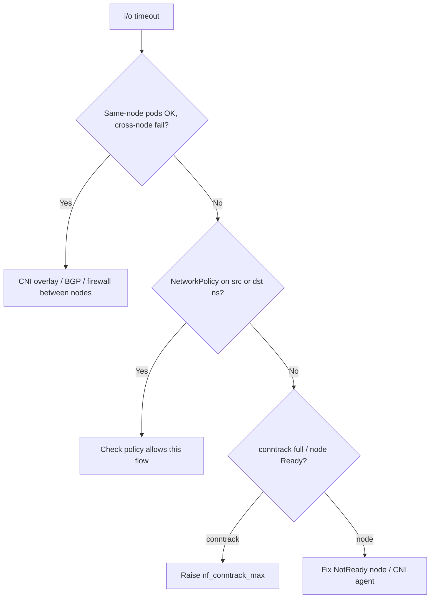

# Pod-to-Pod Timeout

> **Severity:** High · **Typical recovery time:** 15–60 min · **Affected versions:** 1.20+

## Error Message

```text
dial tcp 10.244.5.23:8080: i/o timeout
Get "http://orders:8080/": context deadline exceeded (Client.Timeout exceeded)
curl: (28) Connection timed out after 5001 milliseconds
```

## Description

Unlike `connection refused`, a timeout means the SYN packet never got an answer:
the destination silently dropped it or the path never reached it. Nothing sent a
RST. In Kubernetes this points at the network fabric between pods — a
NetworkPolicy dropping the traffic, a broken CNI overlay/route, an unhealthy
node, conntrack exhaustion, or cross-node encapsulation failing.

This is High severity because it tends to be intermittent or topology-specific
(works same-node, fails cross-node), which makes it hard to diagnose and can
partially degrade many services at once.

## Affected Kubernetes Versions

All versions (1.20+). Symptoms depend heavily on the CNI (Calico, Cilium,
Flannel, AWS VPC CNI). Cross-node failures frequently trace to overlay
encapsulation (VXLAN/IPIP), BGP routing, or security-group/firewall rules.

## Likely Root Causes

- NetworkPolicy denying ingress/egress between the pods
- CNI overlay/routing broken (node down, BGP/VXLAN issue)
- Destination node NotReady or its CNI agent unhealthy
- conntrack table full on a node, dropping new flows
- Cloud security group / firewall blocking the node-to-node or VXLAN port

## Diagnostic Flow



## Verification Steps

Test connectivity from a pod on the *same* node as the target, then from a pod
on a *different* node. A same-node success with cross-node failure points
squarely at the CNI/overlay or node-to-node firewall, not the application.

## kubectl Commands

```bash
kubectl get pods -o wide -n <ns>            # note which nodes pods are on
kubectl get networkpolicy -A
kubectl exec -n <ns> <same-node-client> -- curl -s -m 3 http://<pod-ip>:8080/ -o /dev/null -w '%{http_code}\n'
kubectl exec -n <ns> <other-node-client> -- curl -s -m 3 http://<pod-ip>:8080/ -o /dev/null -w '%{http_code}\n'
kubectl get nodes -o wide
kubectl logs -n kube-system -l k8s-app=calico-node --tail=30
```

## Expected Output

```text
# Same node:
200
# Different node:
curl: (28) Connection timed out after 3001 milliseconds

NAME     STATUS   ROLES    AGE   VERSION
node-3   NotReady <none>   2d    v1.29.4   # destination node unhealthy
```

## Common Fixes

1. Add/repair a NetworkPolicy rule that allows the required flow
2. Restore the CNI fabric (fix NotReady node, restart CNI agent, repair BGP)
3. Open node-to-node and overlay ports (VXLAN 4789 / IPIP / BGP 179) in firewalls
4. Increase `nf_conntrack_max` on nodes hitting conntrack limits

## Recovery Procedures

1. Use the same-node vs. cross-node test to localise the fault.
2. If a NetworkPolicy is the cause, treat it as
   [NetworkPolicy Blocking Traffic](./networkpolicy-blocking-traffic.md).
3. If cross-node is broken, inspect the CNI: check
   [Calico Node Not Ready](./calico-node-not-ready.md) and
   [Calico BGP Peering Down](./calico-bgp-peer-down.md), and verify overlay/BGP
   ports are open between nodes.
4. If conntrack is full, raise `nf_conntrack_max` via the CNI/sysctl config and
   roll the affected nodes. **Disruptive — per node:** draining evicts pods;
   stage across the fleet.

## Validation

Both same-node and cross-node `curl` to the target return the expected status,
and intermittent timeout errors disappear from application logs.

## Prevention

- Test default-deny NetworkPolicies in staging before rollout
- Monitor node Ready status and CNI agent health
- Alert on conntrack utilisation per node
- Keep node and overlay firewall rules in version control

## Related Errors

- [Pod-to-Pod Connection Refused](./pod-to-pod-connection-refused.md)
- [NetworkPolicy Blocking Traffic](./networkpolicy-blocking-traffic.md)
- [Calico Node Not Ready](./calico-node-not-ready.md)

## References

- [Debug Services](https://kubernetes.io/docs/tasks/debug/debug-application/debug-service/)
- [Cluster Networking](https://kubernetes.io/docs/concepts/cluster-administration/networking/)

## Further Reading

- [DevOps AI ToolKit — Kubernetes guides](https://devopsaitoolkit.com/blog/)
