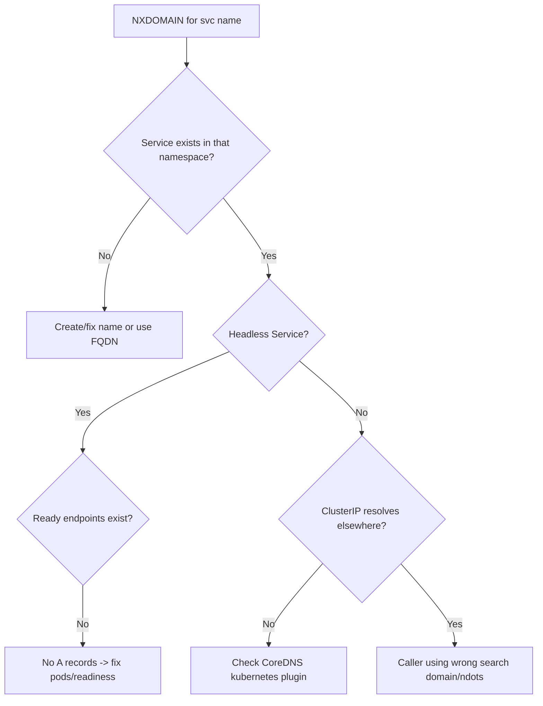

# Service Name Not Resolving

> **Severity:** High · **Typical recovery time:** 10–30 min · **Affected versions:** 1.20+

## Error Message

```text
nslookup: can't resolve 'myservice.namespace.svc.cluster.local'
** server can't find myservice.prod.svc.cluster.local: NXDOMAIN
Error: dial tcp: lookup payments on 10.96.0.10:53: no such host
```

## Description

DNS works in general, but one specific Service name will not resolve. CoreDNS
synthesises A/SRV records from the Kubernetes API for every Service. If the
Service object doesn't exist, lives in another namespace, has no backing
endpoints (for a headless Service), or is referenced by the wrong name, CoreDNS
returns `NXDOMAIN` and the caller fails with `no such host`.

This is High severity because a single mis-resolved dependency can take down a
critical request path even though DNS infrastructure is healthy. It is
frequently a naming or namespace mistake rather than an infrastructure fault.

## Affected Kubernetes Versions

All clusters (1.20+). The DNS schema `<svc>.<ns>.svc.cluster.local` is stable.
Headless Services (`clusterIP: None`) only publish A records when they have
ready endpoints — a common source of `NXDOMAIN`.

## Likely Root Causes

- Service name or namespace typo (cross-namespace call without FQDN)
- Service doesn't exist / was deleted or never created
- Headless Service with zero ready endpoints (no A records published)
- `publishNotReadyAddresses` false while all pods are NotReady
- CoreDNS Corefile missing the `kubernetes` plugin / stale API watch

## Diagnostic Flow



## Verification Steps

Confirm the Service exists in the expected namespace, then resolve its FQDN from
a test pod. If the FQDN works but the short name doesn't, the caller is in a
different namespace and needs the full name. If the FQDN returns `NXDOMAIN` for a
headless Service, check its endpoints.

## kubectl Commands

```bash
kubectl get svc myservice -n namespace
kubectl get endpoints myservice -n namespace
kubectl get endpointslices -n namespace -l kubernetes.io/service-name=myservice
kubectl exec -n <ns> <pod> -- nslookup myservice.namespace.svc.cluster.local
kubectl exec -n <ns> <pod> -- nslookup myservice
kubectl get svc kube-dns -n kube-system
```

## Expected Output

```text
** server can't find myservice.prod.svc.cluster.local: NXDOMAIN

# Headless service with no ready endpoints:
NAME        ENDPOINTS   AGE
myservice   <none>      12m

# Working case after fix:
Name:   myservice.prod.svc.cluster.local
Address: 10.103.42.7
```

## Common Fixes

1. Use the FQDN `<svc>.<ns>.svc.cluster.local` for cross-namespace calls
2. Create or correct the Service so the name/namespace matches the caller
3. For headless Services, make at least one backing pod Ready so A records appear
4. Restore the `kubernetes` plugin in the CoreDNS Corefile

## Recovery Procedures

1. Verify the Service object exists in the right namespace and the selector
   matches pod labels so endpoints populate.
2. For a ClusterIP Service that resolves but isn't reachable, treat it as
   [ClusterIP Unreachable](./kube-proxy-clusterip-unreachable.md).
3. For headless Services returning `NXDOMAIN`, fix pod readiness so endpoints
   appear, or set `publishNotReadyAddresses: true` if the client must discover
   not-ready pods (e.g. some clustering apps).
4. If CoreDNS lost its API watch, roll the CoreDNS deployment.
   **Disruptive — cluster-wide:** restarts DNS; surge the rollout.

## Validation

The Service FQDN resolves to its ClusterIP (or pod IPs for headless) from a test
pod in the calling namespace, and the dependent request path recovers.

## Prevention

- Reference cross-namespace Services by FQDN in config and Helm values
- Add CI checks that Service names/selectors match their Deployments
- Alert on Services with zero endpoints for critical workloads
- Keep the CoreDNS `kubernetes` plugin and RBAC intact during upgrades

## Related Errors

- [DNS Resolution Failure](./dns-resolution-failure.md)
- [ClusterIP Unreachable (kube-proxy)](./kube-proxy-clusterip-unreachable.md)
- [CoreDNS CrashLoopBackOff](./coredns-crashloopbackoff.md)

## References

- [DNS for Services and Pods](https://kubernetes.io/docs/concepts/services-networking/dns-pod-service/)
- [Headless Services](https://kubernetes.io/docs/concepts/services-networking/service/#headless-services)

## Further Reading

- [DevOps AI ToolKit — Kubernetes guides](https://devopsaitoolkit.com/blog/)
