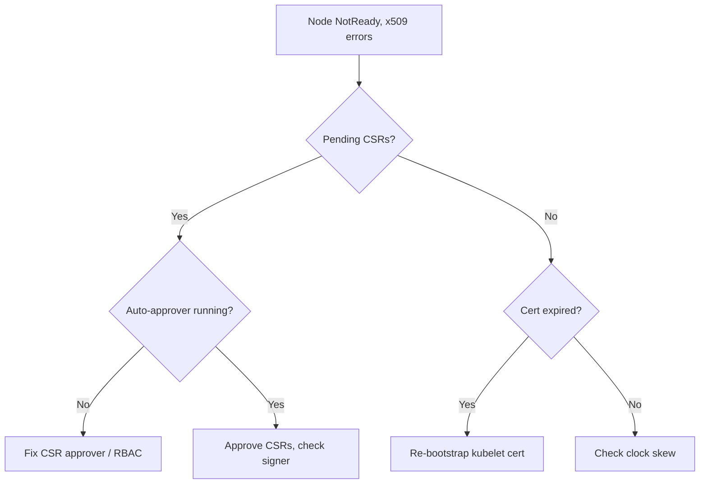

# Kubelet Cert Rotation Failed

> **Severity:** Critical · **Typical recovery time:** 15–45 min · **Affected versions:** 1.20+

## Description

The kubelet authenticates to the API server with a client certificate that it
rotates automatically before expiry by submitting a CertificateSigningRequest
(CSR). If rotation fails — the CSR is not approved, the signer is broken, or
clock skew invalidates the cert — the kubelet eventually presents an expired
certificate, the API server rejects it, and the node goes `NotReady`. New CSRs
also fail because the kubelet can no longer authenticate to create them.

This is a creeping failure: nodes are fine until the cert lapses, then drop
out, often several at once if rotation has been silently broken cluster-wide.
Because the kubelet cannot post status, pods are evicted and the node looks
unreachable.

## Error Message

```text
kubelet: failed to rotate kubelet client certificate:
certificate request was not signed: timed out waiting for the condition
Unable to register node with API server ... x509: certificate has expired or is not yet valid
```

## Affected Kubernetes Versions

Applies to 1.20+. Automatic rotation is enabled by default
(`rotateCertificates: true`). Serving-cert rotation
(`serverTLSBootstrap`/`RotateKubeletServerCertificate`) follows the same CSR
flow. The `kubernetes.io/kube-apiserver-client-kubelet` signer must be working.

## Likely Root Causes

- CSRs pending and never approved (no approver / RBAC for the CSR approver)
- The signing controller (kube-controller-manager) misconfigured or down
- Clock skew between node and control plane invalidating certs
- The existing kubelet client cert already expired, so it cannot request a new one

## Diagnostic Flow



## Verification Steps

Confirm certificate expiry and CSR state, and whether the controller-manager
signer is healthy.

## kubectl Commands

```bash
kubectl get nodes
kubectl get csr
kubectl get csr -o wide | grep -i pending
kubectl describe csr <csr-name>
kubectl -n kube-system get pods -l component=kube-controller-manager

# On the node host (read-only):
sudo journalctl -u kubelet --no-pager | grep -iE 'certificate|x509|rotate'
sudo openssl x509 -enddate -noout -in /var/lib/kubelet/pki/kubelet-client-current.pem
date -u
```

## Expected Output

```text
$ kubectl get csr
NAME        AGE   SIGNERNAME                                    REQUESTOR             CONDITION
csr-abc12   8m    kubernetes.io/kube-apiserver-client-kubelet   system:node:node-1    Pending

$ openssl x509 -enddate -noout -in /var/lib/kubelet/pki/kubelet-client-current.pem
notAfter=Jun 28 09:00:00 2026 GMT
```

## Common Fixes

1. Approve legitimate pending CSRs and fix the auto-approver RBAC so future
   rotations approve automatically.
2. Repair the kube-controller-manager signer (correct `--cluster-signing-*`
   flags / CA key) so CSRs get signed.
3. Correct clock skew (sync NTP/chrony) on nodes and control plane.

## Recovery Procedures

1. If certs are still valid but CSRs are stuck, approve them and fix the
   approver — no node disruption.
2. If the kubelet cert has already expired, re-bootstrap it: restore a valid
   bootstrap token / kubeconfig and **restart the kubelet** — blast radius:
   node-local, but required to rejoin.
3. For a wedged node where the cert and bootstrap are both gone, **drain and
   rejoin** it — blast radius: its pods reschedule; verify capacity first.
4. Validate each node before moving on; fix the cluster-wide cause so it does
   not recur on every node.

## Validation

`kubectl get nodes` shows `Ready`, no `Pending` CSRs remain, the kubelet log is
free of x509 errors, and the on-disk cert has a future `notAfter` date.

## Prevention

- Keep `rotateCertificates: true` and a working CSR auto-approver.
- Alert on certificate expiry and on `Pending` CSRs older than a few minutes.
- Enforce NTP across all nodes and control-plane hosts.

## Related Errors

- [Container Runtime Network Not Ready](node-container-runtime-network-not-ready.md)
- [Node cgroup Driver Mismatch](node-cgroup-driver-mismatch.md)
- [Node Kernel Hung / Panic](node-kernel-hung.md)

## References

- [Certificate rotation](https://kubernetes.io/docs/tasks/tls/certificate-rotation/)
- [Certificate Signing Requests](https://kubernetes.io/docs/reference/access-authn-authz/certificate-signing-requests/)

## Further Reading

- [DevOps AI ToolKit — Kubernetes guides](https://devopsaitoolkit.com/blog/)
