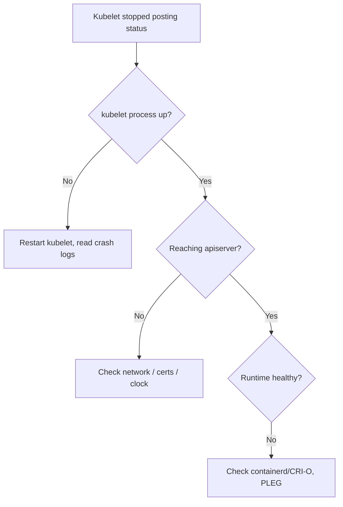

# Kubelet Stopped Posting Status

> **Severity:** High · **Typical recovery time:** 5–30 min · **Affected versions:** 1.20+

## Error Message

```text
Conditions:
  Type     Status    Reason               Message
  Ready    Unknown   NodeStatusUnknown    Kubelet stopped posting node status.

LastHeartbeatTime: 2026-06-29T13:58:02Z   (stale)
```

## Description

This message comes from the node controller: it has not seen a node lease update
within the monitor grace period, so it flips the `Ready` condition to `Unknown`
with reason `NodeStatusUnknown`. It means the kubelet's heartbeat path to the
API server has broken — the kubelet may be crashed, hung, throttled, blocked on
the runtime, or unable to authenticate/connect to the control plane.

In an incident this is the precursor to taint-based eviction: once `Ready` is
`Unknown`, the `unreachable` taint is applied and pods start evicting. Fast
diagnosis of why the heartbeat stopped is key to avoiding unnecessary churn.

## Affected Kubernetes Versions

Applies to 1.20+. Heartbeats use the `coordination.k8s.io` Lease in the
`kube-node-lease` namespace (default renew 10s, lease duration 40s). The
controller's `--node-monitor-grace-period` governs when status becomes
`Unknown`. The mechanism is stable across modern releases.

## Likely Root Causes

- kubelet process crashed, hung, or OOM-killed
- Container runtime down, so kubelet is blocked (PLEG unhealthy)
- Node→apiserver network/firewall break
- Expired kubelet client certificate (TLS handshake fails)
- Clock skew causing TLS validation failures
- kubelet CPU starvation preventing lease renewal

## Diagnostic Flow



## Verification Steps

Confirm `Ready=Unknown` with reason `NodeStatusUnknown` and a stale
`LastHeartbeatTime`, then check whether the kubelet is even running on the host.

## kubectl Commands

```bash
kubectl get nodes -o wide
kubectl describe node worker-2 | sed -n '/Conditions/,/Events/p'
kubectl get lease -n kube-node-lease worker-2 -o yaml
kubectl get events --field-selector involvedObject.name=worker-2 --sort-by=.lastTimestamp
# Host-level read-only checks:
systemctl status kubelet
journalctl -u kubelet --since "20 min ago" --no-pager
systemctl status containerd
```

## Expected Output

```text
Conditions:
  Ready   Unknown   NodeStatusUnknown   Kubelet stopped posting node status.

# journalctl -u kubelet
E0629 use of closed network connection
E0629 PLEG is not healthy: pleg was last seen active 3m ago
```

## Common Fixes

1. Restart the kubelet and/or container runtime on the node.
2. Restore node→apiserver connectivity (firewall, DNS, routes).
3. Renew an expired kubelet certificate and re-sync the clock.

## Recovery Procedures

1. Read kubelet/runtime logs to find why heartbeats stopped before acting.
2. Restart kubelet, then the runtime if PLEG is unhealthy — **blast radius:
   node only**; pods keep running but lose their manager briefly.
3. If the node cannot be revived before the eviction timeout, **cordon then
   drain** to relocate workloads. Drain evicts all pods and may breach PDBs.
   Safer alternative: cordon and provision a replacement, then drain.
4. Reboot only if kubelet/runtime are unrecoverable — full node blast radius.

## Validation

The node returns to `Ready`, the lease in `kube-node-lease` updates on the
~10s cadence, `LastHeartbeatTime` is current, and no eviction events follow.

## Prevention

- Alert on node lease staleness well before the monitor grace period.
- Automate kubelet certificate rotation (`--rotate-certificates`).
- Reserve CPU for system/kube so kubelet never starves.
- Monitor container runtime health and PLEG latency.

## Related Errors

- [NodeNotReady](./nodenotready.md)
- [Node Unreachable](./node-unreachable.md)
- [Node Clock Skew](./node-clock-skew.md)

## References

- [Heartbeats and node leases](https://kubernetes.io/docs/concepts/architecture/nodes/#heartbeats)
- [Node controller](https://kubernetes.io/docs/concepts/architecture/nodes/#node-controller)

## Further Reading

- [DevOps AI ToolKit — Kubernetes guides](https://devopsaitoolkit.com/blog/)
