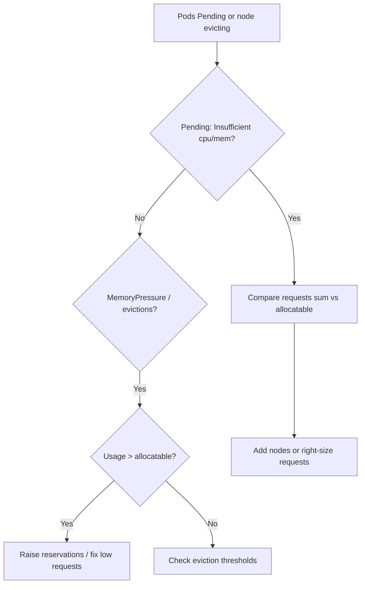

# Node Allocatable Exhausted

> **Severity:** High · **Typical recovery time:** 15–45 min · **Affected versions:** 1.20+

## Description

A node's *allocatable* resources are its capacity minus `kube-reserved`,
`system-reserved`, and the eviction threshold. The scheduler only places pods
against allocatable, not raw capacity. When pod requests sum to allocatable, no
further pods schedule on the node (`Insufficient cpu/memory`). Worse, if actual
usage by pods plus system daemons overcommits real memory — because requests
were set too low or reservations too small — the node hits `MemoryPressure`,
the kubelet evicts pods, and the kubelet/runtime themselves can be starved.

This shows up as `Pending` pods despite "free" capacity, or as eviction storms
on a node that looks under-requested. The gap between capacity and allocatable,
and the accuracy of reservations, is the heart of the problem.

## Error Message

```text
0/4 nodes are available: 4 Insufficient memory.
The node was low on resource: memory. Threshold quantity: ...
system-reserved/kube-reserved overcommit: node Allocatable exhausted
```

## Affected Kubernetes Versions

Applies to 1.20+. Node allocatable is computed from
`KubeletConfiguration` (`kubeReserved`, `systemReserved`,
`evictionHard`, `enforceNodeAllocatable`). Defaults vary by installer; managed
distros often set conservative reservations.

## Likely Root Causes

- Pod requests sum up to allocatable, so the scheduler stops placing pods
- `kube-reserved` / `system-reserved` too small, so daemons overcommit memory
- Requests set far below real usage, hiding true consumption from the scheduler
- A few large pods fragmenting capacity so nothing else fits

## Diagnostic Flow



## Verification Steps

Compare summed pod requests and real usage against the node's allocatable, and
inspect the reservation settings.

## kubectl Commands

```bash
kubectl describe node <node> | grep -A12 "Allocated resources"
kubectl get node <node> -o jsonpath='{.status.capacity}{"\n"}{.status.allocatable}{"\n"}'
kubectl top node <node>
kubectl top pods -A --sort-by=memory | head
kubectl get events -A --sort-by=.lastTimestamp | grep -iE 'Insufficient|Evicted|MemoryPressure'

# On the node host (read-only):
grep -E 'kubeReserved|systemReserved|evictionHard' /var/lib/kubelet/config.yaml
free -h
```

## Expected Output

```text
$ kubectl describe node node-1 | grep -A6 "Allocated resources"
Allocated resources:
  Resource  Requests       Limits
  cpu       3800m (95%)    6 (150%)
  memory    14800Mi (96%)  20Gi

$ kubectl get events -A | grep Insufficient
default ... FailedScheduling 0/4 nodes are available: 4 Insufficient memory.
```

## Common Fixes

1. Right-size pod `requests` to match real usage so the scheduler packs nodes
   accurately and stops over- or under-committing.
2. Set realistic `kubeReserved`/`systemReserved` and an eviction threshold so
   system daemons keep headroom.
3. Add nodes / scale the node pool (or use larger instances) for genuine
   capacity shortfalls.

## Recovery Procedures

1. For `Pending` pods, scale out the node pool or reduce/right-size requests so
   they fit — no disruption to running pods.
2. To apply changed reservations, update `KubeletConfiguration` and **restart
   the kubelet** node-by-node — blast radius: node-local resync; pods may be
   re-evaluated against new allocatable.
3. If a node is overcommitted and evicting, **cordon and drain** it to relieve
   pressure, then return it with corrected reservations — blast radius: its
   pods reschedule; verify cluster capacity and PDBs first.

## Validation

`Pending` pods schedule, `Allocated resources` sit below 100% of allocatable,
`MemoryPressure` is `False`, and evictions stop. `kubectl top node` shows
headroom above reservations.

## Prevention

- Enforce sensible `requests` via LimitRange / policy and VPA recommendations.
- Standardise `kubeReserved`/`systemReserved`/eviction thresholds in node images.
- Alert on allocatable utilisation and `MemoryPressure`.

## Related Errors

- [Node Image GC Failed](node-image-gc-failed.md)
- [Node Too Many Open Files](node-too-many-open-files.md)
- [NoExecute Taint Evicting Pods](node-noexecute-taint-evicting.md)

## References

- [Reserve Compute Resources for System Daemons](https://kubernetes.io/docs/tasks/administer-cluster/reserve-compute-resources/)
- [Node-pressure eviction](https://kubernetes.io/docs/concepts/scheduling-eviction/node-pressure-eviction/)

## Further Reading

- [Free Kubernetes config validators](https://devopsaitoolkit.com/validators/)
