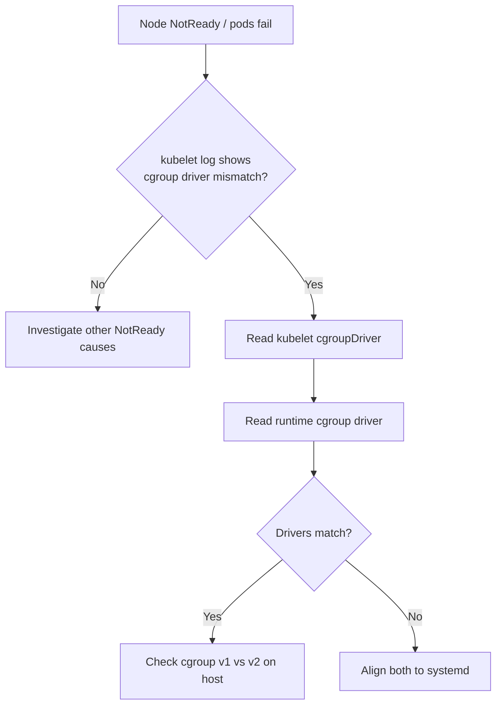

# Node cgroup Driver Mismatch

> **Severity:** High · **Typical recovery time:** 15–45 min · **Affected versions:** 1.22+

## Error Message

```text
misconfiguration: kubelet cgroup driver "cgroupfs" is different from the
container runtime cgroup driver "systemd"
failed to run Kubelet: ... cgroup driver mismatch
```

## Description

The kubelet and the container runtime (containerd, CRI-O) each manage cgroups
for the pods they run. They must agree on which cgroup driver to use —
`systemd` or `cgroupfs`. When they disagree, the kubelet either refuses to
start or pods fail to launch with resource-management errors, and on systemd
hosts you can get two competing cgroup managers, which destabilises the node
under memory pressure.

This usually surfaces right after a kubeadm install, an OS upgrade that moved
the host to cgroup v2, or a runtime config change. The node will show
`NotReady` and the kubelet log loops on the mismatch message.

## Affected Kubernetes Versions

Applies to 1.22+. Since 1.22 kubeadm defaults the kubelet to the `systemd`
driver, and most modern distros (cgroup v2) require `systemd`. The
`KubeletConfiguration.cgroupDriver` field replaced the deprecated
`--cgroup-driver` flag; the flag still works through 1.27 but is removed later.

## Likely Root Causes

- Runtime configured for `systemd` while kubelet still uses `cgroupfs` (or vice versa)
- Host migrated to cgroup v2, which only supports the `systemd` driver
- containerd `SystemdCgroup` setting left at the default `false` after upgrade
- Drift between nodes joined at different times with different configs

## Diagnostic Flow



## Verification Steps

Confirm the two components actually disagree before changing anything, and
check whether the host is on cgroup v1 or v2.

## kubectl Commands

```bash
kubectl get nodes -o wide
kubectl describe node <node>

# On the node host (read-only):
sudo journalctl -u kubelet --no-pager | grep -i cgroup
sudo cat /var/lib/kubelet/config.yaml | grep -i cgroupDriver
sudo containerd config dump | grep -i SystemdCgroup
stat -fc %T /sys/fs/cgroup    # cgroup2fs = v2, tmpfs = v1
systemctl status kubelet --no-pager
```

## Expected Output

```text
$ journalctl -u kubelet | grep -i cgroup
kubelet: misconfiguration: kubelet cgroup driver "cgroupfs" is different
from the container runtime cgroup driver "systemd"

$ stat -fc %T /sys/fs/cgroup
cgroup2fs

$ containerd config dump | grep SystemdCgroup
            SystemdCgroup = false
```

## Common Fixes

1. Standardise on `systemd`. In containerd set `SystemdCgroup = true` under
   `[plugins."io.containerd.grpc.v1.cri".containerd.runtimes.runc.options]`.
2. Set `cgroupDriver: systemd` in `/var/lib/kubelet/config.yaml`.
3. For CRI-O, set `cgroup_manager = "systemd"` in `/etc/crio/crio.conf`.

## Recovery Procedures

1. Edit the runtime and kubelet config to both use `systemd`.
2. **Restart the container runtime** (`systemctl restart containerd`) —
   blast radius: all pods on this node restart; drain first if it is not safe
   to interrupt workloads.
3. **Restart the kubelet** (`systemctl restart kubelet`) — blast radius:
   node-local only, but pods are briefly re-synced.
4. Roll the change node-by-node across the cluster, not all at once.

## Validation

Node returns to `Ready`, kubelet log no longer prints the mismatch, and new
pods schedule and run. Confirm with `kubectl get nodes` and a test pod.

## Prevention

- Bake the cgroup driver into your node image / kubeadm config so all nodes match.
- Add a CI check that asserts `cgroupDriver: systemd` on every node.
- Verify the driver as part of OS-upgrade runbooks (cgroup v2 needs systemd).

## Related Errors

- [Node Swap Unsupported](node-swap-unsupported.md)
- [Container Runtime Network Not Ready](node-container-runtime-network-not-ready.md)
- [Node Allocatable Exhausted](node-allocatable-exhausted.md)

## References

- [Configuring a cgroup driver](https://kubernetes.io/docs/tasks/administer-cluster/kubeadm/configure-cgroup-driver/)
- [Container runtimes](https://kubernetes.io/docs/setup/production-environment/container-runtimes/)

## Further Reading

- [DevOps AI ToolKit — Kubernetes guides](https://devopsaitoolkit.com/blog/)
