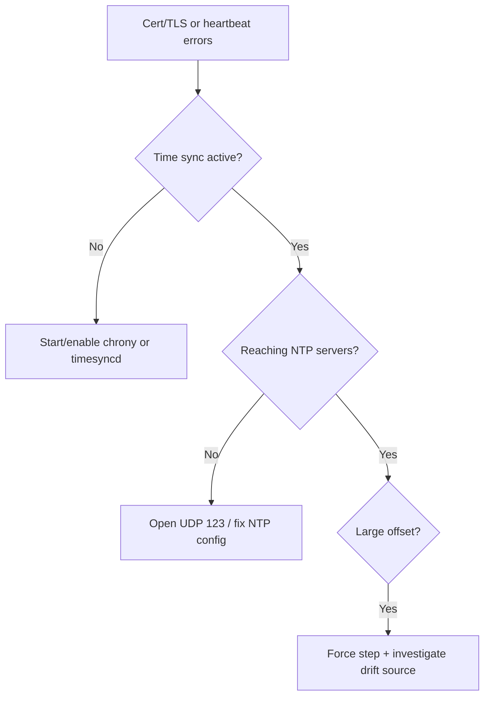

# Node Clock Skew

> **Severity:** High · **Typical recovery time:** 5–20 min · **Affected versions:** 1.20+

## Error Message

```text
x509: certificate has expired or is not yet valid:
  current time 2026-06-29T14:00:00Z is before 2026-06-29T14:07:30Z

# chronyc / timedatectl
System clock synchronized: no
NTP service: inactive
```

## Description

Clock skew is when a node's system time drifts from real time (and from the rest
of the cluster). Kubernetes relies on accurate time for TLS certificate validity
windows, bootstrap token expiry, audit/event timestamps, and lease/heartbeat
reasoning. Even a few minutes of skew can break the kubelet's TLS handshake to
the API server with `certificate has expired or is not yet valid`.

During an incident, skew presents indirectly: a node fails to register, the
kubelet "stops posting status," CSRs are rejected, or certs appear invalid even
though they are fine — the clock, not the cert, is wrong. It is easy to chase the
wrong symptom, so always check time sync early.

## Affected Kubernetes Versions

Applies to 1.20+ (and effectively all versions). Kubernetes has no built-in
clock-skew condition; the symptom surfaces through TLS/cert errors and stale
heartbeats. The fix is host-level time synchronization (chrony/systemd-timesyncd/
ntpd), independent of cluster version.

## Likely Root Causes

- NTP/chrony service stopped or never configured on the node
- Blocked egress to NTP servers (UDP 123 / firewall)
- VM clock drift after host pause/migration/snapshot resume
- Wrong timezone vs UTC confusion in logs masking real skew
- Hardware RTC battery failure on bare metal

## Diagnostic Flow



## Verification Steps

Confirm the node's time is actually off (compare to a trusted source) and that
the time-sync service reports synchronized before assuming a certificate problem.

## kubectl Commands

```bash
kubectl get nodes -o wide
kubectl describe node worker-2 | sed -n '/Conditions/,/Events/p'
kubectl get events --field-selector involvedObject.name=worker-2 --sort-by=.lastTimestamp
# Host-level read-only checks (run on the node):
timedatectl status
chronyc tracking
systemctl status chrony
journalctl -u kubelet --since "15 min ago" --no-pager | grep -i x509
```

## Expected Output

```text
# timedatectl status
System clock synchronized: no
NTP service: inactive
Local time: Mon 2026-06-29 13:52:30 UTC   (7.5 min behind)

# kubelet
x509: certificate has expired or is not yet valid: current time is before notBefore
```

## Common Fixes

1. Start and enable the time-sync service (`chronyd`/`systemd-timesyncd`).
2. Allow egress to NTP servers (UDP 123) and configure reachable sources.
3. Force a one-time correction, then let the daemon discipline the clock.

## Recovery Procedures

1. Confirm the offset and its direction (ahead/behind) on the node.
2. Re-sync the clock (start chrony / `chronyc makestep`) — **blast radius: node
   only**; a large step may momentarily disturb time-sensitive apps on that node.
   Safer alternative: slew gradually for small offsets; step only for large skew.
3. After re-sync, restart the kubelet so it retries TLS — **node-only** impact.
4. Reboot only if a stuck RTC/driver prevents sync — full node blast radius.

## Validation

`timedatectl` shows `System clock synchronized: yes`, `chronyc tracking` offset
is sub-second, kubelet TLS errors stop, and the node reports `Ready`.

## Prevention

- Enable and monitor NTP on every node (baked into the node image).
- Alert on NTP offset and sync status across the fleet.
- Ensure firewall/security groups permit NTP egress.
- Standardize on UTC to avoid timezone-induced confusion.

## Related Errors

- [Kubelet Stopped Posting Status](./kubelet-stopped-posting-status.md)
- [Node Registration / CSR Pending](./node-registration-csr-pending.md)
- [NodeNotReady](./nodenotready.md)

## References

- [Kubelet TLS bootstrapping](https://kubernetes.io/docs/reference/access-authn-authz/kubelet-tls-bootstrapping/)
- [PKI certificates and requirements](https://kubernetes.io/docs/setup/best-practices/certificates/)

## Further Reading

- [DevOps AI ToolKit — Kubernetes guides](https://devopsaitoolkit.com/blog/)
