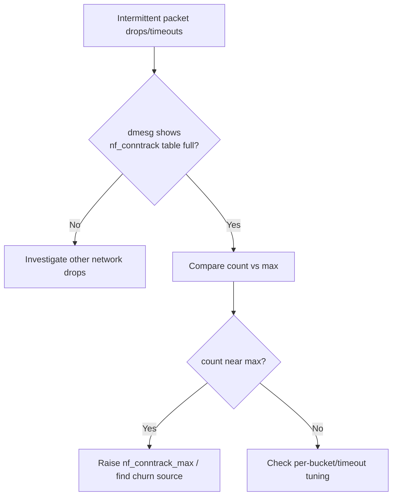

# Node conntrack Table Full

> **Severity:** High · **Typical recovery time:** 10–30 min · **Affected versions:** 1.20+

## Description

The Linux netfilter connection-tracking table (`nf_conntrack`) records every
tracked network flow on a node. kube-proxy and CNI plugins rely on conntrack
for NAT, Service load balancing, and stateful filtering. When the table fills,
the kernel drops new packets, producing intermittent connection timeouts,
failed health checks, and "random" 5xx errors that are hard to attribute to
any single pod.

This is a node-wide network fault: it affects all pods on the node, not just
one workload. High connection churn (short-lived HTTP, scanners, load tests,
or a SYN flood) drives the table to its `nf_conntrack_max` ceiling.

## Error Message

```text
kernel: nf_conntrack: table full, dropping packet
kernel: net_ratelimit: N callbacks suppressed
```

## Affected Kubernetes Versions

Applies to 1.20+. kube-proxy in iptables/ipvs mode sets conntrack sysctls
(`--conntrack-max-per-core`, `--conntrack-min`); the underlying behaviour is
kernel-level and version independent.

## Likely Root Causes

- `nf_conntrack_max` too low for the node's connection volume
- A workload (or attack) opening huge numbers of short-lived connections
- Default per-core conntrack sizing on a high-traffic node
- Long conntrack timeouts keeping closed flows in the table

## Diagnostic Flow



## Verification Steps

Confirm the table is actually saturated and identify what is filling it.

## kubectl Commands

```bash
kubectl get nodes
kubectl get events -A --sort-by=.lastTimestamp | grep -i conntrack
kubectl top pods -A --sort-by=cpu

# On the node host (read-only):
sysctl net.netfilter.nf_conntrack_max
sysctl net.netfilter.nf_conntrack_count
sudo dmesg -T | grep -i "nf_conntrack: table full"
sudo conntrack -S 2>/dev/null || cat /proc/net/stat/nf_conntrack
sudo conntrack -L 2>/dev/null | awk '{print $7}' | sort | uniq -c | sort -rn | head
```

## Expected Output

```text
$ sysctl net.netfilter.nf_conntrack_count net.netfilter.nf_conntrack_max
net.netfilter.nf_conntrack_count = 131072
net.netfilter.nf_conntrack_max = 131072

$ dmesg -T | grep conntrack
[Mon Jun 29 10:14:02 2026] nf_conntrack: table full, dropping packet
```

## Common Fixes

1. Raise the ceiling: `sysctl -w net.netfilter.nf_conntrack_max=524288`
   and persist in `/etc/sysctl.d/`.
2. Set kube-proxy `--conntrack-max-per-core` / `conntrackMaxPerCore` higher.
3. Shorten timeouts (e.g. `nf_conntrack_tcp_timeout_time_wait`) and fix the
   workload generating connection churn.

## Recovery Procedures

1. Increase `nf_conntrack_max` on the node — takes effect immediately, no
   restart needed.
2. Restart kube-proxy on the node (`kubectl -n kube-system delete pod
   <kube-proxy-pod>`) to apply changed conntrack settings — blast radius:
   brief Service-routing reprogramming on that node.
3. Throttle or **restart the offending workload** — blast radius limited to
   that app.
4. Roll the sysctl change to all nodes via config management.

## Validation

`nf_conntrack_count` stays well below `nf_conntrack_max`, `dmesg` is clean, and
connection timeouts stop. Confirm Service health checks pass.

## Prevention

- Size `nf_conntrack_max` for peak load in the node image.
- Alert on conntrack utilisation (count/max ratio).
- Use connection pooling/keep-alive in apps to cut flow churn.

## Related Errors

- [Node Too Many Open Files](node-too-many-open-files.md)
- [Container Runtime Network Not Ready](node-container-runtime-network-not-ready.md)
- [Node Kernel Hung / Panic](node-kernel-hung.md)

## References

- [kube-proxy reference](https://kubernetes.io/docs/reference/command-line-tools-reference/kube-proxy/)
- [Cluster networking](https://kubernetes.io/docs/concepts/cluster-administration/networking/)

## Further Reading

- [DevOps AI ToolKit — Kubernetes guides](https://devopsaitoolkit.com/blog/)
