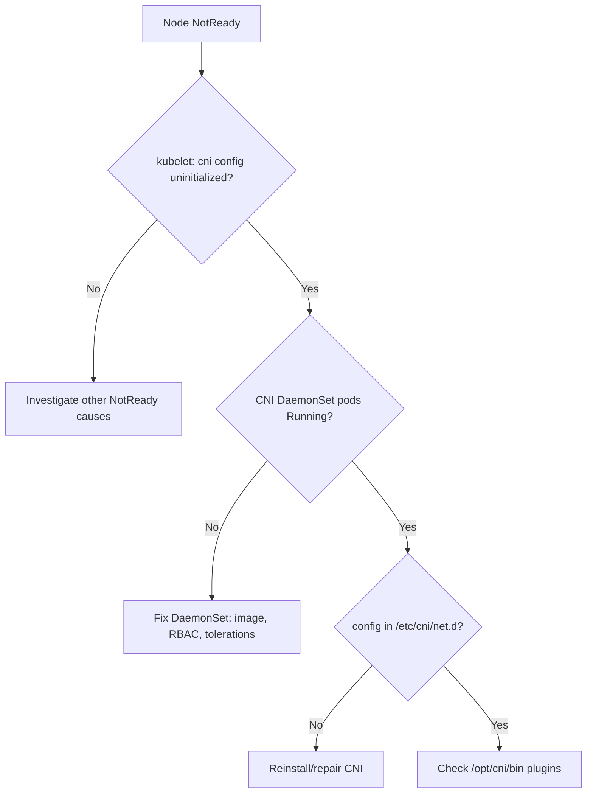

# Container Runtime Network Not Ready

> **Severity:** Critical · **Typical recovery time:** 10–40 min · **Affected versions:** 1.20+

## Description

The kubelet reports a node as `NotReady` when the container runtime cannot set
up pod networking. The kubelet calls the CNI plugin through the runtime to wire
up each pod's network namespace; if no valid CNI configuration is present in
`/etc/cni/net.d` or the CNI binaries are missing, the runtime reports the
network as uninitialized and the kubelet marks the node `NetworkUnavailable` /
`NotReady`.

This is one of the most common new-cluster and post-upgrade faults. Until the
CNI is healthy, no non-hostNetwork pods can start on the node, so it is
effectively out of service.

## Error Message

```text
container runtime network not ready: NetworkReady=false
reason:NetworkPluginNotReady message:Network plugin returns error:
cni plugin not initialized / cni config uninitialized
```

## Affected Kubernetes Versions

Applies to 1.20+. Since dockershim removal (1.24) the kubelet relies entirely
on the CRI runtime's CNI integration; misplaced CNI config or missing
`/opt/cni/bin` plugins is the usual trigger.

## Likely Root Causes

- CNI plugin (Calico, Cilium, Flannel, etc.) not installed or its DaemonSet
  pods crash-looping
- Missing or malformed config in `/etc/cni/net.d`
- CNI binaries absent from `/opt/cni/bin`
- Network plugin DaemonSet not tolerating the node's taints, so it never lands

## Diagnostic Flow



## Verification Steps

Confirm the CNI is the cause and locate the missing piece (DaemonSet, config,
or binaries).

## kubectl Commands

```bash
kubectl get nodes
kubectl describe node <node> | grep -A5 Conditions
kubectl -n kube-system get pods -o wide | grep -iE 'calico|cilium|flannel|weave'
kubectl -n kube-system logs <cni-pod>

# On the node host (read-only):
ls -l /etc/cni/net.d/
ls -l /opt/cni/bin/
sudo journalctl -u kubelet --no-pager | grep -i "cni config"
```

## Expected Output

```text
$ kubectl describe node node-1 | grep Ready
  Ready   False   KubeletNotReady   container runtime network not ready:
  NetworkReady=false reason:NetworkPluginNotReady message:... cni config uninitialized

$ ls /etc/cni/net.d/
(empty)
```

## Common Fixes

1. Install or reapply the CNI manifest (e.g.
   `kubectl apply -f <cni>.yaml`) and wait for its DaemonSet to become Ready.
2. Fix the CNI DaemonSet so it schedules on the node (add tolerations, correct
   RBAC, fix the image).
3. Restore `/etc/cni/net.d` config and `/opt/cni/bin` plugins on the host.

## Recovery Procedures

1. Reapply or repair the CNI DaemonSet; its init container drops the config and
   binaries onto the node.
2. **Restart the kubelet** if it does not re-detect the CNI within a minute —
   blast radius: node-local resync only.
3. If a single node is wedged, **drain it** before deeper host surgery —
   blast radius: its pods reschedule elsewhere; ensure cluster has capacity.
4. Validate before moving to the next node.

## Validation

Node becomes `Ready`, `NetworkUnavailable` is `False`, CNI pods are `Running`,
and a test pod gets an IP and reaches another pod.

## Prevention

- Install the CNI as part of cluster bootstrap automation, before workloads.
- Ensure CNI DaemonSets tolerate `node.kubernetes.io/not-ready` and your taints.
- Bake `/opt/cni/bin` plugins into the node image where appropriate.

## Related Errors

- [Node cgroup Driver Mismatch](node-cgroup-driver-mismatch.md)
- [Node conntrack Table Full](node-conntrack-table-full.md)
- [Kubelet Cert Rotation Failed](kubelet-client-certificate-rotation-failed.md)

## References

- [Network plugins](https://kubernetes.io/docs/concepts/extend-kubernetes/compute-storage-net/network-plugins/)
- [Installing addons (CNI)](https://kubernetes.io/docs/concepts/cluster-administration/addons/)

## Further Reading

- [Free Kubernetes config validators](https://devopsaitoolkit.com/validators/)
