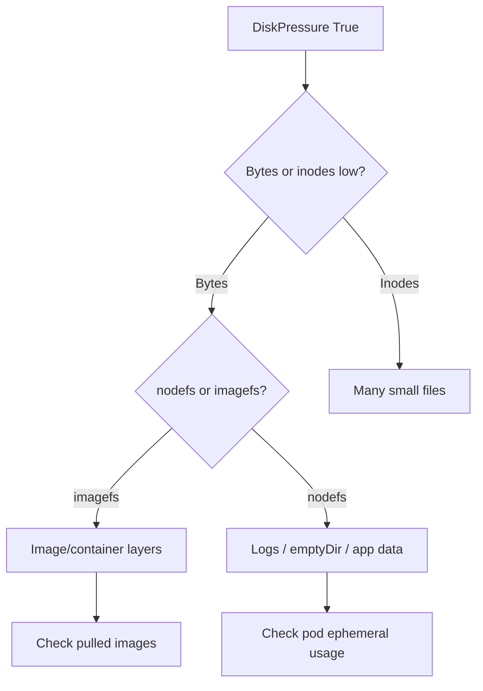

# Node DiskPressure

> **Severity:** High · **Typical recovery time:** 10–45 min · **Affected versions:** 1.20+

## Error Message

```text
Conditions:
  Type           Status   Reason                Message
  DiskPressure   True     KubeletHasDiskPressure   kubelet has disk pressure

Taints: node.kubernetes.io/disk-pressure:NoSchedule
Warning  EvictionThresholdMet  Attempting to reclaim ephemeral-storage
```

## Description

`DiskPressure=True` means the kubelet's eviction manager has crossed a
configured disk eviction threshold — either on the node root/imagefs free
bytes, free inodes, or available ephemeral storage. The kubelet first tries to
reclaim space (deleting unused images and dead containers); if that is
insufficient it begins evicting pods, ranked by QoS and usage above requests.

During an incident this taints the node `NoSchedule`, so no new pods land, and
running pods that exceed ephemeral-storage limits or use the most disk get
evicted. Logging, image churn, and emptyDir writes are common amplifiers.

## Affected Kubernetes Versions

Applies to 1.20+. Eviction thresholds are configured via kubelet flags or the
`KubeletConfiguration` `evictionHard`/`evictionSoft` (e.g. `nodefs.available`,
`imagefs.available`, `nodefs.inodesFree`). Behaviour is stable across modern
releases; defaults may differ by distro.

## Likely Root Causes

- Container/image churn filling imagefs (containerd/overlayfs layers)
- Unbounded pod logs or app writes to emptyDir / ephemeral storage
- Orphaned volumes, stale containers, or large core dumps
- Inode exhaustion despite free bytes available
- Threshold set too aggressively for a small disk

## Diagnostic Flow



## Verification Steps

Confirm the `DiskPressure` condition is `True` and identify whether the squeeze
is on nodefs vs imagefs, and bytes vs inodes, before deleting anything.

## kubectl Commands

```bash
kubectl describe node worker-2 | sed -n '/Conditions/,/Events/p'
kubectl get events --field-selector involvedObject.name=worker-2 --sort-by=.lastTimestamp
kubectl top node worker-2
kubectl get pods -A -o wide --field-selector spec.nodeName=worker-2
# Host-level read-only checks:
systemctl status kubelet
journalctl -u kubelet --since "20 min ago" --no-pager | grep -i evict
```

## Expected Output

```text
Filesystem      Size  Used Avail Use% Mounted on
/dev/nvme0n1p1   80G   77G  2.9G  97% /
Inodes:                       100%  /
Warning  Evicted  pod/log-aggregator-xyz  The node was low on resource: ephemeral-storage
```

## Common Fixes

1. Reclaim image/container space (the kubelet GC normally does this).
2. Rotate or cap pod logs; remove large emptyDir writers.
3. Grow the disk or raise it for nodes with chronically high churn.

## Recovery Procedures

1. Identify the largest consumers (imagefs vs nodefs) before deleting.
2. Let kubelet GC reclaim, or remove unused images on the host — **blast
   radius: node only**, may slow next image pulls.
3. If the node must be serviced (resize disk), **cordon then drain**. Drain is
   disruptive: it evicts all pods and can violate PDBs. Safer alternative:
   cordon first, migrate workloads gradually, then drain.
4. Avoid `reboot`; it does not free disk and incurs full node blast radius.

## Validation

`DiskPressure` condition returns to `False`, the `disk-pressure` taint clears,
disk usage drops below the threshold, and new pods schedule onto the node.

## Prevention

- Set ephemeral-storage requests/limits on pods.
- Configure log rotation and ship logs off-node.
- Right-size disks and set sane `evictionHard` thresholds with `--system-reserved`.
- Alert on `nodefs.available` and inode usage before thresholds trip.

## Related Errors

- [Node Out Of Disk](./node-out-of-disk.md)
- [Node MemoryPressure](./node-memorypressure.md)
- [NodeNotReady](./nodenotready.md)

## References

- [Node-pressure eviction](https://kubernetes.io/docs/concepts/scheduling-eviction/node-pressure-eviction/)
- [Taint-based eviction](https://kubernetes.io/docs/concepts/scheduling-eviction/taint-and-toleration/#taint-based-evictions)

## Further Reading

- [Free Kubernetes config validators](https://devopsaitoolkit.com/validators/)
