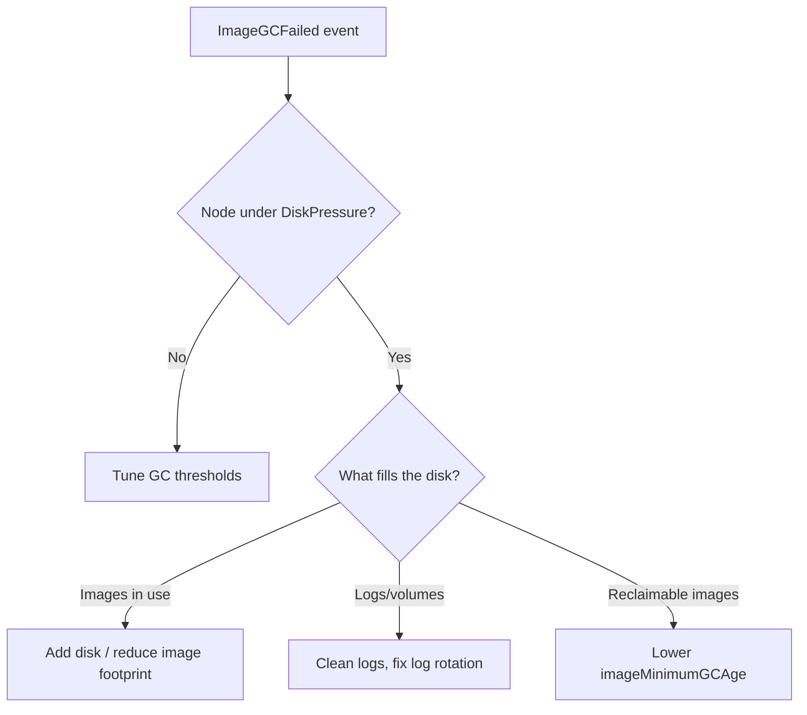

# Node Image GC Failed

> **Severity:** High · **Typical recovery time:** 10–30 min · **Affected versions:** 1.20+

## Description

The kubelet runs image garbage collection to keep the container image
filesystem below its high threshold. When usage crosses
`imageGCHighThresholdPercent`, the kubelet deletes unused images down to the
low threshold. If it cannot free enough space — because all remaining images
are in use by running containers, or disk is consumed by logs/volumes rather
than images — it logs this error and the node enters `DiskPressure`.

Under `DiskPressure` the node stops accepting new pods and begins evicting
existing ones, so this is an early warning of a node about to shed load. Left
unresolved, image pulls fail and the node can flap `NotReady`.

## Error Message

```text
eviction_manager: failed to garbage collect required amount of images.
Wanted to free 5368709120 bytes, but freed 0 bytes
ImageGCFailed: failed to garbage collect required amount of images
```

## Affected Kubernetes Versions

Applies to 1.20+. Thresholds are set via `KubeletConfiguration`
(`imageGCHighThresholdPercent`, `imageGCLowThresholdPercent`,
`imageMinimumGCAge`). Behaviour is consistent across versions; only field
locations changed when flags moved into the config file.

## Likely Root Causes

- Image filesystem genuinely full of in-use images (nothing reclaimable)
- Disk consumed by container logs, emptyDir, or local volumes, not images
- Very large or many image tags pulled to one node
- `imageMinimumGCAge` too high, so recent images are exempt from GC

## Diagnostic Flow



## Verification Steps

Confirm what is actually consuming the image filesystem before deleting
anything.

## kubectl Commands

```bash
kubectl get nodes
kubectl describe node <node> | grep -A6 Conditions
kubectl get events -A --sort-by=.lastTimestamp | grep -i ImageGC

# On the node host (read-only):
df -h /var/lib/containerd /var/lib/docker 2>/dev/null
sudo crictl images
sudo crictl imagefsinfo
sudo du -sh /var/log/pods/* 2>/dev/null | sort -rh | head
sudo journalctl -u kubelet --no-pager | grep -i ImageGC
```

## Expected Output

```text
$ kubectl describe node node-1 | grep DiskPressure
  DiskPressure   True   KubeletHasDiskPressure   kubelet has disk pressure

$ journalctl -u kubelet | grep ImageGC
eviction_manager: failed to garbage collect required amount of images.
Wanted to free 5368709120 bytes, but freed 0 bytes
```

## Common Fixes

1. Reclaim space: remove unused images with `crictl rmi --prune` (read after
   confirming they are unused), and fix container log rotation.
2. Lower `imageGCHighThresholdPercent` / `imageMinimumGCAge` so GC runs sooner.
3. Add disk capacity or move the image filesystem to a larger volume.

## Recovery Procedures

1. Free reclaimable space on the node (prune unused images, rotate logs).
2. If the disk is genuinely too small, **drain the node** and resize/replace
   its disk — blast radius: pods reschedule; verify cluster capacity first.
3. **Restart the kubelet** after config changes to apply new GC thresholds —
   blast radius: node-local resync.
4. Roll threshold changes out fleet-wide.

## Validation

`DiskPressure` clears to `False`, image filesystem usage drops below the high
threshold, and new pods schedule and pull images successfully.

## Prevention

- Size node disks for your largest expected image set plus logs.
- Enforce log rotation (`containerLogMaxSize`, `containerLogMaxFiles`).
- Alert on image filesystem usage and `DiskPressure` conditions.

## Related Errors

- [Node Allocatable Exhausted](node-allocatable-exhausted.md)
- [Node Too Many Open Files](node-too-many-open-files.md)
- [Node Max Volume Count Exceeded](node-max-volume-count.md)

## References

- [Garbage collection](https://kubernetes.io/docs/concepts/architecture/garbage-collection/)
- [Node-pressure eviction](https://kubernetes.io/docs/concepts/scheduling-eviction/node-pressure-eviction/)

## Further Reading

- [DevOps AI ToolKit — Kubernetes guides](https://devopsaitoolkit.com/blog/)
