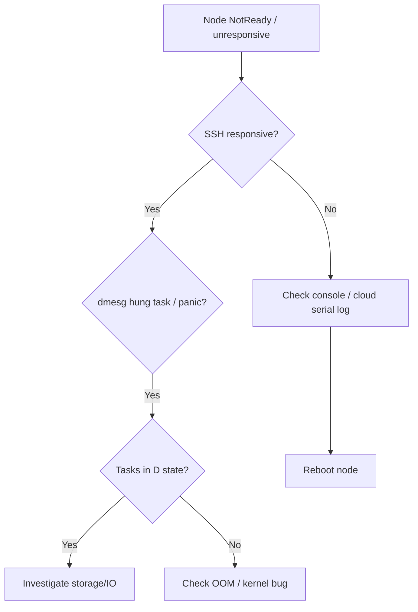

# Node Kernel Hung / Panic

> **Severity:** Critical · **Typical recovery time:** 20–60 min · **Affected versions:** 1.20+

## Description

A node can become unresponsive when the Linux kernel blocks a task for too long
(`hung_task_timeout`), deadlocks in I/O, exhausts memory, or panics. The kernel
logs `hung task` warnings or a panic stack trace, the kubelet stops posting
status, and the control plane marks the node `NotReady`/`unreachable`. After
the taint grace period, its pods are evicted and rescheduled.

This is a host-level failure, not a Kubernetes object problem. Common triggers
include stuck storage (NFS/iSCSI/EBS) causing tasks to block in
uninterruptible sleep (`D` state), memory pressure pushing the system into deep
reclaim, or a kernel/driver bug. Recovery usually requires a reboot.

## Error Message

```text
kernel: INFO: task kworker/3:1:123 blocked for more than 120 seconds.
kernel: "echo 0 > /proc/sys/kernel/hung_task_timeout_secs" disables this message.
kernel: Kernel panic - not syncing: ...   (node became unresponsive)
```

## Affected Kubernetes Versions

Applies to all versions (1.20+) since the fault is in the host kernel, not
Kubernetes. Node lifecycle handling (taint-based eviction, `NotReady`
detection) behaves the same across these releases.

## Likely Root Causes

- Stuck storage backend leaving tasks in uninterruptible `D` state
- Out-of-memory / deep reclaim freezing the system (no/insufficient swap controls)
- Kernel or device-driver bug, sometimes after an OS upgrade
- Hardware fault (failing disk, NIC, or memory)

## Diagnostic Flow



## Verification Steps

Confirm the kernel is the cause (hung-task or panic traces) and whether
storage, memory, or a driver is implicated.

## kubectl Commands

```bash
kubectl get nodes
kubectl describe node <node> | grep -A6 Conditions
kubectl get events -A --sort-by=.lastTimestamp | grep -i <node>

# On the node host / console (read-only):
sudo dmesg -T | grep -iE 'hung task|panic|oom|blocked for more than'
ps -eo pid,stat,wchan,cmd | awk '$2 ~ /D/'
sudo journalctl -k --no-pager | tail -80
uptime
free -h
```

## Expected Output

```text
$ kubectl describe node node-3 | grep Ready
  Ready   Unknown   NodeStatusUnknown   Kubelet stopped posting node status.

$ dmesg -T | grep hung
[...] INFO: task nfsd:842 blocked for more than 120 seconds.
[...] task:nfsd state:D stack: 0 ...
```

## Common Fixes

1. Resolve the underlying I/O block (recover NFS/iSCSI/EBS, remount, fix the
   storage backend) so blocked tasks can complete.
2. Address memory pressure (right-size workloads, set proper requests/limits,
   reserve system resources).
3. Apply kernel/driver updates or roll back a regressing kernel.

## Recovery Procedures

1. Confirm pods have rescheduled (taint-based eviction handles healthy
   replicas) before touching the node.
2. **Cordon the node** to stop new scheduling — blast radius: scheduling only.
3. **Reboot the node** (or replace the instance) — blast radius: all remaining
   pods on it die and reschedule; ensure quorum-based workloads (etcd,
   databases) keep quorum and the cluster has capacity.
4. If reboot does not clear it, **replace the node** entirely.

## Validation

Node returns to `Ready`, `dmesg` is clean of new hung-task/panic entries, no
`D`-state tasks remain, and rescheduled workloads are healthy.

## Prevention

- Enable kernel panic-on-hung-task with auto-reboot for fast self-heal where safe.
- Monitor for `D`-state task counts and storage latency.
- Keep kernels patched; soak OS upgrades in non-prod first.

## Related Errors

- [Node Too Many Open Files](node-too-many-open-files.md)
- [Node conntrack Table Full](node-conntrack-table-full.md)
- [NoExecute Taint Evicting Pods](node-noexecute-taint-evicting.md)

## References

- [Node status and conditions](https://kubernetes.io/docs/concepts/architecture/nodes/#condition)
- [Monitor node health](https://kubernetes.io/docs/tasks/debug/debug-cluster/monitor-node-health/)

## Further Reading

- [DevOps AI ToolKit — Kubernetes guides](https://devopsaitoolkit.com/blog/)
