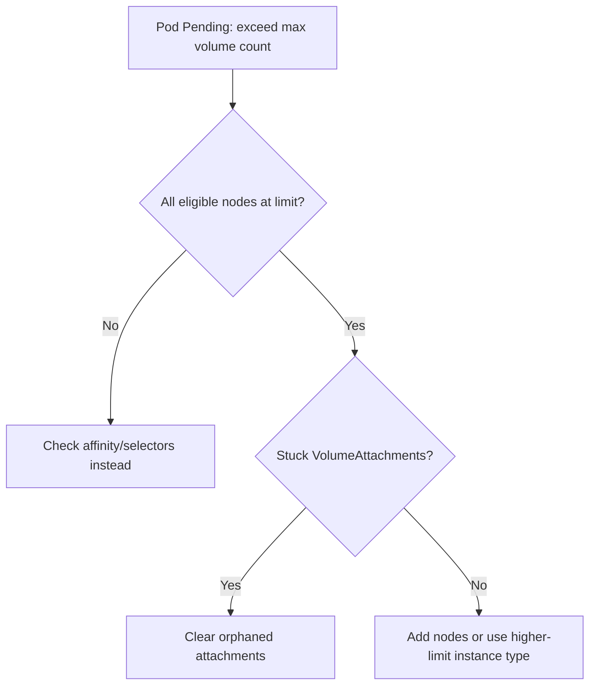

# Node Max Volume Count Exceeded

> **Severity:** Medium · **Typical recovery time:** 10–30 min · **Affected versions:** 1.20+

## Description

Cloud providers and CSI drivers cap how many persistent volumes can be attached
to a single node (for example, AWS EBS limits attachments per instance type).
The scheduler enforces this limit; when every candidate node already has its
maximum number of volumes attached, a pod that needs a PVC stays `Pending` with
`node(s) exceed max volume count` in its scheduling events.

This is a scheduling constraint, not a node fault — the affected nodes are
otherwise healthy. It typically appears when stateful workloads scale up, when
volumes are slow to detach after pod moves, or on instance types with low
attachment limits.

## Error Message

```text
0/6 nodes are available: 3 node(s) exceed max volume count,
3 node(s) didn't match Pod's node affinity/selector.
```

## Affected Kubernetes Versions

Applies to 1.20+. The CSI `VolumeAttachLimit` (reported by the driver via
`CSINode`) governs the per-node count. Older in-tree volume limits were set by
provider-specific predicates; modern clusters use CSI-reported limits.

## Likely Root Causes

- Instance type with a low per-node attachment limit, fully consumed
- Volumes not detaching promptly after pods rescheduled (stuck VolumeAttachment)
- Too many stateful replicas pinned to a small node pool
- CSI driver under-reporting available attach slots

## Diagnostic Flow



## Verification Steps

Confirm the per-node attach limit and how many volumes are currently attached.

## kubectl Commands

```bash
kubectl get pod <pod> -n <ns> -o wide
kubectl describe pod <pod> -n <ns> | grep -A3 Events
kubectl get csinode <node> -o yaml | grep -A4 allocatable
kubectl get volumeattachments | grep <node>
kubectl get pvc -A | grep -i pending
kubectl describe node <node> | grep -i "Attached"
```

## Expected Output

```text
$ kubectl describe pod web-0 -n data | grep -A2 Events
  Warning  FailedScheduling  default-scheduler
  0/6 nodes are available: 3 node(s) exceed max volume count, ...

$ kubectl get csinode node-1 -o yaml | grep -A2 allocatable
      allocatable:
        count: 25
```

## Common Fixes

1. Add nodes (or scale the node pool) so volumes spread across more nodes.
2. Use an instance type with a higher attachment limit for stateful pools.
3. Clear stuck `VolumeAttachment` objects so detached volumes free their slots.

## Recovery Procedures

1. Scale out the relevant node pool so the scheduler has nodes with free slots.
2. Resolve orphaned `VolumeAttachment`s (verify the volume is truly detached at
   the cloud layer before removing) — blast radius: storage-control-plane only.
3. If volumes are clustered on one node, **drain/cordon to redistribute** stateful
   pods — blast radius: those pods restart and reattach elsewhere; ensure
   capacity and quorum (e.g. for databases) first.

## Validation

The `Pending` pod schedules and its PVC binds and mounts. `kubectl get
volumeattachments` shows attachments spread under each node's allocatable count.

## Prevention

- Right-size node pools / instance types for your stateful volume density.
- Spread stateful replicas with topology constraints across nodes.
- Alert on per-node attachment count approaching the CSI limit.

## Related Errors

- [Node Image GC Failed](node-image-gc-failed.md)
- [Node Allocatable Exhausted](node-allocatable-exhausted.md)
- [NoExecute Taint Evicting Pods](node-noexecute-taint-evicting.md)

## References

- [Storage limits / volume limits](https://kubernetes.io/docs/concepts/storage/storage-limits/)
- [CSINode](https://kubernetes.io/docs/concepts/storage/volumes/#csi)

## Further Reading

- [Free Kubernetes config validators](https://devopsaitoolkit.com/validators/)
