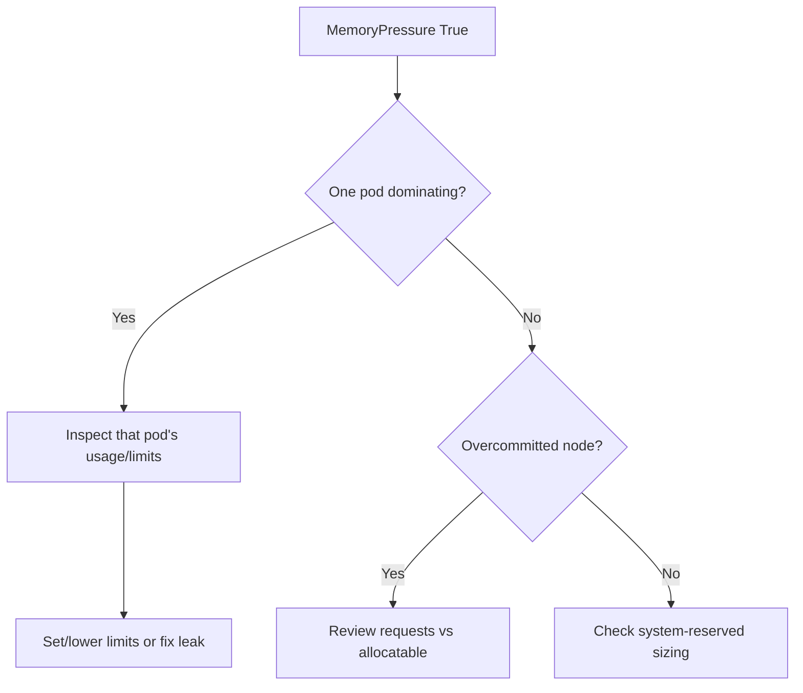

# Node MemoryPressure

> **Severity:** High · **Typical recovery time:** 5–30 min · **Affected versions:** 1.20+

## Error Message

```text
Conditions:
  Type             Status   Reason                      Message
  MemoryPressure   True     KubeletHasInsufficientMemory   kubelet has memory pressure

Taints: node.kubernetes.io/memory-pressure:NoSchedule
Warning  EvictionThresholdMet  Attempting to reclaim memory
```

## Description

`MemoryPressure=True` means available node memory has fallen below the kubelet's
memory eviction threshold (`memory.available`). The kubelet ranks pods by QoS
class and memory usage relative to requests, then evicts `BestEffort` and
over-request `Burstable` pods first to recover headroom. This is distinct from
a kernel OOM kill, though both can occur on a starved node.

During an incident the node is tainted `NoSchedule`, new pods avoid it, and
evicted pods reschedule elsewhere — potentially spreading the pressure. A
runaway container with no memory limit is the classic trigger.

## Affected Kubernetes Versions

Applies to 1.20+. Threshold is the kubelet's `evictionHard`/`evictionSoft`
`memory.available` (default hard `100Mi`). On cgroup v2 systems (default on
many distros from 1.25+) memory accounting is more accurate; behaviour is
otherwise consistent.

## Likely Root Causes

- Pod(s) without memory limits consuming node RAM
- Memory leak in an application container
- Overcommit: sum of requests/limits exceeds allocatable
- Node `--system-reserved`/`--kube-reserved` set too low
- Large page cache plus app pressure pushing past threshold

## Diagnostic Flow



## Verification Steps

Confirm the `MemoryPressure` condition is `True` and correlate with per-pod
memory usage and any recent `Evicted` or `OOMKilled` events on the node.

## kubectl Commands

```bash
kubectl describe node worker-2 | sed -n '/Conditions/,/Events/p'
kubectl top node worker-2
kubectl top pods -A --sort-by=memory | head
kubectl get pods -A --field-selector spec.nodeName=worker-2 -o wide
kubectl get events --field-selector involvedObject.name=worker-2 --sort-by=.lastTimestamp
# Host-level read-only checks:
journalctl -u kubelet --since "15 min ago" --no-pager | grep -i evict
```

## Expected Output

```text
NAME       CPU(cores)   MEMORY(bytes)
worker-2   1200m        15400Mi

Warning  Evicted  pod/cache-7f9   The node was low on resource: memory.
                                   Container cache was using 6Gi, exceeding request 512Mi.
```

## Common Fixes

1. Set/lower memory `limits` on offending pods or fix the leak.
2. Reduce overcommit by aligning requests with real usage.
3. Increase `--system-reserved`/`--kube-reserved` headroom.

## Recovery Procedures

1. Identify the dominant memory consumer from `kubectl top`.
2. Delete or restart the offending pod — **blast radius: that workload only**;
   a Deployment recreates it, ideally after limits are applied.
3. If the node stays pressured, **cordon then drain** to relocate pods. Drain
   evicts everything and may breach PDBs. Safer alternative: cordon, scale the
   deployment to add capacity elsewhere, then drain selectively.
4. Reboot only if memory is unrecoverable (kernel/driver leak) — full node
   blast radius.

## Validation

`MemoryPressure` returns to `False`, the `memory-pressure` taint clears,
`kubectl top node` shows recovered headroom, and no new evictions occur.

## Prevention

- Always set memory requests and limits; use LimitRanges per namespace.
- Alert on `memory.available` approaching the eviction threshold.
- Use ResourceQuotas to cap namespace consumption.
- Right-size node reservations so the system never starves.

## Related Errors

- [Node DiskPressure](./node-diskpressure.md)
- [Node PIDPressure](./node-pidpressure.md)
- [NodeNotReady](./nodenotready.md)

## References

- [Node-pressure eviction](https://kubernetes.io/docs/concepts/scheduling-eviction/node-pressure-eviction/)
- [Reserve compute resources](https://kubernetes.io/docs/tasks/administer-cluster/reserve-compute-resources/)

## Further Reading

- [DevOps AI ToolKit — Kubernetes guides](https://devopsaitoolkit.com/blog/)
